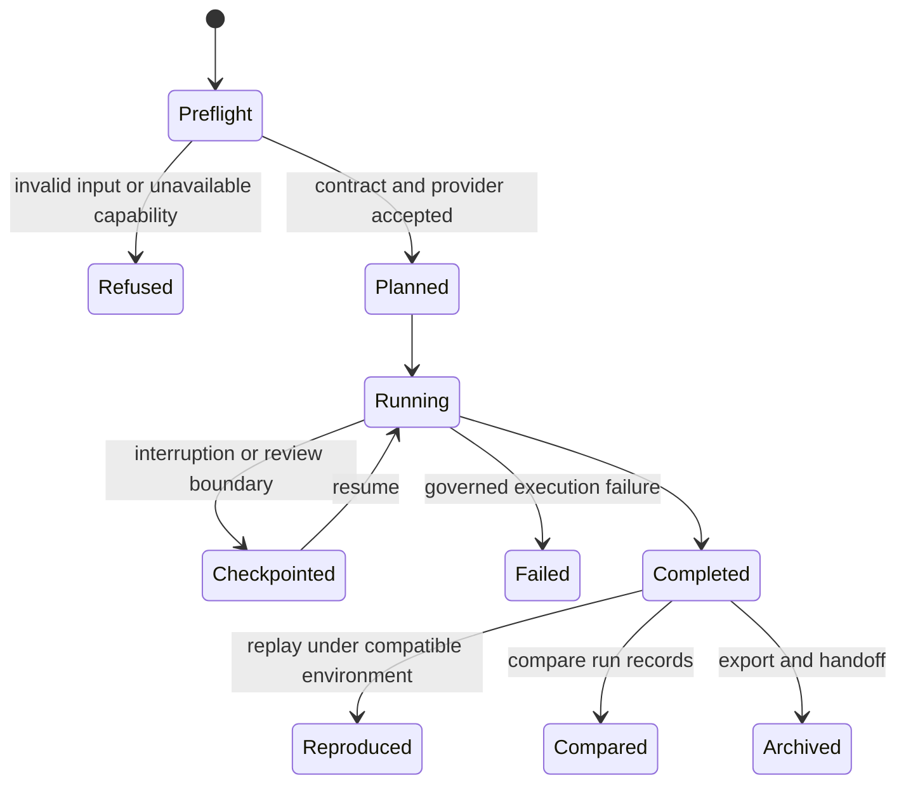

# bijux-proteomics-runtime

`bijux-proteomics-runtime` is the canonical execution layer. It turns validated
workflow requests into inspectable runs with explicit configuration, provider
selection, lifecycle state, checkpoints, artifacts, comparison, replay, and
operator handoff.

```bash
python -m pip install bijux-proteomics-runtime
bijux-proteomics-runtime --help
```

## Runtime lifecycle



Runtime records execution truth: what was requested, selected, attempted,
produced, refused, or failed. It does not convert operational success into a
scientific or biological claim.

## Operator surfaces

- The `bijux-proteomics-runtime` CLI starts, resumes, compares, reproduces,
  inspects, imports, and exports runs.
- `create_app()` exposes the FastAPI application and versioned route surface.
- `RunManager` provides the direct Python execution owner.
- `AppConfig` configures the HTTP application.
- `agentic-proteins` forwards historical commands and imports to these
  canonical owners.

See the [CLI reference](cli-reference.md) for exact commands and examples.

## Execution subsystems

| Subsystem | Responsibility |
| --- | --- |
| `api` | CLI, FastAPI application, v1 routes, request context, errors, logging, and command output |
| `execution` | agent and tool contracts, planning, compilation, graph validation, engine, evaluation, and validation |
| `providers` | capability discovery, selection, assurance, environment checks, and built-in, local, or remote implementations |
| `runs` | configuration, preflight, context, lifecycle, manager, ledger, artifacts, checkpoints, cache, telemetry, recovery, replay, and reruns |
| `state` | memory records, stores, schemas, and snapshots |
| `parallel` and `streaming` | controlled alternative execution modes |
| `rehydrate`, `resume`, and `diff` | recovery, continuation, and completed-run comparison |
| `handoff` | portable archive bundles |

## Provider boundary

The built-in heuristic provider supports deterministic local behavior.
Structure providers such as ESMFold, RoseTTAFold, ColabFold, and OpenProtein
are opt-in and carry environment, dependency, network, hardware, and upstream
service constraints. Provider selection and capability checks are recorded in
the run. A fallback must remain visible; it cannot masquerade as the requested
provider.

## Run evidence

A reviewable run includes its request, normalized configuration, environment
and version identity, provider decision, lifecycle transitions, structured
logs, checkpoints, artifact hashes, failure or refusal information, and output
summary. Replay verifies declared runtime behavior under a compatible
environment; comparison identifies relevant differences between completed
runs.

Imported results have a distinct provenance route. Supplying an external
engine name, version, source file, and sequence creates an import-backed run
record; it does not make the external computation native or independently
reproducible.

## Documentation map

- [Execution overview](execution-overview.md) — execution model and run record.
- [Operator rerun journey](operator-rerun-journey.md) — reopen a workflow from
  public evidence.
- [Benchmark rerun kits](benchmark-rerun-kits.md) — inputs and instructions for
  benchmark replay.
- [Raw versus import execution](raw-versus-import-execution.md) — provenance
  difference between native and external results.
- [Artifact stability](runtime-artifact-stability.md) — persistence and
  comparison guarantees.
- [Environment contracts](runtime-environment-contracts.md) — provider and
  system assumptions.
- [Rerun refusals](runtime-rerun-refusals.md) — conditions that prevent an
  honest rerun claim.
- [Migration ledger](migration-ledger/README.md) — historical
  `agentic-proteins` mappings.

Runtime does not own core scientific semantics, knowledge grounding,
recommendation policy, or laboratory readiness.
