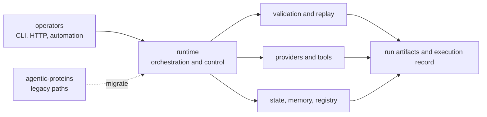

# Runtime Handbook

`bijux-proteomics-runtime` is the canonical execution package for the
proteomics family. It owns how work is invoked, orchestrated, replayed, and
made inspectable after the run. This is where the system becomes operational:
operators touch it, providers plug into it, state moves through it, and runs
leave artifacts behind that a reviewer can inspect later.

## Why This Package Is Central

- it is the place where abstract package contracts become concrete runs
- it keeps execution reviewable instead of letting provider calls disappear into
  opaque side effects
- it holds the operational seam between the product family and the outside
  world

## Why This Package Matters More Now

- runtime is now a public proof surface for flagship families, not only an
  internal operator utility
- the repository can now show checked run bundles, replay pressure,
  comparability limits, and raw-versus-import honesty in public docs instead of
  maintainer explanation
- stronger benchmark and trust routes only become operationally meaningful when
  runtime keeps their execution limits explicit

## Shared Reader Routes

- Use [Execution](https://bijux.io/bijux-proteomics/09-bijux-proteomics-runtime/execution-overview/)
  when the question is still about rerun flow rather than one runtime-owned
  surface.
- Use [Operator Rerun Journey](https://bijux.io/bijux-proteomics/09-bijux-proteomics-runtime/operator-rerun-journey/)
  when the question starts from a flagship workflow family rather than from a
  runtime subsystem.
- Use [Benchmark Rerun Kits](https://bijux.io/bijux-proteomics/09-bijux-proteomics-runtime/benchmark-rerun-kits/)
  when the question is how an outsider would reopen the shipped benchmark lane
  without relying on maintainer memory.

## Start Inside This Package

- Proof route:
  open [Flagship Run Registry](https://bijux.io/bijux-proteomics/09-bijux-proteomics-runtime/flagship-run-registry/),
  [Benchmark Comparability Matrix](https://bijux.io/bijux-proteomics/09-bijux-proteomics-runtime/benchmark-comparability-matrix/),
  and [Black-Box Benchmark Dashboard](https://bijux.io/bijux-proteomics/09-bijux-proteomics-runtime/black-box-benchmark-dashboard/)
  when the question is which runtime-backed workflow claims are live and what
  evidence still authorizes them.
- Boundary route:
  open [Runtime Execution Boundary](https://bijux.io/bijux-proteomics/09-bijux-proteomics-runtime/runtime-execution-boundary/),
  [Black-Box Run Verification](https://bijux.io/bijux-proteomics/09-bijux-proteomics-runtime/black-box-run-verification/),
  and [Raw Versus Import Execution](https://bijux.io/bijux-proteomics/09-bijux-proteomics-runtime/raw-versus-import-execution/)
  when the question is how a benchmark package becomes a checked runtime story
  and where that story still stops.
- Stability route:
  open [Runtime Replay Challenges](https://bijux.io/bijux-proteomics/09-bijux-proteomics-runtime/runtime-replay-challenges/),
  [Runtime Environment Contracts](https://bijux.io/bijux-proteomics/09-bijux-proteomics-runtime/runtime-environment-contracts/),
  [Runtime Artifact Stability](https://bijux.io/bijux-proteomics/09-bijux-proteomics-runtime/runtime-artifact-stability/),
  and [Runtime Rerun Refusals](https://bijux.io/bijux-proteomics/09-bijux-proteomics-runtime/runtime-rerun-refusals/)
  when the question is what still blocks a stronger rerun claim.
- Compatibility route:
  open [agentic-proteins](https://bijux.io/bijux-proteomics/02-agentic-proteins/)
  and the [Migration Ledger](https://bijux.io/bijux-proteomics/09-bijux-proteomics-runtime/migration-ledger/)
  when the question starts from a legacy import, CLI path, or API surface.
- Domain handoff:
  open the lower package handbooks when the disputed behavior is really domain,
  evidence, recommendation, or lab meaning instead of runtime execution.

## What Runtime Owns

- operator entrypoints such as CLI and HTTP surfaces
- provider binding, execution adapters, and workspace control
- run orchestration, replay, determinism, and state transitions
- runtime artifacts and execution-lifecycle records

## What Runtime Refuses

- canonical domain and biology semantics
- evidence, confidence, contradiction, and review semantics
- recommendation policy, scoring, and design-loop meaning
- planning and outcome-promotion meaning from the lab layer

## Reader Questions Runtime Can Answer Well

- which workflow families are truly raw-executable today and which still stop
  at import-backed review lanes
- which checked run bundles an outsider can inspect right now without asking
  maintainers what counts
- where rerun strength still fails to authorize stronger scientific or release
  language

## First Proof Check

- `packages/bijux-proteomics-runtime/src/bijux_proteomics_runtime/api/cli.py`
- `packages/bijux-proteomics-runtime/src/bijux_proteomics_runtime/api/`
- `packages/bijux-proteomics-runtime/src/bijux_proteomics_runtime/execution/`, `providers/`, and `state/`
- `packages/bijux-proteomics-runtime/tests`

## Migration References

- [Repository Runtime Migration Validation](https://bijux.io/bijux-proteomics/01-bijux-proteomics/operations/runtime-migration-validation/)
- [Migration Ledger](https://bijux.io/bijux-proteomics/09-bijux-proteomics-runtime/migration-ledger/)
- [Agentic Module Ledger Summary](https://bijux.io/bijux-proteomics/09-bijux-proteomics-runtime/migration-ledger/agentic-proteins-module-ledger-summary/)

## Boundary

Runtime should explain execution clearly, but it should not quietly absorb the
meaning of evidence, recommendation, or lab intent just because those meanings
eventually move through a run.
