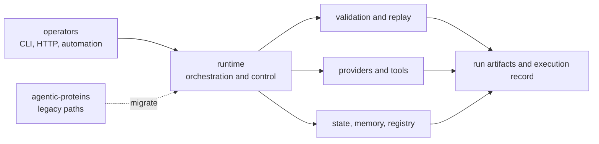

# Runtime Handbook

`bijux-proteomics-runtime` is the canonical execution package for the
proteomics family. It owns how work is invoked, orchestrated, replayed, and
made inspectable after the run. This is where the system becomes operational:
operators touch it, providers plug into it, state moves through it, and runs
leave artifacts behind that a reviewer can inspect later.

## Why This Package Is Central

- it is the place where abstract package contracts become concrete runs
- it keeps execution reviewable instead of letting provider calls disappear into
  opaque side effects
- it holds the operational seam between the product family and the outside
  world

## Start With

- open [agentic-proteins](https://bijux.io/bijux-proteomics/02-agentic-proteins/) when the question starts from a legacy import, CLI path, or API surface
- open [Flagship Run Registry](https://bijux.io/bijux-proteomics/09-bijux-proteomics-runtime/flagship-run-registry/) when the question is which public benchmark runs are actually checked and what claims they authorize
- open [Benchmark Rerun Kits](https://bijux.io/bijux-proteomics/09-bijux-proteomics-runtime/benchmark-rerun-kits/) when the question is how to reopen a workflow family from its primary and companion package roots without maintainer narration
- open [Benchmark Comparability Matrix](https://bijux.io/bijux-proteomics/09-bijux-proteomics-runtime/benchmark-comparability-matrix/) when the question is whether a workflow sentence survives both the flagship package and the companion generalization package
- open [Black-Box Benchmark Dashboard](https://bijux.io/bijux-proteomics/09-bijux-proteomics-runtime/black-box-benchmark-dashboard/) when the question is whether current public workflow language is actually supported by the live rerun evidence
- open [Runtime Proof Accounting](https://bijux.io/bijux-proteomics/09-bijux-proteomics-runtime/runtime-proof-accounting/) when the question is whether a runtime claim is raw, import-backed, replay-backed, or simulation-only
- open [Migration Ledger](https://bijux.io/bijux-proteomics/09-bijux-proteomics-runtime/migration-ledger/) when the question is whether a legacy module still belongs in runtime ownership
- open the lower package handbooks when the disputed behavior is really domain, evidence, recommendation, or lab meaning

## What Runtime Owns

- operator entrypoints such as CLI and HTTP surfaces
- provider binding, execution adapters, and workspace control
- run orchestration, replay, determinism, and state transitions
- runtime artifacts and execution-lifecycle records

## What Runtime Refuses

- canonical domain and biology semantics
- evidence, confidence, contradiction, and review semantics
- recommendation policy, scoring, and design-loop meaning
- planning and outcome-promotion meaning from the lab layer

## First Proof Check

- `packages/bijux-proteomics-runtime/src/bijux_proteomics_runtime/api/cli.py`
- `packages/bijux-proteomics-runtime/src/bijux_proteomics_runtime/api/`
- `packages/bijux-proteomics-runtime/src/bijux_proteomics_runtime/execution/`, `providers/`, and `state/`
- `packages/bijux-proteomics-runtime/tests`

## Migration References

- [Repository Runtime Migration Validation](https://bijux.io/bijux-proteomics/01-bijux-proteomics/operations/runtime-migration-validation/)
- [Migration Ledger](https://bijux.io/bijux-proteomics/09-bijux-proteomics-runtime/migration-ledger/)
- [Agentic Module Ledger Summary](https://bijux.io/bijux-proteomics/09-bijux-proteomics-runtime/migration-ledger/agentic-proteins-module-ledger-summary/)

## Boundary

Runtime should explain execution clearly, but it should not quietly absorb the
meaning of evidence, recommendation, or lab intent just because those meanings
eventually move through a run.
