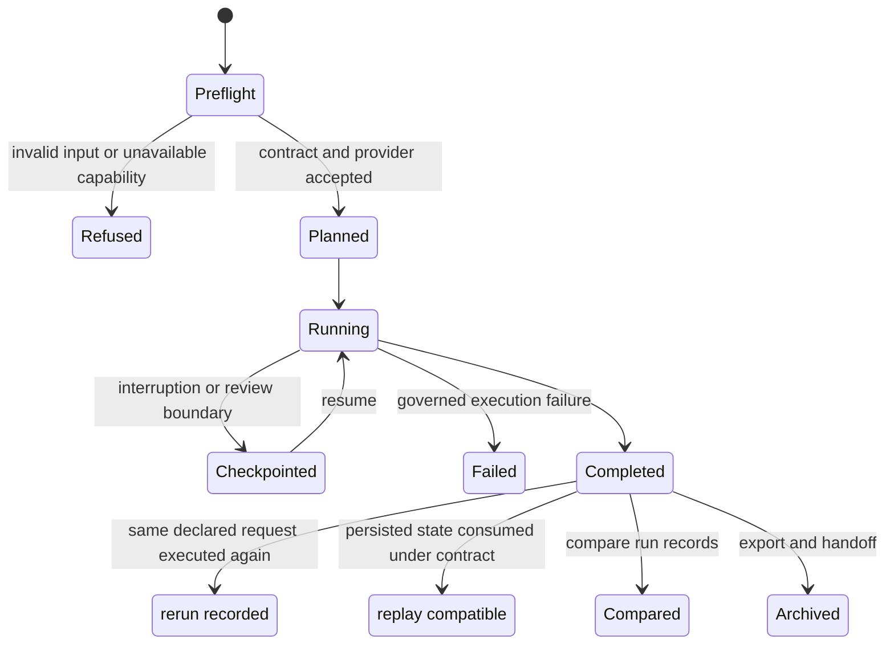
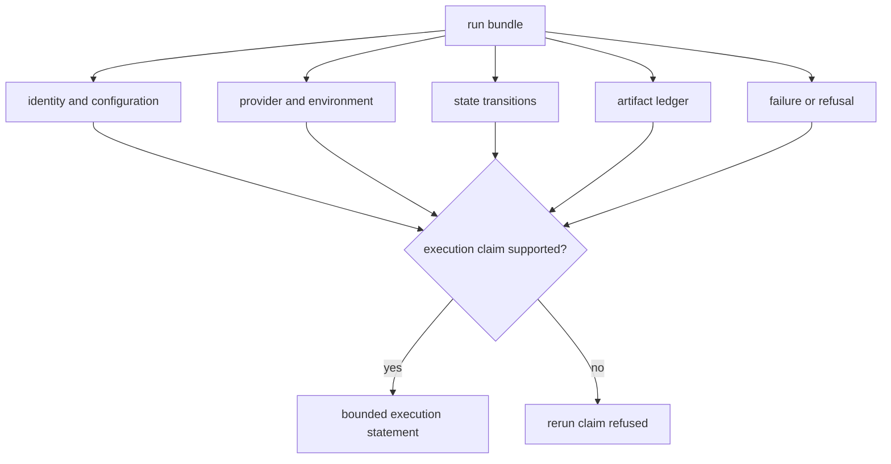
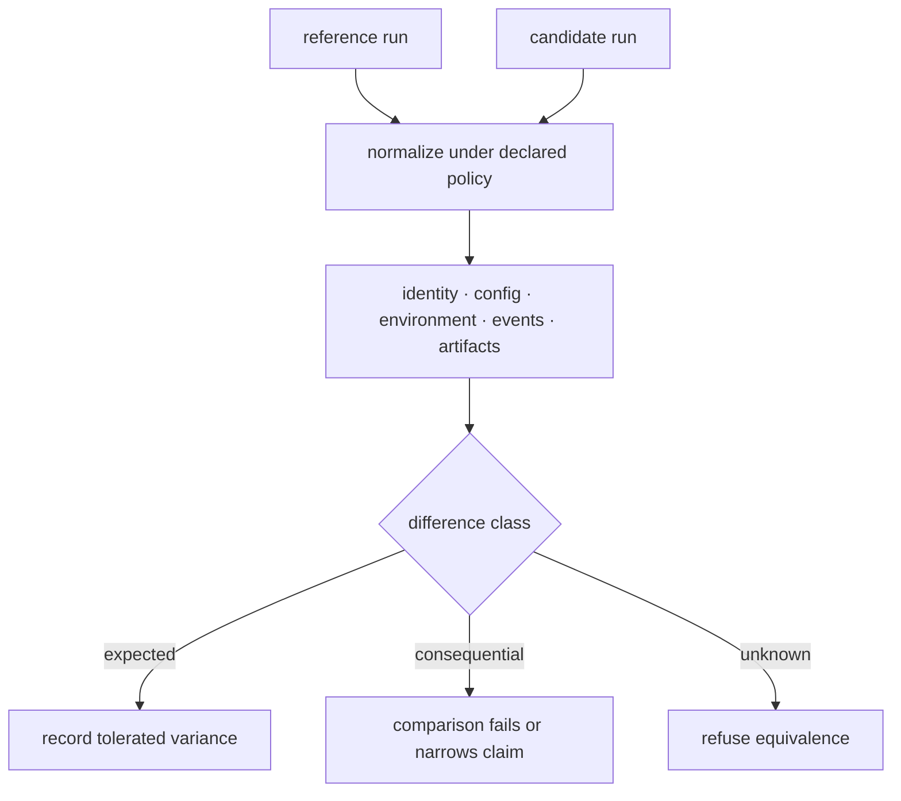
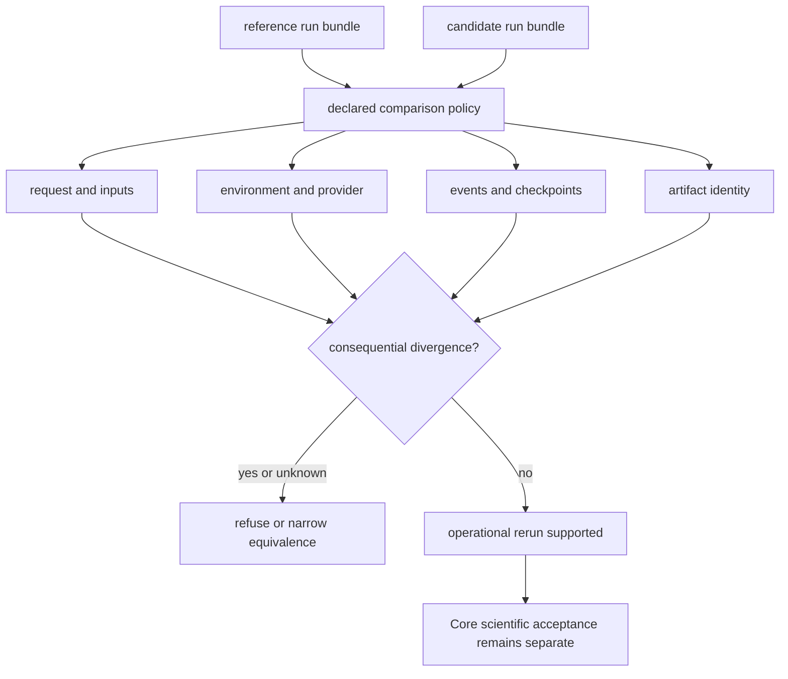

# bijux-proteomics-runtime

`bijux-proteomics-runtime` is the canonical execution layer. It turns validated
workflow requests into inspectable runs with explicit configuration, provider
selection, lifecycle state, checkpoints, artifacts, comparison, replay, and
operator handoff.

```bash
python -m pip install bijux-proteomics-runtime
bijux-proteomics-runtime --help
```

## Open the record that explains the symptom

Runtime failures and differences are diagnosable only when the operator starts
from the record that owns the disputed transition.

| Symptom | Open first | Evidence that resolves it |
| --- | --- | --- |
| work never started | preflight report | request validation, required capability, environment checks, provider availability, and typed refusal |
| a different provider or mode ran | provider decision | requested and selected capability, fallback reason, environment, and assurance result |
| execution stopped unexpectedly | lifecycle events and failure report | last accepted state, operation identity, diagnostics, partial artifacts, and recovery boundary |
| resume does not continue as expected | checkpoint history and state snapshot | checkpoint identity, compatibility, parent run, restored state, and resumed transitions |
| output is missing or changed | artifact ledger and comparison report | artifact identity, producer, hash, lineage, cache decision, stability class, and normalized difference |
| an imported result appears equivalent to native execution | provenance and execution-posture record | external engine, source file, version, custody, normalization, and explicit import ceiling |
| a rerun completed but cannot support reproduction | rerun closure record | source and rerun identities, environment and provider drift, comparison policy, differences, and disposition |

Do not infer the cause from the terminal label alone. `Completed`, `failed`, and
`refused` summarize a run; the owning records explain what happened and which
claim remains supportable.

## Runtime lifecycle



Runtime records execution truth: what was requested, selected, attempted,
produced, refused, or failed. It does not convert operational success into a
scientific or biological claim.

## Run contract

| Stage | Runtime records | Review question |
| --- | --- | --- |
| preflight | request identity, validation, capability and environment checks | was the work executable under declared conditions? |
| planning | resolved configuration, graph, tools, provider decision, fallbacks | what did Runtime intend to execute? |
| running | state transitions, structured logs, telemetry, checkpoints | what actually happened and where can it resume? |
| termination | completion, refusal, or governed failure | why did execution stop? |
| custody | artifact ledger, hashes, cache decisions, handoff archive | which bytes belong to this run? |
| review | comparison, rerun, replay, and provenance results | what is equivalent, different, or not reproducible? |

## Operator surfaces

- The `bijux-proteomics-runtime` CLI starts, resumes, compares, reproduces,
  inspects, imports, and exports runs.
- `create_app()` exposes the FastAPI application and versioned route surface.
- `RunManager` provides the direct Python execution owner.
- `AppConfig` configures the HTTP application.
- `agentic-proteins` forwards historical commands and imports to these
  canonical owners.

See the [CLI reference](cli-reference.md) for exact commands and examples.

## Execution subsystems

| Subsystem | Responsibility |
| --- | --- |
| `api` | CLI, FastAPI application, v1 routes, request context, errors, logging, and command output |
| `execution` | agent and tool contracts, planning, compilation, graph validation, engine, evaluation, and validation |
| `providers` | capability discovery, selection, assurance, environment checks, and built-in, local, or remote implementations |
| `runs` | configuration, preflight, context, lifecycle, manager, ledger, artifacts, checkpoints, cache, telemetry, recovery, replay, and reruns |
| `state` | memory records, stores, schemas, and snapshots |
| `parallel` and `streaming` | controlled alternative execution modes |
| `rehydrate`, `resume`, and `diff` | recovery, continuation, and completed-run comparison |
| `handoff` | portable archive bundles |

## Provider boundary

The built-in heuristic provider supports deterministic local behavior.
Structure providers such as ESMFold, RoseTTAFold, ColabFold, and OpenProtein
are opt-in and carry environment, dependency, network, hardware, and upstream
service constraints. Provider selection and capability checks are recorded in
the run. A fallback must remain visible; it cannot masquerade as the requested
provider.

## Run evidence

A reviewable run includes its request, normalized configuration, environment
and version identity, provider decision, lifecycle transitions, structured
logs, checkpoints, artifact hashes, failure or refusal information, and output
summary. Replay verifies declared runtime behavior under a compatible
environment; comparison identifies relevant differences between completed
runs.

Imported results have a distinct provenance route. Supplying an external
engine name, version, source file, and sequence creates an import-backed run
record; it does not make the external computation native or independently
reproducible.

## Native, delegated, and imported work

| Execution posture | Runtime controls | Evidence ceiling |
| --- | --- | --- |
| native | implementation, configuration, state, artifacts, and failures | rerun and replay claims within the recorded environment contract |
| delegated provider | request, selection, transport, custody, and returned artifacts | provider-conditioned execution; upstream service remains external |
| imported result | intake validation, provenance, normalization, and downstream custody | review of supplied outputs; no claim that Runtime executed the source engine |

These postures cannot be collapsed into a generic completed state. Provider
fallbacks and imported sources remain visible in the run bundle and comparison
record.

## Read a run without overclaiming



Runtime can establish that a particular request executed under recorded
conditions and produced identified artifacts. Core determines scientific
acceptance. Knowledge determines evidential grounding. Intelligence determines
recommendation posture. Lab determines readiness and records experimental
consequence.

## Reproduction levels

| Statement | Minimum evidence |
| --- | --- |
| rerunnable | inputs, environment contract, provider availability, configuration, and instructions are complete |
| rerun | a new run bundle records execution of the same declared request |
| replay-compatible | persisted state and events can be consumed under the declared compatibility contract |
| comparable | a comparison record explains relevant identity, configuration, environment, and artifact differences |
| scientifically reproduced | Core acceptance and domain evidence support equivalence; runtime equality alone is insufficient |

See [artifact stability](runtime-artifact-stability.md),
[environment contracts](runtime-environment-contracts.md), and
[rerun refusals](runtime-rerun-refusals.md) before using reproduction language.

## Comparison semantics

A run comparison separates expected and consequential differences. Timestamps,
generated identifiers, environment changes, provider versions, configuration,
input digests, lifecycle events, and artifact digests are compared under named
rules. Ignoring a field requires a declared normalization policy; it is not a
license to discard inconvenient divergence.



Runtime comparison establishes operational equivalence only. Scientific
equivalence still requires the Core acceptance contract and domain evidence.

## Benchmark execution evidence

| Review surface | Question answered |
| --- | --- |
| [Benchmark Rerun Kits](benchmark-rerun-kits.md) | are the inputs, environment contract, entrypoint, and expected artifacts sufficient for another run? |
| [Benchmark Comparability Matrix](benchmark-comparability-matrix.md) | which workflow families and execution postures can be compared under a declared rule? |
| [Black-Box Benchmark Dashboard](black-box-benchmark-dashboard.md) | did the public execution lane pass rerun, refusal, artifact, and comparison checks? |
| [Flagship Run Registry](flagship-run-registry.md) | which run and artifact identities anchor the published evidence? |

These surfaces establish Runtime evidence only. Their verdicts constrain
workflow claims but do not replace Core acceptance, grounding, recommendation
challenge, or laboratory consequence.

## Current execution ceiling

Runtime evidence is not uniformly strong across workflow families. Family
execution posture and repository release readiness answer different questions:
the first limits one workflow claim; the second requires every applicable
release category to pass.

| Family | Black-box allowed posture | Execution evidence | Remaining ceiling |
| --- | --- | --- | --- |
| DDA | `review_grade_bounded` | primary and companion lanes are `import_only` | no repository-owned raw search execution; the stronger requested posture is blocked |
| DIA | `outsider_auditable_bounded` | primary and companion lanes are raw-executable over checked reports | no chromatogram-native replay; library completeness and absent-peptide consequences remain bounded |
| LFQ | `outsider_auditable_bounded` | primary and companion lanes are raw-executable over checked features | accuracy beyond repeatability and transfer beyond the current cohort package remain bounded |
| multiplex | `internal_support_only` | both lanes are raw-executable, but companion transfer is fragile | collapsed companion claim, absent outsider decision route, and absent lab packet prevent promotion |
| PTM | `outsider_auditable_bounded` | both lanes are raw-executable over checked localization inputs | occupancy, function, and regulatory consequence remain outside localization evidence |
| targeted | `outsider_auditable_bounded` | both lanes are raw-executable over checked targeted QC | vendor parity, calibration transfer, matrix interference, and assay burden remain bounded |

The [Black-Box Benchmark Dashboard](black-box-benchmark-dashboard.md) owns
installed-entrypoint execution language. The
[Workflow Families](../01-bijux-proteomics/foundation/workflow-families.md)
ledger owns product posture. The
[Release Readiness Matrix](../01-bijux-proteomics/foundation/release-readiness-matrix.md)
owns repository publication status. A DIA lane can therefore support bounded
outsider execution language while repository black-box readiness remains
blocked by the stronger chromatogram-native replay burden. That is a scope
difference, not permission to choose the more convenient verdict. When two
surfaces address the same scope and disagree, the narrower live verdict
governs and the disagreement remains visible as release work.

The execution evidence can be audited from the boundary inward:

- [Runtime Execution Boundary](runtime-execution-boundary.md) identifies the
  canonical manifest-producing routes;
- [Black-Box Run Verification](black-box-run-verification.md) checks installed
  entrypoints and observable output;
- [Raw Versus Import Execution](raw-versus-import-execution.md) separates
  native computation from external-result custody;
- [Runtime Replay Challenges](runtime-replay-challenges.md) applies state,
  environment, and artifact pressure;
- [Runtime Environment Contracts](runtime-environment-contracts.md) records
  provider and system assumptions;
- [Runtime Artifact Stability](runtime-artifact-stability.md) defines identity
  and comparison guarantees;
- [Runtime Rerun Refusals](runtime-rerun-refusals.md) states when rerun language
  is unsupported.

## Verify A Rerun Claim

A new terminal `completed` state is not enough to call work reproduced. Compare
the new run with the reference at the request, environment, provider, event,
artifact, and scientific-acceptance boundaries.

| Boundary | Evidence to compare | Refuse the rerun claim when |
| --- | --- | --- |
| request | workflow contract, inputs, policy, expected artifacts | a required input or scientific policy changed without a declared comparison rule |
| environment | package, tool, model, hardware, service, and configuration versions | the effective environment is unknown or incompatible |
| provider | requested, selected, fallback, capability, and execution posture | fallback or import custody is presented as native execution |
| lifecycle | preflight, state transitions, checkpoints, retries, and terminal disposition | the event history cannot explain how completion was reached |
| artifacts | ledger membership, digests, lineage, cache decisions, and missing outputs | required output is absent or content identity diverges consequentially |
| science | Core acceptance, QC, ambiguity, and known limits | operational similarity does not satisfy the family-specific scientific contract |



The [Workflow Families](../01-bijux-proteomics/foundation/workflow-families.md)
ledger still limits public posture, [Benchmark Assets](../04-bijux-proteomics-core/foundation/benchmark-assets.md)
defines the scientific inputs, and
[Decision Support](../01-bijux-proteomics/foundation/decision-support.md) begins
only after execution and scientific evidence are independently acceptable.

## Continue By Execution Question

| Need | Read next | Review is complete when |
| --- | --- | --- |
| understand the execution model and run record | [execution overview](execution-overview.md) | request, configuration, provider, state, artifacts, and terminal disposition resolve to one run identity |
| reopen a workflow from public evidence | [operator rerun journey](operator-rerun-journey.md) | another operator can resolve inputs, environment, entrypoint, expected artifacts, and comparison policy |
| execute and compare a benchmark lane | [Benchmark Rerun Kits](benchmark-rerun-kits.md) and the [comparability matrix](benchmark-comparability-matrix.md) | reference and candidate runs have a declared equivalence result with every consequential difference retained |
| distinguish native execution from external-result custody | [raw versus import execution](raw-versus-import-execution.md) | the selected provider, fallback, import source, and external responsibility are visible |
| assess persistence and comparison guarantees | [artifact stability](runtime-artifact-stability.md) | identity, schema, lineage, digest, and tolerated variance are declared rather than inferred |
| reproduce provider and system assumptions | [environment contracts](runtime-environment-contracts.md) | package, tool, model, hardware, service, and configuration requirements are resolvable |
| understand why a rerun claim is refused | [rerun refusals](runtime-rerun-refusals.md) | the missing contract, owner, evidence, and valid recovery route are named |
| migrate a historical caller | [migration ledger](migration-ledger/README.md) | caller-specific observable parity supports direct use of the canonical Runtime owner |

Runtime does not own core scientific semantics, knowledge grounding,
recommendation policy, or laboratory readiness.
