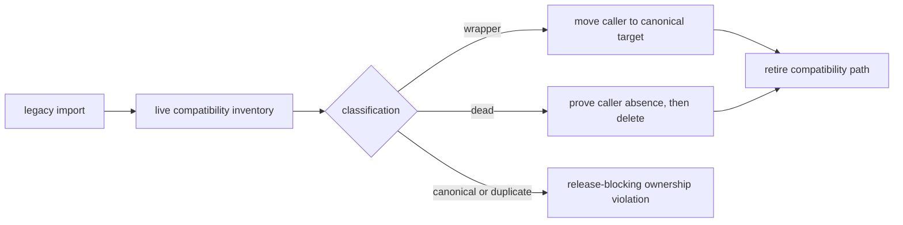

# agentic-proteins Canonical Migration Guide

This guide shows how compatibility imports map back to canonical package ownership. The point is not to preserve the bridge forever; it is to make every remaining legacy path reviewable and replaceable.

## Migration Decision



The inventory is a routing authority, not a parity claim. A canonical import still requires surface-specific compatibility evidence before a caller can move safely.

## Current Posture

- total compatibility modules: 117
- wrapper modules: 112
- dead modules: 5

## Migration Map

| legacy module | status | canonical target(s) | migration action |
| --- | --- | --- | --- |
| `agentic_proteins.__init__` | `wrapper` | `bijux_proteomics_runtime` | replace `agentic_proteins.__init__` with `bijux_proteomics_runtime` and retire the compat import |
| `agentic_proteins.agents` | `wrapper` | `bijux_proteomics_runtime.execution.agents.catalog`<br>`bijux_proteomics_runtime.execution.agents.contracts` | replace `agentic_proteins.agents` with one of `bijux_proteomics_runtime.execution.agents.catalog`, `bijux_proteomics_runtime.execution.agents.contracts` based on the live owner |
| `agentic_proteins.agents.analysis` | `dead` | _none declared_ | delete `agentic_proteins.agents.analysis` after confirming no callers remain |
| `agentic_proteins.agents.analysis.failure_analysis` | `wrapper` | `bijux_proteomics_runtime.execution.agents.analysis.failure_analysis` | replace `agentic_proteins.agents.analysis.failure_analysis` with `bijux_proteomics_runtime.execution.agents.analysis.failure_analysis` and retire the compat import |
| `agentic_proteins.agents.analysis.sequence_analysis` | `wrapper` | `bijux_proteomics_runtime.execution.agents.analysis.sequence_analysis` | replace `agentic_proteins.agents.analysis.sequence_analysis` with `bijux_proteomics_runtime.execution.agents.analysis.sequence_analysis` and retire the compat import |
| `agentic_proteins.agents.analysis.structure` | `wrapper` | `bijux_proteomics_runtime.execution.agents.analysis.structure` | replace `agentic_proteins.agents.analysis.structure` with `bijux_proteomics_runtime.execution.agents.analysis.structure` and retire the compat import |
| `agentic_proteins.agents.base` | `wrapper` | `bijux_proteomics_runtime.execution.agents.base` | replace `agentic_proteins.agents.base` with `bijux_proteomics_runtime.execution.agents.base` and retire the compat import |
| `agentic_proteins.agents.base.base` | `wrapper` | `bijux_proteomics_runtime.execution.agents.base.base` | replace `agentic_proteins.agents.base.base` with `bijux_proteomics_runtime.execution.agents.base.base` and retire the compat import |
| `agentic_proteins.agents.catalog` | `wrapper` | `bijux_proteomics_runtime.execution.agents.catalog` | replace `agentic_proteins.agents.catalog` with `bijux_proteomics_runtime.execution.agents.catalog` and retire the compat import |
| `agentic_proteins.agents.contracts` | `wrapper` | `bijux_proteomics_runtime.execution.agents.contracts` | replace `agentic_proteins.agents.contracts` with `bijux_proteomics_runtime.execution.agents.contracts` and retire the compat import |
| `agentic_proteins.agents.coordination` | `wrapper` | `bijux_proteomics_runtime.execution.agents.coordination.coordinator` | replace `agentic_proteins.agents.coordination` with `bijux_proteomics_runtime.execution.agents.coordination.coordinator` and retire the compat import |
| `agentic_proteins.agents.coordination.coordinator` | `wrapper` | `bijux_proteomics_runtime.execution.agents.coordination.coordinator` | replace `agentic_proteins.agents.coordination.coordinator` with `bijux_proteomics_runtime.execution.agents.coordination.coordinator` and retire the compat import |
| `agentic_proteins.agents.execution` | `wrapper` | `bijux_proteomics_runtime.execution.agents.coordination` | replace `agentic_proteins.agents.execution` with `bijux_proteomics_runtime.execution.agents.coordination` and retire the compat import |
| `agentic_proteins.agents.execution.coordinator` | `wrapper` | `bijux_proteomics_runtime.execution.agents.coordination.coordinator` | replace `agentic_proteins.agents.execution.coordinator` with `bijux_proteomics_runtime.execution.agents.coordination.coordinator` and retire the compat import |
| `agentic_proteins.agents.planning` | `dead` | _none declared_ | delete `agentic_proteins.agents.planning` after confirming no callers remain |
| `agentic_proteins.agents.planning.compiler` | `wrapper` | `bijux_proteomics_runtime.execution.agents.planning.compiler` | replace `agentic_proteins.agents.planning.compiler` with `bijux_proteomics_runtime.execution.agents.planning.compiler` and retire the compat import |
| `agentic_proteins.agents.planning.generation` | `wrapper` | `bijux_proteomics_runtime.execution.agents.planning.generation` | replace `agentic_proteins.agents.planning.generation` with `bijux_proteomics_runtime.execution.agents.planning.generation` and retire the compat import |
| `agentic_proteins.agents.planning.planner` | `wrapper` | `bijux_proteomics_runtime.execution.agents.planning.planner` | replace `agentic_proteins.agents.planning.planner` with `bijux_proteomics_runtime.execution.agents.planning.planner` and retire the compat import |
| `agentic_proteins.agents.planning.schemas` | `wrapper` | `bijux_proteomics_runtime.execution.agents.planning.schemas` | replace `agentic_proteins.agents.planning.schemas` with `bijux_proteomics_runtime.execution.agents.planning.schemas` and retire the compat import |
| `agentic_proteins.agents.planning.validation` | `wrapper` | `bijux_proteomics_runtime.execution.agents.planning.validation` | replace `agentic_proteins.agents.planning.validation` with `bijux_proteomics_runtime.execution.agents.planning.validation` and retire the compat import |
| `agentic_proteins.agents.reporting` | `dead` | _none declared_ | delete `agentic_proteins.agents.reporting` after confirming no callers remain |
| `agentic_proteins.agents.reporting.reporting` | `wrapper` | `bijux_proteomics_runtime.execution.agents.reporting.reporting` | replace `agentic_proteins.agents.reporting.reporting` with `bijux_proteomics_runtime.execution.agents.reporting.reporting` and retire the compat import |
| `agentic_proteins.agents.schemas` | `wrapper` | `bijux_proteomics_runtime.execution.agents.schemas` | replace `agentic_proteins.agents.schemas` with `bijux_proteomics_runtime.execution.agents.schemas` and retire the compat import |
| `agentic_proteins.agents.verification` | `dead` | _none declared_ | delete `agentic_proteins.agents.verification` after confirming no callers remain |
| `agentic_proteins.agents.verification.critic` | `wrapper` | `bijux_proteomics_runtime.execution.agents.verification.critic` | replace `agentic_proteins.agents.verification.critic` with `bijux_proteomics_runtime.execution.agents.verification.critic` and retire the compat import |
| `agentic_proteins.agents.verification.input_validation` | `wrapper` | `bijux_proteomics_runtime.execution.agents.verification.input_validation` | replace `agentic_proteins.agents.verification.input_validation` with `bijux_proteomics_runtime.execution.agents.verification.input_validation` and retire the compat import |
| `agentic_proteins.agents.verification.quality_control` | `wrapper` | `bijux_proteomics_runtime.execution.agents.verification.quality_control` | replace `agentic_proteins.agents.verification.quality_control` with `bijux_proteomics_runtime.execution.agents.verification.quality_control` and retire the compat import |
| `agentic_proteins.execution` | `wrapper` | `bijux_proteomics_runtime.execution.graph_validation`<br>`bijux_proteomics_runtime.runs.analysis`<br>`bijux_proteomics_runtime.runs.logging`<br>`bijux_proteomics_runtime.runs.manager`<br>`bijux_proteomics_runtime.runs.run_config`<br>`bijux_proteomics_runtime.runs.telemetry`<br>`bijux_proteomics_runtime.runs.tool_reliability` | replace `agentic_proteins.execution` with one of `bijux_proteomics_runtime.execution.graph_validation`, `bijux_proteomics_runtime.runs.analysis`, `bijux_proteomics_runtime.runs.logging`, `bijux_proteomics_runtime.runs.manager`, `bijux_proteomics_runtime.runs.run_config`, `bijux_proteomics_runtime.runs.telemetry`, `bijux_proteomics_runtime.runs.tool_reliability` based on the live owner |
| `agentic_proteins.execution.analysis` | `wrapper` | `bijux_proteomics_runtime.runs.analysis` | replace `agentic_proteins.execution.analysis` with `bijux_proteomics_runtime.runs.analysis` and retire the compat import |
| `agentic_proteins.execution.artifacts` | `wrapper` | `bijux_proteomics_runtime.runs.artifacts` | replace `agentic_proteins.execution.artifacts` with `bijux_proteomics_runtime.runs.artifacts` and retire the compat import |
| `agentic_proteins.execution.compiler` | `wrapper` | `bijux_proteomics_runtime.execution.compiler` | replace `agentic_proteins.execution.compiler` with `bijux_proteomics_runtime.execution.compiler` and retire the compat import |
| `agentic_proteins.execution.compiler.boundary` | `wrapper` | `bijux_proteomics_runtime.execution.compiler.boundary` | replace `agentic_proteins.execution.compiler.boundary` with `bijux_proteomics_runtime.execution.compiler.boundary` and retire the compat import |
| `agentic_proteins.execution.evaluation` | `wrapper` | `bijux_proteomics_runtime.execution.evaluation` | replace `agentic_proteins.execution.evaluation` with `bijux_proteomics_runtime.execution.evaluation` and retire the compat import |
| `agentic_proteins.execution.evaluation.evaluation` | `wrapper` | `bijux_proteomics_runtime.execution.evaluation.evaluation` | replace `agentic_proteins.execution.evaluation.evaluation` with `bijux_proteomics_runtime.execution.evaluation.evaluation` and retire the compat import |
| `agentic_proteins.execution.evaluation.observations` | `wrapper` | `bijux_proteomics_runtime.execution.evaluation.observations` | replace `agentic_proteins.execution.evaluation.observations` with `bijux_proteomics_runtime.execution.evaluation.observations` and retire the compat import |
| `agentic_proteins.execution.evaluation.schemas` | `wrapper` | `bijux_proteomics_runtime.execution.evaluation.schemas` | replace `agentic_proteins.execution.evaluation.schemas` with `bijux_proteomics_runtime.execution.evaluation.schemas` and retire the compat import |
| `agentic_proteins.execution.graphs` | `wrapper` | `bijux_proteomics_runtime.execution.graph_validation` | replace `agentic_proteins.execution.graphs` with `bijux_proteomics_runtime.execution.graph_validation` and retire the compat import |
| `agentic_proteins.execution.logging` | `wrapper` | `bijux_proteomics_runtime.runs.logging` | replace `agentic_proteins.execution.logging` with `bijux_proteomics_runtime.runs.logging` and retire the compat import |
| `agentic_proteins.execution.manager` | `wrapper` | `bijux_proteomics_runtime.runs.manager` | replace `agentic_proteins.execution.manager` with `bijux_proteomics_runtime.runs.manager` and retire the compat import |
| `agentic_proteins.execution.run_config` | `wrapper` | `bijux_proteomics_runtime.runs.run_config` | replace `agentic_proteins.execution.run_config` with `bijux_proteomics_runtime.runs.run_config` and retire the compat import |
| `agentic_proteins.execution.runtime` | `wrapper` | `bijux_proteomics_runtime.execution.engine` | replace `agentic_proteins.execution.runtime` with `bijux_proteomics_runtime.execution.engine` and retire the compat import |
| `agentic_proteins.execution.runtime.executor` | `wrapper` | `bijux_proteomics_runtime.execution.engine.executor` | replace `agentic_proteins.execution.runtime.executor` with `bijux_proteomics_runtime.execution.engine.executor` and retire the compat import |
| `agentic_proteins.execution.runtime.integration` | `wrapper` | `bijux_proteomics_runtime.execution.engine.integration` | replace `agentic_proteins.execution.runtime.integration` with `bijux_proteomics_runtime.execution.engine.integration` and retire the compat import |
| `agentic_proteins.execution.schemas` | `wrapper` | `bijux_proteomics_runtime.execution.schemas` | replace `agentic_proteins.execution.schemas` with `bijux_proteomics_runtime.execution.schemas` and retire the compat import |
| `agentic_proteins.execution.state_machine` | `wrapper` | `bijux_proteomics_runtime.runs.state_machine` | replace `agentic_proteins.execution.state_machine` with `bijux_proteomics_runtime.runs.state_machine` and retire the compat import |
| `agentic_proteins.execution.telemetry` | `wrapper` | `bijux_proteomics_runtime.runs.telemetry` | replace `agentic_proteins.execution.telemetry` with `bijux_proteomics_runtime.runs.telemetry` and retire the compat import |
| `agentic_proteins.execution.tool_reliability` | `wrapper` | `bijux_proteomics_runtime.runs.tool_reliability` | replace `agentic_proteins.execution.tool_reliability` with `bijux_proteomics_runtime.runs.tool_reliability` and retire the compat import |
| `agentic_proteins.execution.validation` | `wrapper` | `bijux_proteomics_runtime.execution.validation` | replace `agentic_proteins.execution.validation` with `bijux_proteomics_runtime.execution.validation` and retire the compat import |
| `agentic_proteins.interfaces` | `wrapper` | `bijux_proteomics_runtime.api.app` | replace `agentic_proteins.interfaces` with `bijux_proteomics_runtime.api.app` and retire the compat import |
| `agentic_proteins.interfaces.cli` | `wrapper` | `bijux_proteomics_runtime.api.cli` | replace `agentic_proteins.interfaces.cli` with `bijux_proteomics_runtime.api.cli` and retire the compat import |
| `agentic_proteins.interfaces.http` | `wrapper` | `bijux_proteomics_runtime.api.app` | replace `agentic_proteins.interfaces.http` with `bijux_proteomics_runtime.api.app` and retire the compat import |
| `agentic_proteins.interfaces.http.app` | `wrapper` | `bijux_proteomics_runtime.api.app` | replace `agentic_proteins.interfaces.http.app` with `bijux_proteomics_runtime.api.app` and retire the compat import |
| `agentic_proteins.interfaces.http.deps` | `wrapper` | `bijux_proteomics_runtime.api.deps` | replace `agentic_proteins.interfaces.http.deps` with `bijux_proteomics_runtime.api.deps` and retire the compat import |
| `agentic_proteins.interfaces.http.errors` | `wrapper` | `bijux_proteomics_runtime.api.errors` | replace `agentic_proteins.interfaces.http.errors` with `bijux_proteomics_runtime.api.errors` and retire the compat import |
| `agentic_proteins.interfaces.http.middleware` | `wrapper` | `bijux_proteomics_runtime.api.middleware` | replace `agentic_proteins.interfaces.http.middleware` with `bijux_proteomics_runtime.api.middleware` and retire the compat import |
| `agentic_proteins.interfaces.http.v1` | `dead` | _none declared_ | delete `agentic_proteins.interfaces.http.v1` after confirming no callers remain |
| `agentic_proteins.interfaces.http.v1.endpoints` | `wrapper` | `bijux_proteomics_runtime.api.v1.endpoints` | replace `agentic_proteins.interfaces.http.v1.endpoints` with `bijux_proteomics_runtime.api.v1.endpoints` and retire the compat import |
| `agentic_proteins.interfaces.http.v1.endpoints.compare` | `wrapper` | `bijux_proteomics_runtime.api.v1.endpoints.compare` | replace `agentic_proteins.interfaces.http.v1.endpoints.compare` with `bijux_proteomics_runtime.api.v1.endpoints.compare` and retire the compat import |
| `agentic_proteins.interfaces.http.v1.endpoints.inspect` | `wrapper` | `bijux_proteomics_runtime.api.v1.endpoints.inspect` | replace `agentic_proteins.interfaces.http.v1.endpoints.inspect` with `bijux_proteomics_runtime.api.v1.endpoints.inspect` and retire the compat import |
| `agentic_proteins.interfaces.http.v1.endpoints.resume` | `wrapper` | `bijux_proteomics_runtime.api.v1.endpoints.resume` | replace `agentic_proteins.interfaces.http.v1.endpoints.resume` with `bijux_proteomics_runtime.api.v1.endpoints.resume` and retire the compat import |
| `agentic_proteins.interfaces.http.v1.endpoints.run` | `wrapper` | `bijux_proteomics_runtime.api.v1.endpoints.run` | replace `agentic_proteins.interfaces.http.v1.endpoints.run` with `bijux_proteomics_runtime.api.v1.endpoints.run` and retire the compat import |
| `agentic_proteins.interfaces.http.v1.router` | `wrapper` | `bijux_proteomics_runtime.api.v1.router` | replace `agentic_proteins.interfaces.http.v1.router` with `bijux_proteomics_runtime.api.v1.router` and retire the compat import |
| `agentic_proteins.interfaces.http.v1.schema` | `wrapper` | `bijux_proteomics_runtime.api.v1.schema` | replace `agentic_proteins.interfaces.http.v1.schema` with `bijux_proteomics_runtime.api.v1.schema` and retire the compat import |
| `agentic_proteins.interfaces.structure_reports` | `wrapper` | `bijux_proteomics.review.structure_reports`<br>`bijux_proteomics.review.structure_reports.render` | replace `agentic_proteins.interfaces.structure_reports` with one of `bijux_proteomics.review.structure_reports`, `bijux_proteomics.review.structure_reports.render` based on the live owner |
| `agentic_proteins.orchestration` | `wrapper` | `bijux_proteomics_runtime.execution`<br>`bijux_proteomics_runtime.governance.compatibility_bridges`<br>`bijux_proteomics_runtime.runs` | replace `agentic_proteins.orchestration` with one of `bijux_proteomics_runtime.execution`, `bijux_proteomics_runtime.governance.compatibility_bridges`, `bijux_proteomics_runtime.runs` based on the live owner |
| `agentic_proteins.orchestration.analysis` | `wrapper` | `bijux_proteomics_runtime.runs.analysis` | replace `agentic_proteins.orchestration.analysis` with `bijux_proteomics_runtime.runs.analysis` and retire the compat import |
| `agentic_proteins.orchestration.artifacts` | `wrapper` | `bijux_proteomics_runtime.runs.artifacts` | replace `agentic_proteins.orchestration.artifacts` with `bijux_proteomics_runtime.runs.artifacts` and retire the compat import |
| `agentic_proteins.orchestration.bridge_contracts` | `wrapper` | `bijux_proteomics_runtime.governance.compatibility_bridges` | replace `agentic_proteins.orchestration.bridge_contracts` with `bijux_proteomics_runtime.governance.compatibility_bridges` and retire the compat import |
| `agentic_proteins.orchestration.compiler` | `wrapper` | `bijux_proteomics_runtime.execution.compiler` | replace `agentic_proteins.orchestration.compiler` with `bijux_proteomics_runtime.execution.compiler` and retire the compat import |
| `agentic_proteins.orchestration.compiler.boundary` | `wrapper` | `bijux_proteomics_runtime.execution.compiler.boundary` | replace `agentic_proteins.orchestration.compiler.boundary` with `bijux_proteomics_runtime.execution.compiler.boundary` and retire the compat import |
| `agentic_proteins.orchestration.evaluation` | `wrapper` | `bijux_proteomics_runtime.execution.evaluation` | replace `agentic_proteins.orchestration.evaluation` with `bijux_proteomics_runtime.execution.evaluation` and retire the compat import |
| `agentic_proteins.orchestration.evaluation.evaluation` | `wrapper` | `bijux_proteomics_runtime.execution.evaluation.evaluation` | replace `agentic_proteins.orchestration.evaluation.evaluation` with `bijux_proteomics_runtime.execution.evaluation.evaluation` and retire the compat import |
| `agentic_proteins.orchestration.evaluation.observations` | `wrapper` | `bijux_proteomics_runtime.execution.evaluation.observations` | replace `agentic_proteins.orchestration.evaluation.observations` with `bijux_proteomics_runtime.execution.evaluation.observations` and retire the compat import |
| `agentic_proteins.orchestration.evaluation.schemas` | `wrapper` | `bijux_proteomics_runtime.execution.evaluation.schemas` | replace `agentic_proteins.orchestration.evaluation.schemas` with `bijux_proteomics_runtime.execution.evaluation.schemas` and retire the compat import |
| `agentic_proteins.orchestration.graphs` | `wrapper` | `bijux_proteomics_runtime.execution.graph_validation` | replace `agentic_proteins.orchestration.graphs` with `bijux_proteomics_runtime.execution.graph_validation` and retire the compat import |
| `agentic_proteins.orchestration.logging` | `wrapper` | `bijux_proteomics_runtime.runs.logging` | replace `agentic_proteins.orchestration.logging` with `bijux_proteomics_runtime.runs.logging` and retire the compat import |
| `agentic_proteins.orchestration.manager` | `wrapper` | `bijux_proteomics_runtime.runs.manager` | replace `agentic_proteins.orchestration.manager` with `bijux_proteomics_runtime.runs.manager` and retire the compat import |
| `agentic_proteins.orchestration.run_config` | `wrapper` | `bijux_proteomics_runtime.runs.run_config` | replace `agentic_proteins.orchestration.run_config` with `bijux_proteomics_runtime.runs.run_config` and retire the compat import |
| `agentic_proteins.orchestration.runtime` | `wrapper` | `bijux_proteomics_runtime.execution.engine` | replace `agentic_proteins.orchestration.runtime` with `bijux_proteomics_runtime.execution.engine` and retire the compat import |
| `agentic_proteins.orchestration.runtime.executor` | `wrapper` | `bijux_proteomics_runtime.execution.engine.executor` | replace `agentic_proteins.orchestration.runtime.executor` with `bijux_proteomics_runtime.execution.engine.executor` and retire the compat import |
| `agentic_proteins.orchestration.runtime.integration` | `wrapper` | `bijux_proteomics_runtime.execution.engine.integration` | replace `agentic_proteins.orchestration.runtime.integration` with `bijux_proteomics_runtime.execution.engine.integration` and retire the compat import |
| `agentic_proteins.orchestration.schemas` | `wrapper` | `bijux_proteomics_runtime.execution.schemas` | replace `agentic_proteins.orchestration.schemas` with `bijux_proteomics_runtime.execution.schemas` and retire the compat import |
| `agentic_proteins.orchestration.state_machine` | `wrapper` | `bijux_proteomics_runtime.runs.state_machine` | replace `agentic_proteins.orchestration.state_machine` with `bijux_proteomics_runtime.runs.state_machine` and retire the compat import |
| `agentic_proteins.orchestration.telemetry` | `wrapper` | `bijux_proteomics_runtime.runs.telemetry` | replace `agentic_proteins.orchestration.telemetry` with `bijux_proteomics_runtime.runs.telemetry` and retire the compat import |
| `agentic_proteins.orchestration.tool_reliability` | `wrapper` | `bijux_proteomics_runtime.runs.tool_reliability` | replace `agentic_proteins.orchestration.tool_reliability` with `bijux_proteomics_runtime.runs.tool_reliability` and retire the compat import |
| `agentic_proteins.orchestration.validation` | `wrapper` | `bijux_proteomics_runtime.execution.validation` | replace `agentic_proteins.orchestration.validation` with `bijux_proteomics_runtime.execution.validation` and retire the compat import |
| `agentic_proteins.providers` | `wrapper` | `bijux_proteomics_runtime.providers.assurance`<br>`bijux_proteomics_runtime.providers.builtin.heuristic`<br>`bijux_proteomics_runtime.providers.capabilities`<br>`bijux_proteomics_runtime.providers.catalog`<br>`bijux_proteomics_runtime.providers.contracts`<br>`bijux_proteomics_runtime.providers.errors`<br>`bijux_proteomics_runtime.providers.selection` | replace `agentic_proteins.providers` with one of `bijux_proteomics_runtime.providers.assurance`, `bijux_proteomics_runtime.providers.builtin.heuristic`, `bijux_proteomics_runtime.providers.capabilities`, `bijux_proteomics_runtime.providers.catalog`, `bijux_proteomics_runtime.providers.contracts`, `bijux_proteomics_runtime.providers.errors`, `bijux_proteomics_runtime.providers.selection` based on the live owner |
| `agentic_proteins.providers.base` | `wrapper` | `bijux_proteomics_runtime.providers.contracts` | replace `agentic_proteins.providers.base` with `bijux_proteomics_runtime.providers.contracts` and retire the compat import |
| `agentic_proteins.providers.capabilities` | `wrapper` | `bijux_proteomics_runtime.providers.capabilities`<br>`bijux_proteomics_runtime.providers.catalog` | replace `agentic_proteins.providers.capabilities` with one of `bijux_proteomics_runtime.providers.capabilities`, `bijux_proteomics_runtime.providers.catalog` based on the live owner |
| `agentic_proteins.providers.errors` | `wrapper` | `bijux_proteomics_runtime.providers.errors` | replace `agentic_proteins.providers.errors` with `bijux_proteomics_runtime.providers.errors` and retire the compat import |
| `agentic_proteins.providers.experimental` | `wrapper` | `bijux_proteomics_runtime.providers.remote` | replace `agentic_proteins.providers.experimental` with `bijux_proteomics_runtime.providers.remote` and retire the compat import |
| `agentic_proteins.providers.experimental._async_utils` | `wrapper` | `bijux_proteomics_runtime.providers.remote._async_utils` | replace `agentic_proteins.providers.experimental._async_utils` with `bijux_proteomics_runtime.providers.remote._async_utils` and retire the compat import |
| `agentic_proteins.providers.experimental.colabfold` | `wrapper` | `bijux_proteomics_runtime.providers.remote.colabfold` | replace `agentic_proteins.providers.experimental.colabfold` with `bijux_proteomics_runtime.providers.remote.colabfold` and retire the compat import |
| `agentic_proteins.providers.experimental.openprotein` | `wrapper` | `bijux_proteomics_runtime.providers.remote.openprotein` | replace `agentic_proteins.providers.experimental.openprotein` with `bijux_proteomics_runtime.providers.remote.openprotein` and retire the compat import |
| `agentic_proteins.providers.heuristic` | `wrapper` | `bijux_proteomics_runtime.providers.builtin.heuristic` | replace `agentic_proteins.providers.heuristic` with `bijux_proteomics_runtime.providers.builtin.heuristic` and retire the compat import |
| `agentic_proteins.providers.local` | `wrapper` | `bijux_proteomics_runtime.providers.local` | replace `agentic_proteins.providers.local` with `bijux_proteomics_runtime.providers.local` and retire the compat import |
| `agentic_proteins.providers.local.esmfold` | `wrapper` | `bijux_proteomics_runtime.providers.local.esmfold` | replace `agentic_proteins.providers.local.esmfold` with `bijux_proteomics_runtime.providers.local.esmfold` and retire the compat import |
| `agentic_proteins.providers.local.rosettafold` | `wrapper` | `bijux_proteomics_runtime.providers.local.rosettafold` | replace `agentic_proteins.providers.local.rosettafold` with `bijux_proteomics_runtime.providers.local.rosettafold` and retire the compat import |
| `agentic_proteins.providers.remote` | `wrapper` | `bijux_proteomics_runtime.providers.remote`<br>`bijux_proteomics_runtime.providers.remote.colabfold`<br>`bijux_proteomics_runtime.providers.remote.openprotein` | replace `agentic_proteins.providers.remote` with one of `bijux_proteomics_runtime.providers.remote`, `bijux_proteomics_runtime.providers.remote.colabfold`, `bijux_proteomics_runtime.providers.remote.openprotein` based on the live owner |
| `agentic_proteins.providers.remote._async_utils` | `wrapper` | `bijux_proteomics_runtime.providers.remote._async_utils` | replace `agentic_proteins.providers.remote._async_utils` with `bijux_proteomics_runtime.providers.remote._async_utils` and retire the compat import |
| `agentic_proteins.providers.remote.colabfold` | `wrapper` | `bijux_proteomics_runtime.providers.remote.colabfold` | replace `agentic_proteins.providers.remote.colabfold` with `bijux_proteomics_runtime.providers.remote.colabfold` and retire the compat import |
| `agentic_proteins.providers.remote.openprotein` | `wrapper` | `bijux_proteomics_runtime.providers.remote.openprotein` | replace `agentic_proteins.providers.remote.openprotein` with `bijux_proteomics_runtime.providers.remote.openprotein` and retire the compat import |
| `agentic_proteins.providers.selection` | `wrapper` | `bijux_proteomics_runtime.providers.selection` | replace `agentic_proteins.providers.selection` with `bijux_proteomics_runtime.providers.selection` and retire the compat import |
| `agentic_proteins.state` | `wrapper` | `bijux_proteomics_runtime.state.memory_records`<br>`bijux_proteomics_runtime.state.memory_store`<br>`bijux_proteomics_runtime.state.schemas`<br>`bijux_proteomics_runtime.state.snapshot` | replace `agentic_proteins.state` with one of `bijux_proteomics_runtime.state.memory_records`, `bijux_proteomics_runtime.state.memory_store`, `bijux_proteomics_runtime.state.schemas`, `bijux_proteomics_runtime.state.snapshot` based on the live owner |
| `agentic_proteins.state.context` | `wrapper` | `bijux_proteomics_runtime.runs.context` | replace `agentic_proteins.state.context` with `bijux_proteomics_runtime.runs.context` and retire the compat import |
| `agentic_proteins.state.lifecycle` | `wrapper` | `bijux_proteomics_runtime.runs.lifecycle` | replace `agentic_proteins.state.lifecycle` with `bijux_proteomics_runtime.runs.lifecycle` and retire the compat import |
| `agentic_proteins.state.output` | `wrapper` | `bijux_proteomics_runtime.runs.output` | replace `agentic_proteins.state.output` with `bijux_proteomics_runtime.runs.output` and retire the compat import |
| `agentic_proteins.state.request` | `wrapper` | `bijux_proteomics_runtime.runs.request` | replace `agentic_proteins.state.request` with `bijux_proteomics_runtime.runs.request` and retire the compat import |
| `agentic_proteins.state.schemas` | `wrapper` | `bijux_proteomics_runtime.state.schemas` | replace `agentic_proteins.state.schemas` with `bijux_proteomics_runtime.state.schemas` and retire the compat import |
| `agentic_proteins.state.snapshot` | `wrapper` | `bijux_proteomics_runtime.state.snapshot` | replace `agentic_proteins.state.snapshot` with `bijux_proteomics_runtime.state.snapshot` and retire the compat import |
| `agentic_proteins.state.workspace` | `wrapper` | `bijux_proteomics_runtime.support.workspace` | replace `agentic_proteins.state.workspace` with `bijux_proteomics_runtime.support.workspace` and retire the compat import |
| `agentic_proteins.tools` | `wrapper` | `bijux_proteomics_runtime.execution.tools.base`<br>`bijux_proteomics_runtime.execution.tools.catalog`<br>`bijux_proteomics_runtime.execution.tools.contracts`<br>`bijux_proteomics_runtime.execution.tools.heuristic` | replace `agentic_proteins.tools` with one of `bijux_proteomics_runtime.execution.tools.base`, `bijux_proteomics_runtime.execution.tools.catalog`, `bijux_proteomics_runtime.execution.tools.contracts`, `bijux_proteomics_runtime.execution.tools.heuristic` based on the live owner |
| `agentic_proteins.tools.base` | `wrapper` | `bijux_proteomics_runtime.execution.tools.base` | replace `agentic_proteins.tools.base` with `bijux_proteomics_runtime.execution.tools.base` and retire the compat import |
| `agentic_proteins.tools.catalog` | `wrapper` | `bijux_proteomics_runtime.execution.tools.catalog` | replace `agentic_proteins.tools.catalog` with `bijux_proteomics_runtime.execution.tools.catalog` and retire the compat import |
| `agentic_proteins.tools.contracts` | `wrapper` | `bijux_proteomics_runtime.execution.tools.contracts` | replace `agentic_proteins.tools.contracts` with `bijux_proteomics_runtime.execution.tools.contracts` and retire the compat import |
| `agentic_proteins.tools.heuristic` | `wrapper` | `bijux_proteomics_runtime.execution.tools.heuristic` | replace `agentic_proteins.tools.heuristic` with `bijux_proteomics_runtime.execution.tools.heuristic` and retire the compat import |
| `agentic_proteins.tools.schemas` | `wrapper` | `bijux_proteomics_runtime.execution.tools.schemas` | replace `agentic_proteins.tools.schemas` with `bijux_proteomics_runtime.execution.tools.schemas` and retire the compat import |

## Reading The Guide

- `wrapper` means the compatibility module is a narrow bridge and callers should move directly to the named canonical target.
- `dead` means the module no longer carries meaningful behavior and should be deleted once callers disappear.
- `canonical` or `duplicate` would be release-blocking because the compatibility family is not allowed to regain original product logic.

## Migration Proof

| Migration state | Evidence required before progression |
| --- | --- |
| caller still uses a wrapper | canonical target, caller inventory, and observable compatibility comparison |
| caller moved to canonical owner | updated import plus import, CLI, HTTP, state, or replay proof for the affected surface |
| wrapper has no callers | repository and declared downstream absence evidence |
| wrapper removed | compatibility inventory, generated guide, tests, and release notes agree at the same revision |

A `wrapper` row authorizes migration work, not immediate deletion. A `dead` row identifies absent owned behavior, not proven absence of callers.

## Freshness Contract

This reference is generated from the live compatibility inventory. Validate it with:

```bash
PYTHONPATH=packages/bijux-proteomics-dev/src .venv/bin/python -m bijux_proteomics_dev.quality.architecture.compatibility_migration_guides --check
```

When forwarding changes, run the same command without `--check`, review the generator and guide together, then rerun the compatibility and migration gates. A stale guide cannot support a retirement decision.
