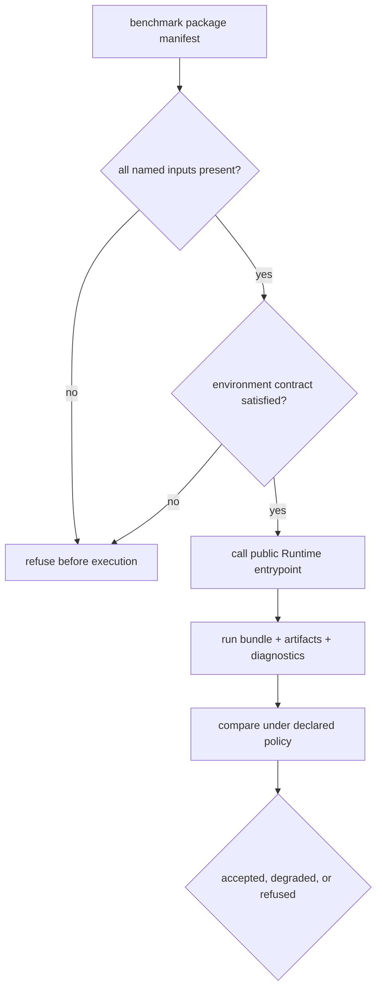

# Operator Rerun Journey

A reproducible rerun begins with a governed benchmark manifest and ends with a
new run bundle whose identity, environment, state history, artifacts, and
comparison result can be inspected independently. Reusing the same family name
or obtaining similar summary values is not enough.

## Select The Exact Lane

Open [Workflow Families](../01-bijux-proteomics/foundation/workflow-families.md)
and record the family’s current trust status and primary run mode. Then use
[Benchmark Rerun Kits](benchmark-rerun-kits.md) to identify:

- the primary and companion benchmark package roots;
- the primary and companion Runtime entrypoints;
- whether the lane is raw-executable over checked inputs or import-only;
- the scientific and operational conditions that still limit the claim.

For DDA, `import_only` is a material property: the rerun reopens imported
search results and their review lineage. It does not rerun MaxQuant, Comet,
Sage, or another search engine from raw spectra.

## Preflight The Environment

Use [Runtime Environment Contracts](runtime-environment-contracts.md) to record
the supported Python and dependency bounds, operating system, provider,
external tool identity, environment variables that affect behavior, and any
optional dependency required by the selected lane.



Refuse before execution when an input identity, checksum, required provider,
or compatibility condition cannot be established. Substituting a convenient
local file creates a different run.

## Execute Without Rewriting Evidence

Write local output below `artifacts/bijux-proteomics-runtime/`; do not overwrite
the tracked flagship fixtures. Preserve:

1. source revision and installed distribution versions;
2. benchmark manifest and input checksums;
3. selected public entrypoint and resolved configuration;
4. provider, environment, external tool, and dependency identities;
5. state transitions, retries, checkpoints, warnings, and refusal reasons;
6. artifact inventory, media types, sizes, and checksums;
7. terminal state and comparison-policy identity.

The [Runtime Execution Boundary](runtime-execution-boundary.md) gives the exact
manifest, entrypoint, tracked run bundle, and refusal statement for each
primary family lane.

### Run and serialize the DIA primary lane

The published DIA wrapper resolves its governed package inputs internally and
returns a typed run report. From the repository root:

```python
from pathlib import Path

from bijux_proteomics_runtime.workflows.benchmark_runs import (
    run_benchmark_dia_review_path,
)

report = run_benchmark_dia_review_path()
output_dir = Path("artifacts/bijux-proteomics-runtime/dia-library-review")
output_dir.mkdir(parents=True, exist_ok=True)
(output_dir / "run-report.json").write_text(
    report.model_dump_json(indent=2) + "\n",
    encoding="utf-8",
)
```

This executes the checked report-based DIA transformation. It is
`raw_executable` over the packaged report inputs; it does not process
vendor-native raw chromatograms. Run the matrix-shift companion through
`run_benchmark_dia_generalization_review_path()` before making a family-level
transfer statement.

## Inspect The Run Bundle

| Check | Acceptable evidence | Reject or downgrade when |
| --- | --- | --- |
| input identity | paths and checksums match the governed manifest | files are substituted, missing, or unattributed |
| state history | legal transitions reach a recorded terminal state | transitions are missing or inferred from logs |
| artifacts | inventory resolves and checksums verify | output exists without an inventory or stable identity |
| environment | provider and dependency record is complete | behavior-relevant conditions are unknown |
| refusal | structured reason and unmet condition are preserved | failure is collapsed into an empty or successful result |
| replay | declared stable fields compare under the named policy | byte similarity is used without semantic comparison |

Use [Black-Box Run Verification](black-box-run-verification.md) for installed
entrypoint checks and [Runtime Artifact Stability](runtime-artifact-stability.md)
for stable, conditionally stable, and intentionally variable fields.

## Apply Replay Pressure

Run the primary and companion lanes independently. Then apply the relevant
[Runtime Replay Challenges](runtime-replay-challenges.md): changed ordering,
missing inputs, environment drift, interrupted state, artifact substitution,
or family-specific transfer pressure.

Read the result in the [Black-Box Benchmark Dashboard](black-box-benchmark-dashboard.md).
A dashboard downgrade is evidence, not a documentation inconvenience. The
allowed language is the maximum statement defended by the black-box packet.

## Classify The Comparison

| comparison outcome | required record | permitted interpretation |
| --- | --- | --- |
| stable fields match under the named policy | primary and companion reports, policy identifier, field-level diff | the declared runtime behavior is repeatable for the checked package pair |
| direction survives but scope or coverage weakens | weakened-claim rows and affected artifacts | transfer is bounded; narrow the family statement |
| a declared claim collapses | collapsed-claim row and refusal or downgrade | exclude that claim even if the aggregate stability score is high |
| fields differ because they are intentionally variable | stability class and observed values | report variation; do not call it failure or parity |
| policy, environment, or input identity is missing | preflight refusal | no comparison claim is available |

## Separate Runtime From Scientific Acceptance

Runtime success establishes that the declared lane completed under recorded
conditions. Core’s [Flagship Acceptance Bars](../04-bijux-proteomics-core/foundation/flagship-acceptance-bars.md)
determine whether scientific outputs meet the family contract. Knowledge,
Intelligence, and Lab can narrow the claim further through contradiction,
recommendation instability, or downstream burden.

| Result | Operator conclusion |
| --- | --- |
| primary and companion pass under the comparison policy | report bounded Runtime evidence and continue scientific review |
| primary passes, companion fails | report fragile transfer; do not generalize |
| execution completes but Core acceptance fails | report operational completion and scientific rejection separately |
| environment or input identity is incomplete | refuse the rerun claim |
| imported lane completes | report imported-result replay, not native engine execution |

## Preserve The Refusal

Open [Runtime Rerun Refusals](runtime-rerun-refusals.md) before summarizing the
run. Record the failed invariant, the strongest statement still supported, and
the evidence required to retry or widen the claim. Consult
[Current Capability Limits](../01-bijux-proteomics/foundation/current-capability-limits.md)
instead of converting a degraded rerun into broader public language.
