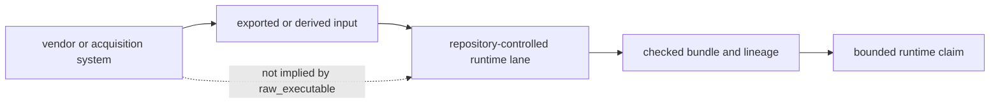

# Raw Versus Import Execution

Execution mode states where repository-controlled computation begins. It does not, by itself, establish vendor-native acquisition replay, chromatogram processing, external-engine parity, or scientific authority.

## Mode Contract

| mode | repository guarantee | claim ceiling |
| --- | --- | --- |
| `import_only` | the checked lane begins from imported exported-result evidence | no raw or external-engine rerun claim |
| `raw_executable` | the repository can execute its declared transformation from the checked input level | no automatic vendor-native, acquisition-native, or vendor-parity claim |

The model field `raw_rerun_supported` distinguishes those two repository modes.
On this page, the clearer reader-facing term is **declared lane executable from
checked input** because the input may already be exported or derived.

## Family Summary

| workflow family | current run mode | declared lane executable from checked input | imported dependency count | blocked claim count |
| --- | --- | --- | --- | --- |
| `dda` | `import_only` | no | `3` | `2` |
| `dia` | `raw_executable` | yes | `5` | `2` |
| `lfq` | `raw_executable` | yes | `3` | `0` |
| `multiplex` | `raw_executable` | yes | `2` | `1` |
| `ptm` | `raw_executable` | yes | `2` | `0` |
| `targeted` | `raw_executable` | yes | `4` | `0` |

## Family Boundaries

### `dda`

- run contract: dda currently reruns through imported exported-result evidence instead of a raw in-repository execution lane.
- tracked imported dependencies: `packages/bijux-proteomics-core/tests/fixtures/search_adapter_corpora/maxquant/maxquant_pipeline_export.tsv`, `packages/bijux-proteomics-core/tests/fixtures/search_adapter_corpora/maxquant/maxquant_evidence.tsv`, `packages/bijux-proteomics-core/tests/fixtures/search_adapter_corpora/maxquant/maxquant_settings.txt`
- blocked claims: raw external-engine parity, vendor-native or engine-native reproducibility
- public claim ceiling: dda must not be described as raw-executable while `dda-maxquant-pipeline-corpus` still runs in `import_only` mode.

### `dia`

- run contract: dia executes inside the runtime package, but its benchmark package can still include imported or derived evidence that does not prove vendor-native parity.
- tracked imported dependencies: `packages/bijux-proteomics-core/benchmark-assets/flagship-public-packages/dia_library_review_package/primary/spectronaut_report.tsv`, `packages/bijux-proteomics-core/benchmark-assets/flagship-public-packages/dia_library_review_package/primary/spectronaut_pipeline_export.tsv`, `packages/bijux-proteomics-core/benchmark-assets/flagship-public-packages/dia_library_review_package/primary/spectronaut_settings.txt`, `packages/bijux-proteomics-core/benchmark-assets/flagship-public-packages/dia_library_review_package/comparator/diann_pipeline_export.tsv`, `packages/bijux-proteomics-core/benchmark-assets/flagship-public-packages/dia_library_review_package/comparator/diann_config.json`
- blocked claims: chromatogram-native DIA authority, broad vendor-parity DIA replay
- public claim ceiling: DIA remains raw-executable in runtime terms, but the shipped package still stops short of chromatogram-native and vendor-parity claims.

### `lfq`

- run contract: lfq executes inside the runtime package, but its benchmark package can still include imported or derived evidence that does not prove vendor-native parity.
- tracked imported dependencies: `packages/bijux-proteomics-core/benchmark-assets/flagship-public-packages/lfq_cohort_review_package/evidence/study_scale_ms1_features.tsv`, `packages/bijux-proteomics-core/benchmark-assets/flagship-public-packages/lfq_cohort_review_package/evidence/study_scale.design.tsv`, `packages/bijux-proteomics-core/benchmark-assets/flagship-public-packages/lfq_cohort_review_package/evidence/quant_reproducibility_manifest.json`
- blocked claims: none
- public claim ceiling: lfq should keep its stronger sentence behind the current benchmark package and downstream consequence limits.

### `multiplex`

- run contract: multiplex executes inside the runtime package, but its benchmark package can still include imported or derived evidence that does not prove vendor-native parity.
- tracked imported dependencies: `packages/bijux-proteomics-core/benchmark-assets/flagship-public-packages/multiplex_tmtpro_review_package/evidence/multiplex_ms1_features.tsv`, `packages/bijux-proteomics-core/benchmark-assets/flagship-public-packages/multiplex_tmtpro_review_package/evidence/multiplex.design.tsv`
- blocked claims: outsider-auditable multiplex trust
- public claim ceiling: Multiplex may rerun in runtime terms while still failing the stronger outsider-facing claim boundary.

### `ptm`

- run contract: ptm executes inside the runtime package, but its benchmark package can still include imported or derived evidence that does not prove vendor-native parity.
- tracked imported dependencies: `packages/bijux-proteomics-core/benchmark-assets/flagship-public-packages/ptm_localization_review_package/evidence/localization_results.tsv`, `packages/bijux-proteomics-core/benchmark-assets/flagship-public-packages/ptm_localization_review_package/evidence/ptm_features.tsv`
- blocked claims: none
- public claim ceiling: ptm should keep its stronger sentence behind the current benchmark package and downstream consequence limits.

### `targeted`

- run contract: targeted executes inside the runtime package, but its benchmark package can still include imported or derived evidence that does not prove vendor-native parity.
- tracked imported dependencies: `packages/bijux-proteomics-core/benchmark-assets/flagship-public-packages/targeted_transition_review_package/evidence/targeted_benchmark_qc.tsv`, `packages/bijux-proteomics-core/benchmark-assets/flagship-public-packages/targeted_transition_review_package/follow_up/supported_targeted_follow_up.json`, `packages/bijux-proteomics-core/benchmark-assets/flagship-public-packages/targeted_transition_review_package/follow_up/failed_targeted_transition_follow_up.json`, `packages/bijux-proteomics-core/benchmark-assets/flagship-public-packages/targeted_transition_review_package/follow_up/refused_targeted_follow_up.json`
- blocked claims: none
- public claim ceiling: targeted should keep its stronger sentence behind the current benchmark package and downstream consequence limits.

## Interpretation Discipline

A stronger execution mode changes the runtime statement only. Benchmark
acceptance, grounding, recommendation, and lab consequence remain separately
owned decisions. Imported dependencies stay visible even for `raw_executable`
families so a repository rerun cannot be mistaken for vendor-parity replay.
