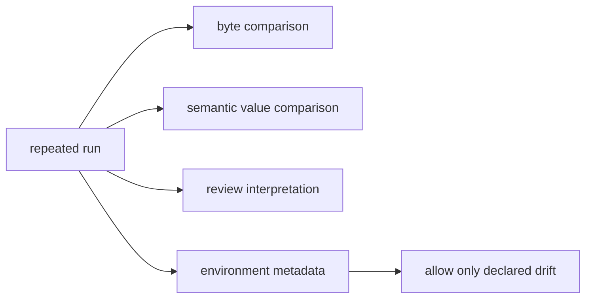
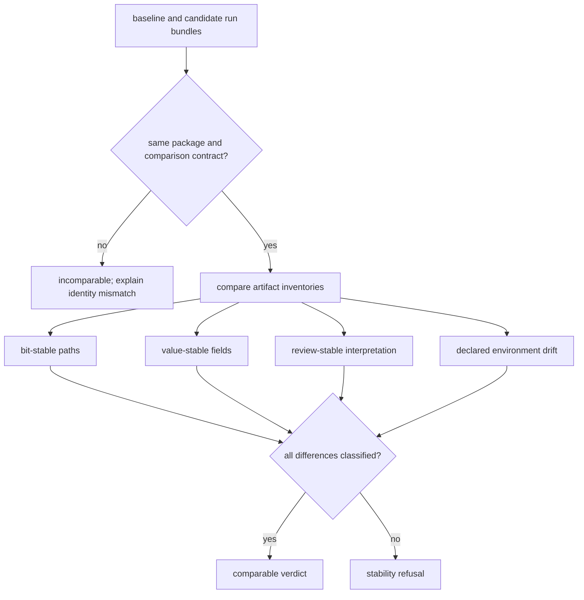

# Runtime Artifact Stability

Artifact stability separates exact bytes, semantic values, reviewer interpretation, and permitted environment metadata. Treating all drift alike would either reject harmless run identity changes or conceal meaningful contract movement.

| stability class | required invariant |
| --- | --- |
| bit stable | governed fixture bytes remain identical |
| value stable | named semantic values retain the same meaning |
| review stable | authorized claim scope and interpretation remain unchanged |
| permitted environment drift | named execution metadata may vary without changing the proof surface |

## Classify Drift Before Comparing Runs

Classification is ordered. Package or contract identity is checked before
bytes; artifact inventory is checked before field values; review meaning is
checked even when the numeric comparison passes. An unclassified difference
is a failed comparison, not permitted drift.

| Drift example | Class | Required response |
| --- | --- | --- |
| changed governed fixture byte | bit stability | fail until the fixture change and its owner are reviewed |
| reordered representation with unchanged governed value | value stability | prove canonical value equivalence and explain byte drift |
| changed blocker, claim scope, or invalidation reason | review stability | treat as contract movement even if result values match |
| new run ID or artifact directory | permitted environment drift | accept only when explicitly named and non-authoritative |
| missing required artifact | inventory failure | refuse comparison; absence cannot be normalized away |
| new artifact with unknown role | unclassified drift | assign ownership and stability class before acceptance |

## Family Stability Contracts

### `dda`

- bit-stable paths: `packages/bijux-proteomics-runtime/tests/fixtures/flagship_runs/dda/run_bundle.json`, `packages/bijux-proteomics-runtime/tests/fixtures/flagship_runs/dda/stage_lineage.json`, `packages/bijux-proteomics-runtime/tests/fixtures/flagship_runs/dda/failure_replay.json`
- value-stable surfaces: runtime package id `dda-maxquant-pipeline-corpus`, run mode `import_only`, remaining blockers `none`
- review-stable surfaces: authorized claim scope in the runtime bundle, family-specific replay invalidation reasons, downstream owner links carried by the checked runtime bundle
- permitted environment drift: `run_id`, `environment.environment_id`, `run_summary.artifacts_dir`

### `dia`

- bit-stable paths: `packages/bijux-proteomics-runtime/tests/fixtures/flagship_runs/dia/run_bundle.json`, `packages/bijux-proteomics-runtime/tests/fixtures/flagship_runs/dia/stage_lineage.json`, `packages/bijux-proteomics-runtime/tests/fixtures/flagship_runs/dia/failure_replay.json`
- value-stable surfaces: runtime package id `dia-diann-pipeline-corpus`, run mode `raw_executable`, remaining blockers `none`
- review-stable surfaces: authorized claim scope in the runtime bundle, family-specific replay invalidation reasons, downstream owner links carried by the checked runtime bundle
- permitted environment drift: `run_id`, `environment.environment_id`, `run_summary.artifacts_dir`

### `lfq`

- bit-stable paths: `packages/bijux-proteomics-runtime/tests/fixtures/flagship_runs/lfq/run_bundle.json`, `packages/bijux-proteomics-runtime/tests/fixtures/flagship_runs/lfq/stage_lineage.json`, `packages/bijux-proteomics-runtime/tests/fixtures/flagship_runs/lfq/failure_replay.json`
- value-stable surfaces: runtime package id `lfq-cohort-review-corpus`, run mode `raw_executable`, remaining blockers `none`
- review-stable surfaces: authorized claim scope in the runtime bundle, family-specific replay invalidation reasons, downstream owner links carried by the checked runtime bundle
- permitted environment drift: `run_id`, `environment.environment_id`, `run_summary.artifacts_dir`

### `multiplex`

- bit-stable paths: `packages/bijux-proteomics-runtime/tests/fixtures/flagship_runs/multiplex/run_bundle.json`, `packages/bijux-proteomics-runtime/tests/fixtures/flagship_runs/multiplex/stage_lineage.json`, `packages/bijux-proteomics-runtime/tests/fixtures/flagship_runs/multiplex/failure_replay.json`
- value-stable surfaces: runtime package id `multiplex-tmtpro-review-corpus`, run mode `raw_executable`, remaining blockers `none`
- review-stable surfaces: authorized claim scope in the runtime bundle, family-specific replay invalidation reasons, downstream owner links carried by the checked runtime bundle
- permitted environment drift: `run_id`, `environment.environment_id`, `run_summary.artifacts_dir`

### `ptm`

- bit-stable paths: `packages/bijux-proteomics-runtime/tests/fixtures/flagship_runs/ptm/run_bundle.json`, `packages/bijux-proteomics-runtime/tests/fixtures/flagship_runs/ptm/stage_lineage.json`, `packages/bijux-proteomics-runtime/tests/fixtures/flagship_runs/ptm/failure_replay.json`
- value-stable surfaces: runtime package id `ptm-localization-review-corpus`, run mode `raw_executable`, remaining blockers `none`
- review-stable surfaces: authorized claim scope in the runtime bundle, family-specific replay invalidation reasons, downstream owner links carried by the checked runtime bundle
- permitted environment drift: `run_id`, `environment.environment_id`, `run_summary.artifacts_dir`

### `targeted`

- bit-stable paths: `packages/bijux-proteomics-runtime/tests/fixtures/flagship_runs/targeted/run_bundle.json`, `packages/bijux-proteomics-runtime/tests/fixtures/flagship_runs/targeted/stage_lineage.json`, `packages/bijux-proteomics-runtime/tests/fixtures/flagship_runs/targeted/failure_replay.json`
- value-stable surfaces: runtime package id `targeted-transition-review-corpus`, run mode `raw_executable`, remaining blockers `none`
- review-stable surfaces: authorized claim scope in the runtime bundle, family-specific replay invalidation reasons, downstream owner links carried by the checked runtime bundle
- permitted environment drift: `run_id`, `environment.environment_id`, `run_summary.artifacts_dir`

## Change Rule

A bit-stable path changes only through an intentional governed fixture update.
Value-stable or review-stable surfaces change only when the underlying runtime
or scientific boundary changes in the same reviewable edit. Permitted
environment drift never authorizes a claim, blocker, or lineage change.

Stable execution protects rerun honesty; it does not enlarge biological,
analytical, vendor-parity, recommendation, or lab authority.

A stability verdict must retain both run identities, the comparison contract,
artifact inventories, classified differences, comparison-tool identity, and
the final disposition. A bare “same” or “changed” result is not reviewable.

## Minimum comparison record

| Record field | Why it is required |
| --- | --- |
| baseline and candidate identities | prevents comparison against the wrong run or contract |
| artifact inventories | exposes missing, added, and role-changed outputs before value comparison |
| stability policy revision | fixes which paths, fields, meanings, and environment values were governed |
| classified differences | separates byte, value, review, permitted-environment, and unresolved drift |
| comparator identity and tolerances | makes numeric and semantic equivalence reproducible |
| disposition and authority | records who accepted, refused, or escalated the comparison and why |

Comparison is refused when either run identity is unresolved, a required
artifact is absent, a governed difference has no class, or review meaning
moves without an explicit contract decision. Permitted environment drift
never absorbs a changed result, blocker, or claim.
