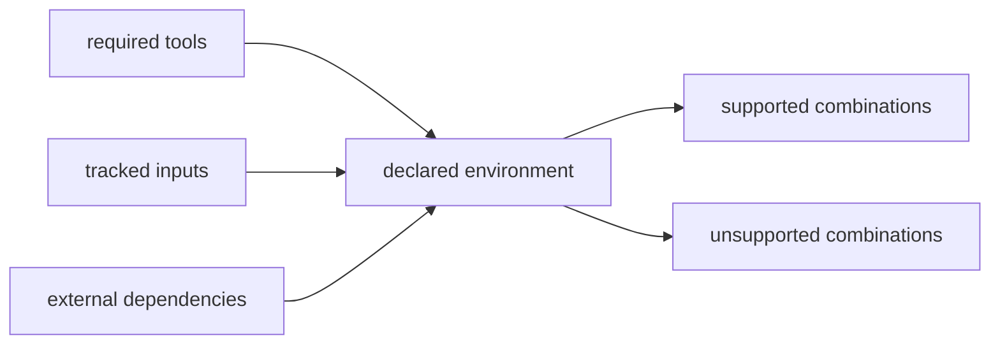

# Runtime Environment Contracts

A runtime environment contract identifies the tools, tracked inputs, and external dependencies required to reopen one shipped lane. Unsupported combinations are present claim refusals, not an informal roadmap.

## Qualify an environment

| Decision | Evidence to inspect | Refusal condition |
| --- | --- | --- |
| identify the lane | workflow family, runtime package ID, execution mode, and benchmark manifest | the request does not match one governed lane |
| resolve required tools | tool name, version, configuration, and availability | a required tool or declared capability is absent |
| bind tracked inputs | source paths, digests, schema identities, and benchmark revision | an input is missing, mutable, or does not match the retained contract |
| disclose external dependencies | imported engine outputs, remote services, credentials, licenses, and network assumptions | an external dependency is implicit or cannot be reconstructed |
| compare the supported envelope | operating system, Python and package versions, extras, providers, and checked combinations | the requested combination lies outside retained evidence |
| execute invalidation cases | unavailable provider, changed input, incompatible schema, missing artifact, and other lane-specific challenges | a challenged condition succeeds silently or produces an ambiguous result |

## Contract Fields

| field | interpretation |
| --- | --- |
| required tools | minimum repository-owned execution lane |
| external dependencies | systems or imported evidence outside that lane |
| supported combinations | environment combinations defended by retained evidence |
| unsupported combinations | stronger combinations the current release refuses |

## Family Contracts

### `dda`

- runtime package id: `dda-maxquant-pipeline-corpus`
- required tools: `python 3.11`, `uv`, `bijux-proteomics-runtime`, `tracked public benchmark package files`
- external dependencies: tracked exported results from `maxquant` 19.0, no live external engine install is required for the shipped rerun lane
- supported combinations: repository-managed python environment plus tracked imported benchmark exports
- unsupported combinations: claiming live external-engine parity from the shipped import lane, claiming raw instrument-side rerun without new tracked inputs and runtime support

### `dia`

- runtime package id: `dia-diann-pipeline-corpus`
- required tools: `python 3.11`, `uv`, `bijux-proteomics-runtime`, `tracked public benchmark package files`
- external dependencies: none beyond tracked repository inputs
- supported combinations: repository-managed python environment plus tracked DIA report and comparator exports, library-conditioned review over the shipped benchmark package
- unsupported combinations: claiming chromatogram-native or vendor-parity DIA authority, treating library-conditioned exported reports as a substitute for raw acquisition replay

### `lfq`

- runtime package id: `lfq-cohort-review-corpus`
- required tools: `python 3.11`, `uv`, `bijux-proteomics-runtime`, `tracked public benchmark package files`
- external dependencies: none beyond tracked repository inputs
- supported combinations: repository-managed python environment plus tracked benchmark package inputs
- unsupported combinations: claiming broader family authority than the shipped benchmark package and downstream consequence surfaces earn

### `multiplex`

- runtime package id: `multiplex-tmtpro-review-corpus`
- required tools: `python 3.11`, `uv`, `bijux-proteomics-runtime`, `tracked public benchmark package files`
- external dependencies: none beyond tracked repository inputs
- supported combinations: repository-managed python environment plus tracked benchmark package inputs
- unsupported combinations: claiming outsider-auditable multiplex authority from the current internal-support lane

### `ptm`

- runtime package id: `ptm-localization-review-corpus`
- required tools: `python 3.11`, `uv`, `bijux-proteomics-runtime`, `tracked public benchmark package files`
- external dependencies: none beyond tracked repository inputs
- supported combinations: repository-managed python environment plus tracked benchmark package inputs
- unsupported combinations: claiming broader family authority than the shipped benchmark package and downstream consequence surfaces earn

### `targeted`

- runtime package id: `targeted-transition-review-corpus`
- required tools: `python 3.11`, `uv`, `bijux-proteomics-runtime`, `tracked public benchmark package files`
- external dependencies: none beyond tracked repository inputs
- supported combinations: repository-managed python environment plus tracked benchmark package inputs
- unsupported combinations: claiming broader family authority than the shipped benchmark package and downstream consequence surfaces earn

## Review Rule

An environment claim may expand only when required tools, external
dependencies, replay evidence, and failure behavior expand together. A green
repository execution lane does not erase the unsupported combinations listed
for that family.

## Record the qualification

A reviewable environment decision retains the workflow family, runtime
package ID, request fingerprint, input inventory, required and observed tool
versions, package lock or environment identity, external dependencies,
provider decisions, invalidation results, and final disposition.

| Disposition | Meaning | Operator response |
| --- | --- | --- |
| qualified | the exact declared combination is backed by retained replay evidence | proceed and bind the environment record to the run |
| degraded | execution is possible but one non-blocking environmental property differs | record the difference and keep claims inside the reviewed envelope |
| unsupported | the combination lies outside the retained contract | refuse the stronger environment claim; select a supported lane or add evidence |
| irreproducible | required inputs, tools, or external dependencies cannot be reconstructed | stop replay and preserve the missing dependency as the blocker |
