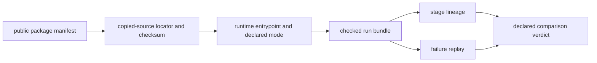

# Runtime Execution Boundary

Start here when the question is: how would an independent reviewer reopen a shipped workflow family without asking maintainers what to trust next?

## Independent Review Contract

- start from the public benchmark manifest, not from runtime prose
- reopen the checked bundle before deciding whether the lane still deserves a
  stronger sentence
- use stage lineage and failure replay to test whether the execution story is
  robust enough to survive scrutiny without maintainer narration

A reviewer should be able to resolve every node without private credentials,
undocumented files, or a maintainer choosing which differences to ignore.

## Shortest Rerun Route

| workflow family | start from | runtime entrypoint | checked bundle | current limit |
| --- | --- | --- | --- | --- |
| `dda` | `packages/bijux-proteomics-core/benchmark-assets/flagship-public-packages/dda_reviewable_run/package_manifest.json` | `bijux_proteomics_runtime.workflows.paths.run_reviewable_import_path` | `packages/bijux-proteomics-runtime/tests/fixtures/flagship_runs/dda/run_bundle.json` | dda replay is real for the shipped imported-result lane, but it still refuses broader raw-engine rerun claims. |
| `dia` | `packages/bijux-proteomics-core/benchmark-assets/flagship-public-packages/dia_library_review_package/package_manifest.json` | `bijux_proteomics_runtime.workflows.benchmark_runs.run_benchmark_dia_review_path` | `packages/bijux-proteomics-runtime/tests/fixtures/flagship_runs/dia/run_bundle.json` | DIA replay is real for the shipped runtime lane, but it still refuses chromatogram-native and broader vendor-parity claims. |
| `lfq` | `packages/bijux-proteomics-core/benchmark-assets/flagship-public-packages/lfq_cohort_review_package/package_manifest.json` | `bijux_proteomics_runtime.workflows.benchmark_runs.run_benchmark_lfq_review_path` | `packages/bijux-proteomics-runtime/tests/fixtures/flagship_runs/lfq/run_bundle.json` | lfq replay is real for the shipped runtime lane, but it still inherits the same benchmark and downstream claim limits as the checked bundle. |
| `multiplex` | `packages/bijux-proteomics-core/benchmark-assets/flagship-public-packages/multiplex_tmtpro_review_package/package_manifest.json` | `bijux_proteomics_runtime.workflows.benchmark_runs.run_benchmark_multiplex_review_path` | `packages/bijux-proteomics-runtime/tests/fixtures/flagship_runs/multiplex/run_bundle.json` | multiplex replay is real for the shipped runtime lane, but it still inherits the same benchmark and downstream claim limits as the checked bundle. |
| `ptm` | `packages/bijux-proteomics-core/benchmark-assets/flagship-public-packages/ptm_localization_review_package/package_manifest.json` | `bijux_proteomics_runtime.workflows.benchmark_runs.run_benchmark_ptm_review_path` | `packages/bijux-proteomics-runtime/tests/fixtures/flagship_runs/ptm/run_bundle.json` | ptm replay is real for the shipped runtime lane, but it still inherits the same benchmark and downstream claim limits as the checked bundle. |
| `targeted` | `packages/bijux-proteomics-core/benchmark-assets/flagship-public-packages/targeted_transition_review_package/package_manifest.json` | `bijux_proteomics_runtime.workflows.benchmark_runs.run_benchmark_targeted_review_path` | `packages/bijux-proteomics-runtime/tests/fixtures/flagship_runs/targeted/run_bundle.json` | targeted replay is real for the shipped runtime lane, but it still inherits the same benchmark and downstream claim limits as the checked bundle. |

## What To Open Next

### `dda`

- start from the public benchmark manifest: `packages/bijux-proteomics-core/benchmark-assets/flagship-public-packages/dda_reviewable_run/package_manifest.json`
- confirm copied-source scope in: `packages/bijux-proteomics-core/benchmark-assets/flagship-public-packages/dda_reviewable_run/source_locator_manifest.json`
- reopen the checked runtime bundle: `packages/bijux-proteomics-runtime/tests/fixtures/flagship_runs/dda/run_bundle.json`
- challenge stage-to-stage continuity with: `packages/bijux-proteomics-runtime/tests/fixtures/flagship_runs/dda/stage_lineage.json`
- challenge replay and invalidation with: `packages/bijux-proteomics-runtime/tests/fixtures/flagship_runs/dda/failure_replay.json`
- rerun refusal summary: faithful rerun still stops at imported MaxQuant and comparator exports because the repository does not own a raw DDA search execution lane, external-engine behavior remains proprietary or out-of-repository for the strongest DDA package

### `dia`

- start from the public benchmark manifest: `packages/bijux-proteomics-core/benchmark-assets/flagship-public-packages/dia_library_review_package/package_manifest.json`
- confirm copied-source scope in: `packages/bijux-proteomics-core/benchmark-assets/flagship-public-packages/dia_library_review_package/source_locator_manifest.json`
- reopen the checked runtime bundle: `packages/bijux-proteomics-runtime/tests/fixtures/flagship_runs/dia/run_bundle.json`
- challenge stage-to-stage continuity with: `packages/bijux-proteomics-runtime/tests/fixtures/flagship_runs/dia/stage_lineage.json`
- challenge replay and invalidation with: `packages/bijux-proteomics-runtime/tests/fixtures/flagship_runs/dia/failure_replay.json`
- rerun refusal summary: the shipped DIA lane is raw-executable in runtime terms but still depends on library-conditioned exported reports rather than chromatogram-native replay

### `lfq`

- start from the public benchmark manifest: `packages/bijux-proteomics-core/benchmark-assets/flagship-public-packages/lfq_cohort_review_package/package_manifest.json`
- confirm copied-source scope in: `packages/bijux-proteomics-core/benchmark-assets/flagship-public-packages/lfq_cohort_review_package/source_locator_manifest.json`
- reopen the checked runtime bundle: `packages/bijux-proteomics-runtime/tests/fixtures/flagship_runs/lfq/run_bundle.json`
- challenge stage-to-stage continuity with: `packages/bijux-proteomics-runtime/tests/fixtures/flagship_runs/lfq/stage_lineage.json`
- challenge replay and invalidation with: `packages/bijux-proteomics-runtime/tests/fixtures/flagship_runs/lfq/failure_replay.json`
- rerun refusal summary: none

### `multiplex`

- start from the public benchmark manifest: `packages/bijux-proteomics-core/benchmark-assets/flagship-public-packages/multiplex_tmtpro_review_package/package_manifest.json`
- confirm copied-source scope in: `packages/bijux-proteomics-core/benchmark-assets/flagship-public-packages/multiplex_tmtpro_review_package/source_locator_manifest.json`
- reopen the checked runtime bundle: `packages/bijux-proteomics-runtime/tests/fixtures/flagship_runs/multiplex/run_bundle.json`
- challenge stage-to-stage continuity with: `packages/bijux-proteomics-runtime/tests/fixtures/flagship_runs/multiplex/stage_lineage.json`
- challenge replay and invalidation with: `packages/bijux-proteomics-runtime/tests/fixtures/flagship_runs/multiplex/failure_replay.json`
- rerun refusal summary: multiplex remains below outsider-auditable trust because runtime rerun strength still outruns family-level consequence and challenge closure

### `ptm`

- start from the public benchmark manifest: `packages/bijux-proteomics-core/benchmark-assets/flagship-public-packages/ptm_localization_review_package/package_manifest.json`
- confirm copied-source scope in: `packages/bijux-proteomics-core/benchmark-assets/flagship-public-packages/ptm_localization_review_package/source_locator_manifest.json`
- reopen the checked runtime bundle: `packages/bijux-proteomics-runtime/tests/fixtures/flagship_runs/ptm/run_bundle.json`
- challenge stage-to-stage continuity with: `packages/bijux-proteomics-runtime/tests/fixtures/flagship_runs/ptm/stage_lineage.json`
- challenge replay and invalidation with: `packages/bijux-proteomics-runtime/tests/fixtures/flagship_runs/ptm/failure_replay.json`
- rerun refusal summary: none

### `targeted`

- start from the public benchmark manifest: `packages/bijux-proteomics-core/benchmark-assets/flagship-public-packages/targeted_transition_review_package/package_manifest.json`
- confirm copied-source scope in: `packages/bijux-proteomics-core/benchmark-assets/flagship-public-packages/targeted_transition_review_package/source_locator_manifest.json`
- reopen the checked runtime bundle: `packages/bijux-proteomics-runtime/tests/fixtures/flagship_runs/targeted/run_bundle.json`
- challenge stage-to-stage continuity with: `packages/bijux-proteomics-runtime/tests/fixtures/flagship_runs/targeted/stage_lineage.json`
- challenge replay and invalidation with: `packages/bijux-proteomics-runtime/tests/fixtures/flagship_runs/targeted/failure_replay.json`
- rerun refusal summary: none

## What This Route Proves And What It Does Not

- it proves that a reviewer can reopen the shipped runtime lane from named
  public roots
- it does not prove that execution alone upgrades benchmark, grounding,
  recommendation, or lab authority
- it should hand off once the question becomes whether the reopened lane still
  deserves stronger language beyond runtime traceability

## Rerun Closure Record

| Record | Closure condition |
| --- | --- |
| package identity | manifest and copied-source checksums resolve to the reviewed public package |
| execution identity | entrypoint, runtime version, mode, provider, and environment contract are recorded |
| run history | state transitions, retries, resume or rehydrate events, and terminal disposition are coherent |
| artifact inventory | required outputs, fingerprints, lineage, and declared absences agree with the lane |
| replay pressure | failure replay and invalidation challenges produce the expected governed verdict |
| comparison | byte, value, review, and permitted-environment differences are classified |
| authority handoff | runtime conclusion and every stronger blocked claim are named separately |

The rerun closes when these records agree. Similar-looking outputs without a
resolved package, run history, or comparison policy do not close it.
