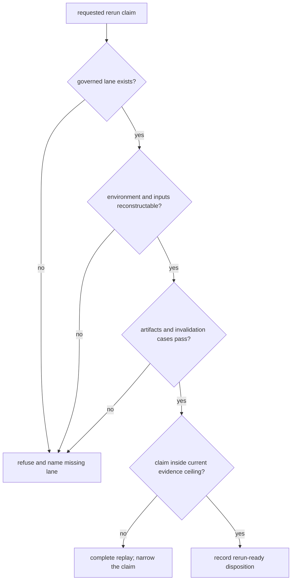

# Runtime Rerun Refusals

A rerun refusal is a positive runtime decision: the retained environment,
inputs, provider boundary, artifacts, or downstream evidence do not support
the requested replay claim. The refusal preserves the best supported lane
without describing a weaker reconstruction as faithful execution.

## Current family posture

| Family | Rerun ready | Present refusal | Blocked claim |
| --- | --- | --- | --- |

| `dda` | `no` | faithful rerun still stops at imported MaxQuant and comparator exports because the repository does not own a raw DDA search execution lane; external-engine behavior remains proprietary or out-of-repository for the strongest DDA package | raw DDA search parity; full outsider-auditable DDA rerun language |
| `dia` | `no` | the shipped DIA lane is raw-executable in runtime terms but still depends on library-conditioned exported reports rather than chromatogram-native replay | chromatogram-native DIA parity; broad vendor-parity DIA authority |
| `lfq` | `yes` | none | none |
| `multiplex` | `no` | multiplex remains below outsider-auditable trust because runtime rerun strength still outruns family-level consequence and challenge closure | outsider-auditable multiplex trust |
| `ptm` | `yes` | none | none |
| `targeted` | `yes` | none | none |

Rerun-ready means the checked Runtime lane can be reopened under its named
contract. It does not establish raw-vendor parity, scientific transfer,
decision validity, or laboratory consequence beyond that contract.

## Family evidence

### `dda`

- rerun ready: `no`
- refusal reasons: faithful rerun still stops at imported MaxQuant and comparator exports because the repository does not own a raw DDA search execution lane, external-engine behavior remains proprietary or out-of-repository for the strongest DDA package
- blocked claims: raw DDA search parity, full outsider-auditable DDA rerun language
- next evidence paths: `packages/bijux-proteomics-core/benchmark-assets/flagship-public-packages/dda_reviewable_run/package_manifest.json`, `packages/bijux-proteomics-runtime/tests/fixtures/flagship_runs/dda/run_bundle.json`, `packages/bijux-proteomics-runtime/tests/fixtures/flagship_runs/dda/failure_replay.json`
- note: The refusal ledger names exactly why a workflow family still stops short of a stronger rerun claim instead of letting maintainers narrate around the gap.

### `dia`

- rerun ready: `no`
- refusal reasons: the shipped DIA lane is raw-executable in runtime terms but still depends on library-conditioned exported reports rather than chromatogram-native replay
- blocked claims: chromatogram-native DIA parity, broad vendor-parity DIA authority
- next evidence paths: `packages/bijux-proteomics-core/benchmark-assets/flagship-public-packages/dia_library_review_package/package_manifest.json`, `packages/bijux-proteomics-runtime/tests/fixtures/flagship_runs/dia/run_bundle.json`, `packages/bijux-proteomics-runtime/tests/fixtures/flagship_runs/dia/failure_replay.json`
- note: The refusal ledger names exactly why a workflow family still stops short of a stronger rerun claim instead of letting maintainers narrate around the gap.

### `lfq`

- rerun ready: `yes`
- refusal reasons: none
- blocked claims: none
- next evidence paths: `packages/bijux-proteomics-core/benchmark-assets/flagship-public-packages/lfq_cohort_review_package/package_manifest.json`, `packages/bijux-proteomics-runtime/tests/fixtures/flagship_runs/lfq/run_bundle.json`, `packages/bijux-proteomics-runtime/tests/fixtures/flagship_runs/lfq/failure_replay.json`
- note: The refusal ledger names exactly why a workflow family still stops short of a stronger rerun claim instead of letting maintainers narrate around the gap.

### `multiplex`

- rerun ready: `no`
- refusal reasons: multiplex remains below outsider-auditable trust because runtime rerun strength still outruns family-level consequence and challenge closure
- blocked claims: outsider-auditable multiplex trust
- next evidence paths: `packages/bijux-proteomics-core/benchmark-assets/flagship-public-packages/multiplex_tmtpro_review_package/package_manifest.json`, `packages/bijux-proteomics-runtime/tests/fixtures/flagship_runs/multiplex/run_bundle.json`, `packages/bijux-proteomics-runtime/tests/fixtures/flagship_runs/multiplex/failure_replay.json`
- note: The refusal ledger names exactly why a workflow family still stops short of a stronger rerun claim instead of letting maintainers narrate around the gap.

### `ptm`

- rerun ready: `yes`
- refusal reasons: none
- blocked claims: none
- next evidence paths: `packages/bijux-proteomics-core/benchmark-assets/flagship-public-packages/ptm_localization_review_package/package_manifest.json`, `packages/bijux-proteomics-runtime/tests/fixtures/flagship_runs/ptm/run_bundle.json`, `packages/bijux-proteomics-runtime/tests/fixtures/flagship_runs/ptm/failure_replay.json`
- note: The refusal ledger names exactly why a workflow family still stops short of a stronger rerun claim instead of letting maintainers narrate around the gap.

### `targeted`

- rerun ready: `yes`
- refusal reasons: none
- blocked claims: none
- next evidence paths: `packages/bijux-proteomics-core/benchmark-assets/flagship-public-packages/targeted_transition_review_package/package_manifest.json`, `packages/bijux-proteomics-runtime/tests/fixtures/flagship_runs/targeted/run_bundle.json`, `packages/bijux-proteomics-runtime/tests/fixtures/flagship_runs/targeted/failure_replay.json`
- note: The refusal ledger names exactly why a workflow family still stops short of a stronger rerun claim instead of letting maintainers narrate around the gap.

## Close or preserve a refusal

| Refusal source | Evidence required before reconsideration |
| --- | --- |
| no repository-owned lane | implementation, public entrypoint, retained fixtures, negative paths, and ownership review |
| imported or proprietary upstream step | governed source custody plus executable or independently comparable upstream evidence |
| missing environment or tool | versioned environment contract and clean-environment replay |
| unstable or incomplete artifacts | complete inventory, stability classification, and successful invalidation challenges |
| claim exceeds Runtime authority | scientific, Knowledge, Intelligence, or Lab evidence from the responsible owner |

A refusal is superseded only by a new record that cites the prior refusal,
identifies the added evidence, replays the negative path, and states the new
claim ceiling. Until then, operators preserve the refusal and use the
strongest supported lane rather than narrating around the missing proof.
