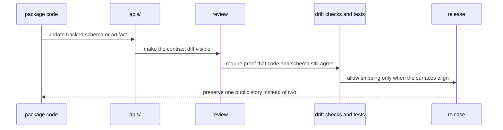

# API and Schema Governance

Shared API artifacts live under `apis/` so contract review does not depend on
reading package source alone. A caller or reviewer should not need to reverse-
engineer Python modules just to understand whether an HTTP or artifact
contract changed.

## How A Public Contract Change Should Move

## Governance Rules

- package code and tracked schema files must describe the same public behavior
- drift checks belong in shared gates or package tests, not in prose alone
- schema hashes and pinned OpenAPI artifacts should move only with reviewable intent

## Current Schema Roots

- `apis/agentic-proteins/v1/schema.yaml` for public runtime API contracts
- `apis/bijux-proteomics-foundation/v1/schema.yaml` for foundation service contracts
- `apis/bijux-proteomics-core/v1/schema.yaml` for core service contracts
- `apis/bijux-proteomics-intelligence/v1/schema.yaml` for intelligence service contracts
- `apis/bijux-proteomics-knowledge/v1/schema.yaml` for knowledge service contracts
- `apis/bijux-proteomics-lab/v1/schema.yaml` for lab service contracts
- package-local model schemas under `packages/*/src/**/schema.py`
- package-local changelog and metadata links as release-facing contract references

## Gate Entry Points

- `make api` for full API lint, freeze, and drift checks
- `make api-freeze` for pinned OpenAPI and digest enforcement only
- `make openapi-drift` for backward-compatibility checks

One public contract should have one reviewable story. If code, schema files,
and release artifacts disagree, the docs are not the thing that will save us.
