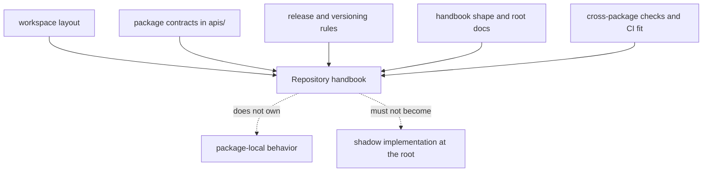

# Repository Handbook

This section is for the questions that no single package can answer on its
own. The root is not a sixth product package. It is where we explain how the
package family fits together, which assets genuinely live above one package,
and where cross-package rules begin and end.

If a reader can answer their question honestly from one package handbook, they
should go there instead of staying here.

## What The Root Actually Owns

## Handbook Sections

- [Foundation](foundation/index.md)
- [Operations](operations/index.md)

## What This Section Covers

- the package split and repository ownership model
- shared automation, validation, release, and review guidance
- the root-level rules that no one package can explain honestly on its own

## Use This Section For

- Questions about why the repository is split the way it is.
- Questions about root-managed assets such as `apis/`, `Makefile`, shared CI,
  and release conventions.
- Questions about where the root should stop and a product package should take
  over.

## Leave This Section For A Package Handbook When

- the answer lives mostly in one package's source tree, tests, or public surface
- the question is about one package's internal boundary rather than repository fit
- you are tempted to describe behavior at the root that really belongs inside
  `packages/`

## Package Handbooks

- [agentic-proteins](../agentic-proteins/foundation/index.md)
- [bijux-proteomics-foundation](../bijux-proteomics-foundation/foundation/index.md)
- [bijux-proteomics-core](../bijux-proteomics-core/foundation/index.md)
- [bijux-proteomics-intelligence](../bijux-proteomics-intelligence/foundation/index.md)
- [bijux-proteomics-knowledge](../bijux-proteomics-knowledge/foundation/index.md)
- [bijux-proteomics-lab](../bijux-proteomics-lab/foundation/index.md)

The job of this section is simple: help readers understand the system without
letting the root pretend it owns behavior that belongs elsewhere.
