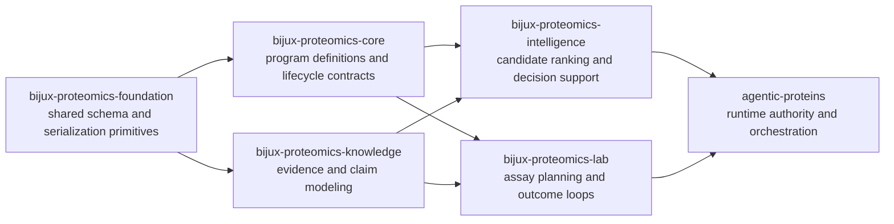

# Package Map

This page is the quickest way to understand the package family without opening
six separate handbooks first.

## Who Owns What

## Canonical Package Roles

| Package | Core role | Open it when |
| --- | --- | --- |
| `agentic-proteins` | deterministic runtime and orchestration boundary | the question is about run control, replay, execution contracts, or runtime APIs |
| `bijux-proteomics-foundation` | shared schema compatibility and canonical serialization | the issue spans payload shape stability, migration helpers, or fingerprinting |
| `bijux-proteomics-core` | program model and lifecycle contract definitions | you are changing target, gate, or lifecycle document semantics |
| `bijux-proteomics-intelligence` | candidate scoring, ranking, and recommendation logic | you are tuning progression decisions, explainability, or portfolio ranking |
| `bijux-proteomics-knowledge` | evidence, claims, and contradiction resolution surfaces | the work concerns evidence trust, claim state, or knowledge consistency |
| `bijux-proteomics-lab` | assay planning, outcomes, and closed-loop lab decisions | the work concerns assay scheduling, reruns, or experiment outcome handling |

If you are still not sure where a change belongs after reading this page, the
right next step is usually one package foundation section, not more root prose.
