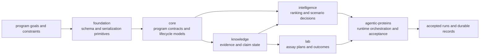

# Platform Overview

The easiest way to understand `bijux-proteomics` is to read it as a chain of
responsibilities. Each package takes one kind of ambiguity out of the system.
The split is not a packaging detail. The split is the design.

## From Raw Inputs To Accepted Runs

## What Each Step Adds

- `bijux-proteomics-foundation` keeps shared payload semantics stable across packages.
- `bijux-proteomics-core` defines durable program and gate contracts.
- `bijux-proteomics-knowledge` tracks evidence and claim state explicitly.
- `bijux-proteomics-intelligence` converts programs and evidence into ranking decisions.
- `bijux-proteomics-lab` turns decisions into executable assay cycles.
- `agentic-proteins` governs runtime execution, replay, and final acceptance.

## Why The Split Helps

- Review conversations get shorter because the first question becomes "which
  package owns this?" instead of "where in the tree did this end up?"
- Interfaces become easier to defend because each package can keep a narrower
  promise.
- Problems show up earlier because the system has explicit handoff points
  instead of one blurred implementation surface.

Do not read the chain as if each package is only the next directory in a
pipeline. Each package is an ownership boundary first.
