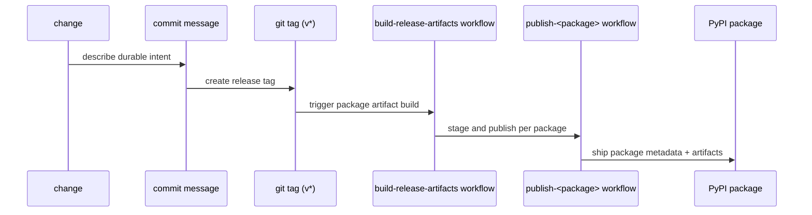

# Release and Versioning

The repository uses conventional commit messages and package changelogs as the
release intent record. Version resolution is a package concern and currently
uses two patterns in this repository:

- Hatch VCS for `agentic-proteins` and `bijux-proteomics-dev`
- explicit package versions for the remaining publishable packages

The wording of the commit history matters because the repository is meant to
stay understandable years later. A good commit message should explain durable
intent, not just what happened to be touched in one diff.

## How A Release Story Moves

## Shared Release Facts

- root commit rules live in `pyproject.toml`
- package versions are resolved per package (Hatch VCS or explicit version)
- publish workflows are tag-triggered (`v*`) and package-specific
- every publishable package keeps its own `CHANGELOG.md`
- the root `CHANGELOG.md` only records repository-wide changes that span more
  than one package or alter shared release machinery
- the public `0.3.0` release line covers the six active packages in this
  repository: `agentic-proteins`, `bijux-proteomics-foundation`,
  `bijux-proteomics-core`, `bijux-proteomics-intelligence`,
  `bijux-proteomics-knowledge`, and `bijux-proteomics-lab`

## Versioning Rule

Commit messages should communicate long-lived intent clearly enough that a
maintainer can understand them years later without opening the diff first.

Two years later, a maintainer should be able to understand why something was
released without first diff-mining the whole repository.

## Changelog Rule

Package release notes belong with the package that ships them. When a release
changes one package, the owning package changelog is the release record that
should explain the shipped story.

Use the root changelog only when the release changes shared repository
structure, shared policy, shared automation, or shared documentation systems.
