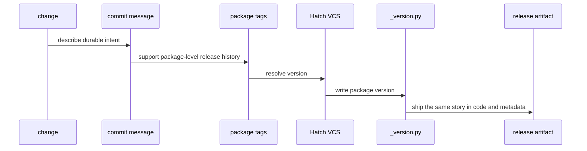

# Release and Versioning

The repository uses commitizen for conventional commit messages and package
tags for version discovery through Hatch VCS. Version resolution is therefore
both a repository concern and a package concern.

The wording of the commit history matters because the repository is meant to
stay understandable years later. A good commit message should explain durable
intent, not just what happened to be touched in one diff.

## How A Release Story Moves

## Shared Release Facts

- root commit rules live in `pyproject.toml`
- package versions are written to package-local `_version.py` files by Hatch VCS
- release support helpers live in `bijux-proteomics-dev`
- every publishable package keeps its own `CHANGELOG.md`
- the root `CHANGELOG.md` only records repository-wide changes that span more
  than one package or alter shared release machinery
- the public `0.3.0` release line covers 10 packages: 5 canonical
  `bijux-proteomics-*` distributions plus 5 compatibility packages
- `bijux-proteomics-dev` remains versioned for internal maintainer work, but it is
  not part of the public `0.3.0` publication set

## Legacy Distribution Continuity

The compatibility packages are the continuation line for the already-published
legacy PyPI project names. They keep the historical distribution name,
preserve the legacy import surface, and depend on the canonical package at the
same version.

- `agentic-flows` continues through `compat-agentic-flows` and installs
  `bijux-proteomics-runtime`
- `bijux-agent` continues through `compat-bijux-agent` and installs
  `bijux-proteomics-agent`
- `bijux-rag` continues through `compat-bijux-rag` and installs
  `bijux-proteomics-ingest`
- `bijux-rar` continues through `compat-bijux-rar` and installs
  `bijux-proteomics-reason`
- `bijux-vex` continues through `compat-bijux-vex` and installs
  `bijux-proteomics-index`

## Versioning Rule

Commit messages should communicate long-lived intent clearly enough that a
maintainer can understand them years later without opening the diff first.

Two years later, a maintainer should be able to understand why something was
released without first diff-mining the whole repository.

## Changelog Rule

Package release notes belong with the package that ships them. When a release
changes `bijux-proteomics-agent`, `bijux-proteomics-index`, `bijux-proteomics-ingest`,
`bijux-proteomics-reason`, `bijux-proteomics-runtime`, or any compatibility package, the
owning package changelog is the release record that should explain the shipped
story.

Use the root changelog only when the release changes shared repository
structure, shared policy, shared automation, or shared documentation systems.
