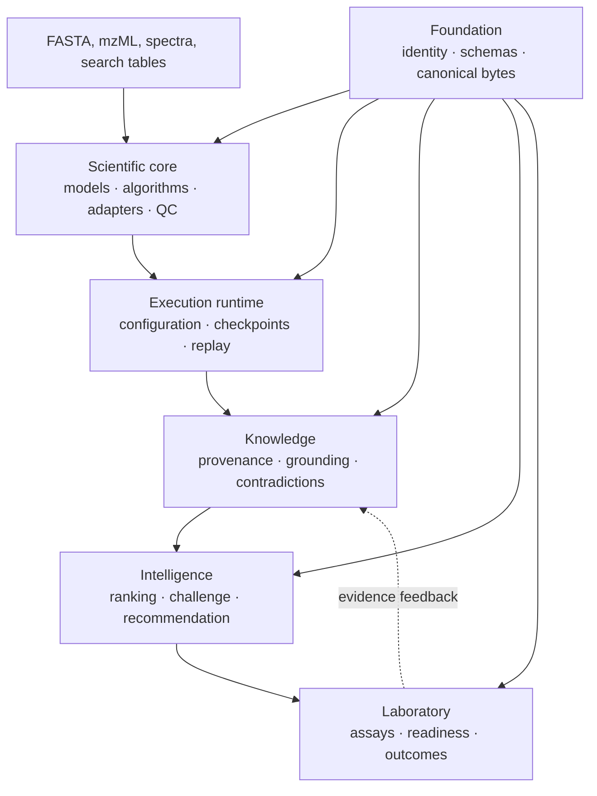

# Bijux Proteomics

`bijux-proteomics` is a composable Python platform for proteomics analysis,
reproducible execution, evidence-aware interpretation, and laboratory
follow-up. It is designed for work that must remain inspectable after a result
leaves the process that produced it.

<!-- bijux-proteomics-badges:generated:start -->

<!-- bijux-proteomics-badges:generated:end -->

## One result, six accountable layers

The architecture separates computation from execution and separates evidence
from judgment. This matters when a run is repeated, a source is contradicted,
or a recommendation reaches the laboratory: each change has an identifiable
owner and can be reviewed without reconstructing hidden state.

## Scientific coverage

The implemented surface spans:

- sequence validation, digestion, amino-acid and peptide chemistry,
  modifications, isotope envelopes, and theoretical fragments;
- mzML and spectrum contracts, search-engine imports, PSM confidence,
  target-decoy review, contaminant audit, and protein inference;
- label-free quantification, DIA precursor and protein matrices, PTM review,
  targeted transitions, reproducibility, and QC;
- benchmark corpora, challenge assets, acceptance reports, and public case
  studies;
- evidence grounding, candidate ranking, recommendation challenge, and
  laboratory consequence.

Coverage is not a blanket accuracy claim. The public evidence currently
supports outsider-auditable DDA, DIA, PTM, and targeted workflow families;
bounded review-grade LFQ; and internal-only multiplex support. The
[workflow-family guide](01-bijux-proteomics/foundation/workflow-families.md)
explains the exact evidence ceiling.

## Choose a route

| You need to… | Start here |
| --- | --- |
| understand the system and its data flow | [Product architecture](01-bijux-proteomics/foundation/product-architecture.md) |
| inspect scientific algorithms and benchmark assets | [Core](04-bijux-proteomics-core/index.md) |
| run, resume, compare, or replay work | [Runtime](09-bijux-proteomics-runtime/index.md) |
| trace a claim to evidence and contradictions | [Knowledge](06-bijux-proteomics-knowledge/index.md) |
| rank candidates or challenge a recommendation | [Intelligence](05-bijux-proteomics-intelligence/index.md) |
| plan follow-up assays and capture outcomes | [Lab](07-bijux-proteomics-lab/index.md) |
| evolve schemas and stable identifiers | [Foundation](03-bijux-proteomics-foundation/index.md) |
| migrate historical execution callers | [agentic-proteins](02-agentic-proteins/index.md) |
| develop, validate, or release the repository | [Maintainer handbook](08-bijux-proteomics-maintain/index.md) |

## Trust model

Every defensible result has five independently inspectable forms:

1. **Scientific contract** — typed inputs, explicit assumptions, and a
   domain-specific result or refusal.
2. **Execution record** — configuration, provider choice, checkpoints,
   artifacts, and failure state.
3. **Evidence record** — citations, contexts, provenance, supporting and
   contradicting observations.
4. **Decision record** — ranking policy, sensitivity, counterfactuals,
   uncertainty, and recommendation posture.
5. **Consequence record** — requested assay, readiness decision, observed
   outcome, and feedback into the evidence base.

Canonical serialization and stable identifiers connect these forms without
collapsing their meanings. Missing evidence is represented as a limitation or
refusal, not converted into confidence by orchestration.

## Verification boundaries

Benchmark-backed support is workflow-specific. A successful execution proves
that a declared run completed under its recorded contract; it does not prove
biological truth. A grounded claim records support and contradiction; it does
not automatically authorize a recommendation. A recommendation does not
become validated until its downstream evidence and assay outcomes justify it.

Use [current capability limits](01-bijux-proteomics/foundation/current-capability-limits.md)
for unsupported or bounded areas and the
[release readiness matrix](01-bijux-proteomics/foundation/release-readiness-matrix.md)
for the current evidence gates.

## Public interfaces

- `bijux-proteomics` exposes the core scientific CLI.
- `bijux-proteomics-runtime` exposes canonical execution through a CLI and
  HTTP application.
- Python APIs are package-owned and re-exported through explicit public API
  modules.
- JSON documents use foundation serialization and compatibility contracts
  where they cross package or process boundaries.

Begin with the [repository handbook](01-bijux-proteomics/index.md) for package
selection, or go directly to the package that owns your scientific or
operational concern.
