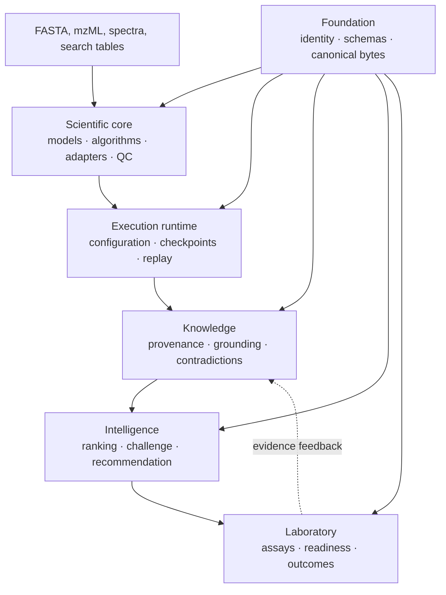
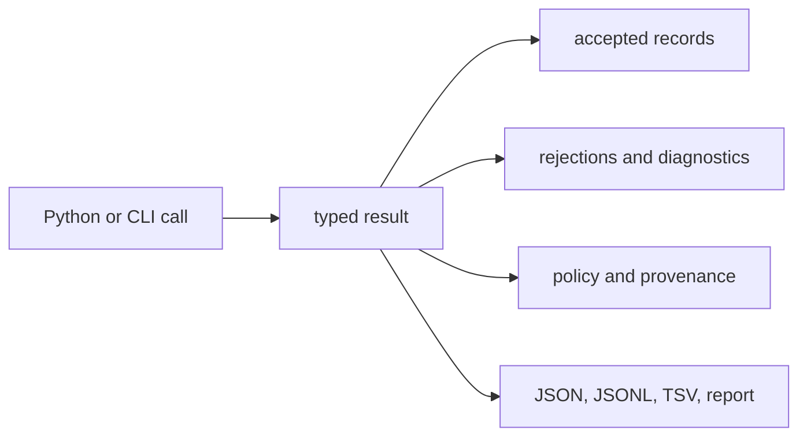

# Bijux Proteomics

`bijux-proteomics` is a composable Python platform for proteomics analysis,
reproducible execution, evidence-aware interpretation, and laboratory
follow-up. A reader can trace a result from accepted and rejected scientific
inputs through execution, grounding, recommendation, and observed consequence
without treating any one layer as authority for all the others.

## Product Scope

Six canonical packages divide responsibility: Foundation owns portable
contracts, Core owns scientific computation, Runtime owns execution, Knowledge
owns evidence memory, Intelligence owns decision policy, and Lab owns
experimental consequence. A compatibility distribution preserves historical
Runtime entrypoints without becoming a second owner.

| Question | Authority to open first | What it can establish |
| --- | --- | --- |
| What scientific calculation ran? | Core report and benchmark lineage | inputs, assumptions, output, rejection, QC, and family acceptance |
| What actually executed? | Runtime run bundle | configuration, provider, state, artifacts, comparison, and replay evidence |
| Why is the claim supportable? | Knowledge review bundle | source identity, context, support, contradiction, and unresolved gaps |
| Why did this action rank? | Intelligence recommendation record | candidate universe, policy, sensitivity, alternatives, confidence, and refusal |
| What did the follow-up cost and observe? | Lab consequence dossier | controls, readiness, custody, deviations, outcome, and feedback |

## Current Credible Workflow Families

Outsider-auditable workflow families today: `dda`, `dia`, `ptm`, `targeted`.

Full outsider-readable family packets today: `dda`, `dia`, `lfq`, `ptm`, `targeted`.

Internal-support-only workflow families today: `multiplex`.

Packet completeness and workflow authority are intentionally separate. LFQ has
an outsider-readable packet while its strongest honest sentence remains
review-grade bounded. DDA currently requests outsider-auditable language but
its import-only black-box lanes defend only review-grade bounded language.

Repository preflight currently blocks publication on that mismatch, stale
hostile-review and Runtime black-box surfaces, duplicate belief-audit ownership,
thin Core package boundaries, and insufficient rerun evidence. A future passing
preflight would establish agreement among governed release checks; it would not
establish universal scientific validity.

## Forbidden Claims

The platform does not claim universal transfer across cohorts, instruments,
search engines, acquisition modes, or experimental designs. Successful
execution does not prove biological truth. Grounding does not authorize a
recommendation, and a recommendation does not establish laboratory value.

[Workflow claim limits](01-bijux-proteomics/foundation/workflow-claim-limits.md)
defines the family ceilings. [Release readiness](01-bijux-proteomics/foundation/release-readiness-matrix.md)
records the live repository gates.

<!-- bijux-proteomics-badges:generated:start -->
[](https://pypi.org/project/bijux-proteomics-runtime/)
[](https://github.com/bijux/bijux-proteomics/blob/main/LICENSE)
[](https://github.com/bijux/bijux-proteomics/actions/workflows/verify.yml?query=branch%3Amain)
[](https://github.com/bijux/bijux-proteomics/actions/workflows/release-pypi.yml)
[](https://github.com/bijux/bijux-proteomics/actions/workflows/release-ghcr.yml)
[](https://github.com/bijux/bijux-proteomics/actions/workflows/release-github.yml)
[](https://github.com/bijux/bijux-proteomics/actions/workflows/deploy-docs.yml)
[](https://github.com/bijux/bijux-proteomics/releases)
[](https://github.com/bijux?tab=packages&repo_name=bijux-proteomics)
[](https://github.com/bijux/bijux-proteomics/tree/main/packages)

[](https://pypi.org/project/agentic-proteins/)
[](https://pypi.org/project/bijux-proteomics-foundation/)
[](https://pypi.org/project/bijux-proteomics-core/)
[](https://pypi.org/project/bijux-proteomics-runtime/)
[](https://pypi.org/project/bijux-proteomics-intelligence/)
[](https://pypi.org/project/bijux-proteomics-knowledge/)
[](https://pypi.org/project/bijux-proteomics-lab/)

[](https://github.com/bijux/bijux-proteomics/pkgs/container/bijux-proteomics%2Fagentic-proteins)
[](https://github.com/bijux/bijux-proteomics/pkgs/container/bijux-proteomics%2Fbijux-proteomics-foundation)
[](https://github.com/bijux/bijux-proteomics/pkgs/container/bijux-proteomics%2Fbijux-proteomics-core)
[](https://github.com/bijux/bijux-proteomics/pkgs/container/bijux-proteomics%2Fbijux-proteomics-runtime)
[](https://github.com/bijux/bijux-proteomics/pkgs/container/bijux-proteomics%2Fbijux-proteomics-intelligence)
[](https://github.com/bijux/bijux-proteomics/pkgs/container/bijux-proteomics%2Fbijux-proteomics-knowledge)
[](https://github.com/bijux/bijux-proteomics/pkgs/container/bijux-proteomics%2Fbijux-proteomics-lab)

[](https://bijux.io/bijux-proteomics/02-agentic-proteins/)
[](https://bijux.io/bijux-proteomics/03-bijux-proteomics-foundation/)
[](https://bijux.io/bijux-proteomics/04-bijux-proteomics-core/)
[](https://bijux.io/bijux-proteomics/09-bijux-proteomics-runtime/)
[](https://bijux.io/bijux-proteomics/05-bijux-proteomics-intelligence/)
[](https://bijux.io/bijux-proteomics/06-bijux-proteomics-knowledge/)
[](https://bijux.io/bijux-proteomics/07-bijux-proteomics-lab/)
<!-- bijux-proteomics-badges:generated:end -->

## Reader Paths

- **Scientist:** follow the [Scientist Journey](01-bijux-proteomics/foundation/scientist-journey.md) from input through consequence.
- **Operator:** use the [Operator Rerun Journey](09-bijux-proteomics-runtime/operator-rerun-journey.md) for execution, resume, comparison, and replay.
- **Maintainer:** use [Maintainer Safe Change](08-bijux-proteomics-maintain/bijux-proteomics-dev/maintainer-safe-change.md) before editing an owned surface.
- **Reviewer:** begin with [Cross-Package Ownership](01-bijux-proteomics/foundation/cross-package-ownership.md) and the [Public Artifact Index](01-bijux-proteomics/foundation/public-artifact-index.md).

Choose a route by the decision you need to make, then stop at the first missing
owner record. Do not substitute a later summary for an absent benchmark,
execution, evidence, recommendation, or consequence artifact.

## One result, six accountable layers



The architecture separates computation from execution and separates evidence
from judgment. This matters when a run is repeated, a source is contradicted,
or a recommendation reaches the laboratory: each change has an identifiable
owner and can be reviewed without reconstructing hidden state.

| Boundary crossing | Required record | What must remain visible |
| --- | --- | --- |
| scientific request → execution | typed request and acceptance policy | input identities, assumptions, expected outputs, and refusal conditions |
| execution → grounding | run bundle and artifact ledger | terminal state, environment, diagnostics, and output hashes |
| grounding → decision | versioned scientific review bundle | support, contradiction, uncertainty, and unresolved gaps |
| decision → laboratory | advisory recommendation and rationale | alternatives, sensitivity, human-review state, and allowed action |
| laboratory → evidence | requested-versus-observed consequence | controls, deviations, QC, disposition, and parent identities |

## Scientific coverage

The implemented surface spans:

- sequence validation, digestion, amino-acid and peptide chemistry,
  modifications, isotope envelopes, and theoretical fragments;
- mzML and spectrum contracts, search-engine imports, PSM confidence,
  target-decoy review, contaminant audit, and protein inference;
- label-free quantification, DIA precursor and protein matrices, PTM review,
  targeted transitions, reproducibility, and QC;
- benchmark corpora, challenge assets, acceptance reports, and public case
  studies;
- evidence grounding, candidate ranking, recommendation challenge, and
  laboratory consequence.

Coverage is not a blanket accuracy claim. Package presence, successful
execution, and a public benchmark packet answer different questions. The
[workflow-family guide](01-bijux-proteomics/foundation/workflow-families.md)
shows the evidence for each family; the claim-limit page records where that
evidence must stop.

## Reader-First Sections

| You need to… | Start here |
| --- | --- |
| understand the product boundary | [Product Overview](01-bijux-proteomics/foundation/product-overview.md) |
| trace system data and decisions | [Product Architecture](01-bijux-proteomics/foundation/product-architecture.md) |
| resolve canonical ownership | [Cross-Package Ownership](01-bijux-proteomics/foundation/cross-package-ownership.md) |
| compare evidence by workflow | [Workflow Families](01-bijux-proteomics/foundation/workflow-families.md) |
| inspect grounding, ranking, and consequence | [Decision Support](01-bijux-proteomics/foundation/decision-support.md) |
| inspect scientific algorithms and benchmark assets | [Core](04-bijux-proteomics-core/index.md) |
| run, resume, compare, or replay work | [Runtime](09-bijux-proteomics-runtime/index.md) |
| trace a claim to evidence and contradictions | [Knowledge](06-bijux-proteomics-knowledge/index.md) |
| rank candidates or challenge a recommendation | [Intelligence](05-bijux-proteomics-intelligence/index.md) |
| plan follow-up assays and capture outcomes | [Lab](07-bijux-proteomics-lab/index.md) |
| evolve schemas and stable identifiers | [Foundation](03-bijux-proteomics-foundation/index.md) |
| migrate historical execution callers | [agentic-proteins](02-agentic-proteins/index.md) |
| develop, validate, or release the repository | [Maintainer handbook](08-bijux-proteomics-maintain/index.md) |

## Start with a visible contract

Install the scientific core and parse one FASTA record:

```bash
python -m pip install bijux-proteomics-core
```

```python
from bijux_proteomics import parse_fasta_document

report = parse_fasta_document(
    ">sp|P31749|AKT1_HUMAN AKT serine/threonine kinase 1\nMPEPTIDEK\n"
)
assert len(report.accepted_records) == 1
assert not report.rejected_records
print(report.accepted_records[0].sequence_checksum)
```

This is intentionally a report rather than a list. Scientific inputs can be
partly valid, and the rejected portion is evidence about what the calculation
did not use. The same design recurs across format intake, FDR review, protein
inference, quantification, knowledge grounding, recommendation, and laboratory
follow-up.



## Trust model

Every defensible result has five independently inspectable forms:

1. **Scientific contract** — typed inputs, explicit assumptions, and a
   domain-specific result or refusal.
2. **Execution record** — configuration, provider choice, checkpoints,
   artifacts, and failure state.
3. **Evidence record** — citations, contexts, provenance, supporting and
   contradicting observations.
4. **Decision record** — ranking policy, sensitivity, counterfactuals,
   uncertainty, and recommendation posture.
5. **Consequence record** — requested assay, readiness decision, observed
   outcome, and feedback into the evidence base.

Canonical serialization and stable identifiers connect these forms without
collapsing their meanings. Missing evidence is represented as a limitation or
refusal, not converted into confidence by orchestration.

## Verification boundaries

Benchmark-backed support is workflow-specific. A successful execution proves
that a declared run completed under its recorded contract; it does not prove
biological truth. A grounded claim records support and contradiction; it does
not automatically authorize a recommendation. A recommendation does not
become validated until its downstream evidence and assay outcomes justify it.

Use [current capability limits](01-bijux-proteomics/foundation/current-capability-limits.md)
for unsupported or bounded areas and the
[release readiness matrix](01-bijux-proteomics/foundation/release-readiness-matrix.md)
for the current evidence gates.

## Public interfaces

<code>bijux-proteomics-runtime</code> governs execution and replay.
<code>agentic-proteins</code> preserves compatibility entrypoints.

- `bijux-proteomics` exposes the core scientific CLI.
- `bijux-proteomics-runtime` exposes canonical execution through a CLI and
  HTTP application.
- Python APIs are package-owned and re-exported through explicit public API
  modules.
- JSON documents use foundation serialization and compatibility contracts
  where they cross package or process boundaries.

Begin with the [repository handbook](01-bijux-proteomics/index.md) for package
selection, or go directly to the package that owns your scientific or
operational concern.
