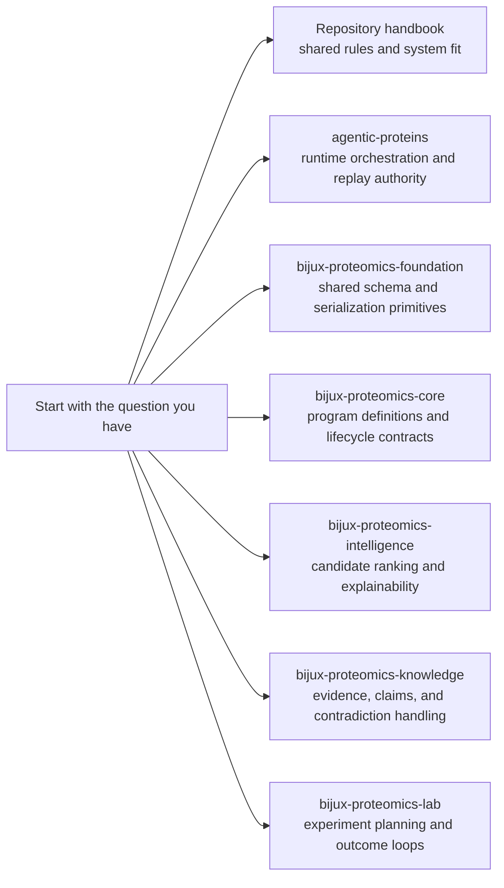

# Bijux Proteomics

`bijux-proteomics` is split on purpose. It is easier to understand, review, and
trust when runtime authority, program contracts, intelligence, evidence, and
lab planning stay separate instead of dissolving into one vague codebase.

This landing page is for orientation. A reader should be able to skim it,
decide where their question belongs, and move on without needing a meeting.

## How To Read The Site

## Start Here

- Open the [Repository Handbook](bijux-proteomics/index.md) when the question
  crosses package boundaries or touches shared repository rules.
- Open one product package when the question is about owned behavior, public
  surfaces, workflows, or proof inside that package.

## Package Handbooks

- [`agentic-proteins`](agentic-proteins/index.md) owns runtime execution,
  orchestration, replay, and operator-facing runtime surfaces.
- [`bijux-proteomics-foundation`](bijux-proteomics-foundation/index.md) owns
  schema compatibility helpers and canonical payload serialization primitives.
- [`bijux-proteomics-core`](bijux-proteomics-core/index.md) owns program
  definitions, constraints, and lifecycle contract models.
- [`bijux-proteomics-intelligence`](bijux-proteomics-intelligence/index.md)
  owns candidate scoring, ranking, and explainable decision outputs.
- [`bijux-proteomics-knowledge`](bijux-proteomics-knowledge/index.md) owns
  evidence records, claim state, and contradiction resolution boundaries.
- [`bijux-proteomics-lab`](bijux-proteomics-lab/index.md) owns experiment
  planning, assay outcomes, and closed-loop lab-facing artifacts.

The root docs should shorten conversations, not create new documentation
ceremony.
