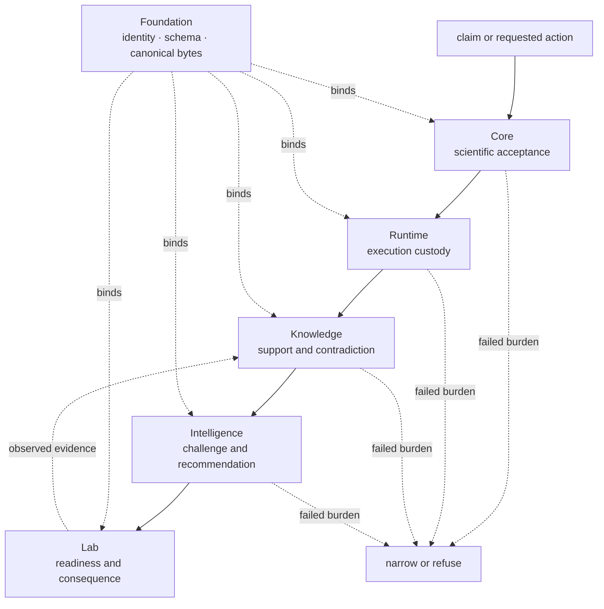
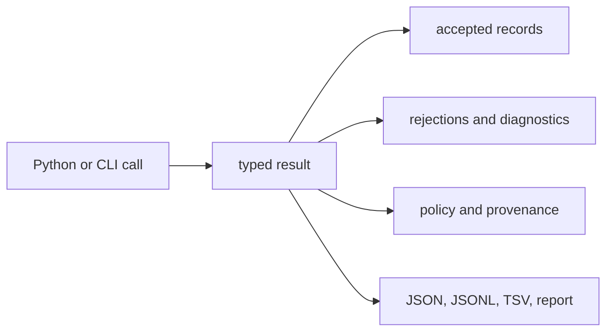

# Bijux Proteomics

`bijux-proteomics` is a composable Python platform for proteomics analysis,
reproducible execution, evidence-aware interpretation, and laboratory
follow-up. A reader can trace a result from accepted and rejected scientific
inputs through execution, grounding, recommendation, and observed consequence
without treating any one layer as authority for all the others.

<!-- bijux-proteomics-badges:generated:start -->
[](https://pypi.org/project/bijux-proteomics-runtime/)
[](https://github.com/bijux/bijux-proteomics/blob/main/LICENSE)
[](https://github.com/bijux/bijux-proteomics/actions/workflows/verify.yml?query=branch%3Amain)
[](https://github.com/bijux/bijux-proteomics/actions/workflows/release-pypi.yml)
[](https://github.com/bijux/bijux-proteomics/actions/workflows/release-ghcr.yml)
[](https://github.com/bijux/bijux-proteomics/actions/workflows/release-github.yml)
[](https://github.com/bijux/bijux-proteomics/actions/workflows/deploy-docs.yml)
[](https://github.com/bijux/bijux-proteomics/releases)
[](https://github.com/bijux?tab=packages&repo_name=bijux-proteomics)
[](https://github.com/bijux/bijux-proteomics/tree/main/packages)

[](https://pypi.org/project/agentic-proteins/)
[](https://pypi.org/project/bijux-proteomics-foundation/)
[](https://pypi.org/project/bijux-proteomics-core/)
[](https://pypi.org/project/bijux-proteomics-runtime/)
[](https://pypi.org/project/bijux-proteomics-intelligence/)
[](https://pypi.org/project/bijux-proteomics-knowledge/)
[](https://pypi.org/project/bijux-proteomics-lab/)

[](https://github.com/bijux/bijux-proteomics/pkgs/container/bijux-proteomics%2Fagentic-proteins)
[](https://github.com/bijux/bijux-proteomics/pkgs/container/bijux-proteomics%2Fbijux-proteomics-foundation)
[](https://github.com/bijux/bijux-proteomics/pkgs/container/bijux-proteomics%2Fbijux-proteomics-core)
[](https://github.com/bijux/bijux-proteomics/pkgs/container/bijux-proteomics%2Fbijux-proteomics-runtime)
[](https://github.com/bijux/bijux-proteomics/pkgs/container/bijux-proteomics%2Fbijux-proteomics-intelligence)
[](https://github.com/bijux/bijux-proteomics/pkgs/container/bijux-proteomics%2Fbijux-proteomics-knowledge)
[](https://github.com/bijux/bijux-proteomics/pkgs/container/bijux-proteomics%2Fbijux-proteomics-lab)

[](https://bijux.io/bijux-proteomics/02-agentic-proteins/)
[](https://bijux.io/bijux-proteomics/03-bijux-proteomics-foundation/)
[](https://bijux.io/bijux-proteomics/04-bijux-proteomics-core/)
[](https://bijux.io/bijux-proteomics/09-bijux-proteomics-runtime/)
[](https://bijux.io/bijux-proteomics/05-bijux-proteomics-intelligence/)
[](https://bijux.io/bijux-proteomics/06-bijux-proteomics-knowledge/)
[](https://bijux.io/bijux-proteomics/07-bijux-proteomics-lab/)
<!-- bijux-proteomics-badges:generated:end -->

Use this handbook to inspect ownership, evidence, limitations, and handoffs.
For installation commands, package badges, and the smallest executable
example, begin with the
[repository README](https://github.com/bijux/bijux-proteomics#readme).

## Product Scope

Six canonical packages divide responsibility: Foundation owns portable
contracts, Core owns scientific computation, Runtime owns execution, Knowledge
owns evidence memory, Intelligence owns decision policy, and Lab owns
experimental consequence. A compatibility distribution preserves historical
Runtime entrypoints without becoming a second owner.

| Question | Authority to open first | What it can establish | Where its authority stops |
| --- | --- | --- | --- |
| How is a record identified and serialized? | Foundation contract | subject identity, schema, canonical representation, digest, compatibility, and typed disposition | authenticity and scientific equivalence remain domain judgments |
| What scientific calculation ran? | Core report and benchmark lineage | inputs, assumptions, output, rejection, QC, and family acceptance | execution custody and biological interpretation remain separate |
| What actually executed? | Runtime run bundle | configuration, provider, state, artifacts, comparison, and replay evidence | completion does not establish scientific acceptance or transfer |
| Why is the claim supportable? | Knowledge review bundle | source identity, context, support, contradiction, and unresolved gaps | grounding does not select or authorize an action |
| Why did this action rank? | Intelligence recommendation record | candidate universe, policy, sensitivity, alternatives, confidence, and refusal | recommendations remain advisory until human and operational review |
| What did the follow-up cost and observe? | Lab consequence dossier | controls, readiness, custody, deviations, outcome, and feedback | observations do not rewrite earlier analytical or decision records |
| Why does an old import or command still work? | `agentic-proteins` compatibility record | forwarded owner, parity evidence, migration target, and retirement state | compatibility does not create a second implementation owner |
| Can this repository candidate be published? | maintainer release decision | revision-specific gates, governed outputs, package artifacts, channel scope, and blockers | a passing repository gate does not strengthen a scientific claim |

## Current Credible Workflow Families

| Workflow family | Permitted posture | Runtime lane | Primary interpretation boundary |
| --- | --- | --- | --- |
| DDA | `review_grade_bounded` | imported primary and companion results | no repository-owned raw search execution |
| DIA | `outsider_auditable_bounded` | raw-executable checked reports | no chromatogram-native or universal library transfer claim |
| LFQ | `outsider_auditable_bounded` | raw-executable checked features | no cross-cohort or accuracy-beyond-repeatability claim |
| multiplex | `internal_support_only` | raw-executable checked features | fragile companion transfer and no outsider consequence closure |
| PTM | `outsider_auditable_bounded` | raw-executable localization inputs | localization is not occupancy, function, or regulation |
| targeted | `outsider_auditable_bounded` | raw-executable targeted QC | calibration, interference, vendor parity, and assay burden remain bounded |

These postures are not maturity labels for the repository. They are
family-specific ceilings after the declared benchmark, execution, grounding,
recommendation, and consequence records are considered.

## Read The Status Vocabulary

| Term | What it establishes | What it does not establish |
| --- | --- | --- |
| outsider-readable packet | the published evidence chain can be opened and inspected | that every gate permits outsider-auditable language |
| `internal_support_only` | useful implementation and evidence exist inside a restricted authority boundary | a public recommendation or outsider consequence claim |
| `review_grade_bounded` | the checked material supports scientific review under named limits | raw execution parity, general transfer, or authority to act |
| `outsider_auditable_bounded` | an external reviewer can inspect and rerun the declared bounded chain | decision-grade, clinical, universal, or release-wide authority |
| release-ready | every required repository-wide category passes for one source candidate | universal scientific validity |

DDA demonstrates why the terms must remain separate: its packet is complete,
but imported execution lowers the black-box ceiling to review-grade. LFQ
demonstrates the converse: raw-executable primary and companion lanes defend an
outsider-auditable bounded chain while cohort transfer and truth beyond
repeatability remain explicitly outside scope.

## Forbidden Claims

The platform does not claim universal transfer across cohorts, instruments,
search engines, acquisition modes, or experimental designs. Successful
execution does not prove biological truth. Grounding does not authorize a
recommendation, and a recommendation does not establish laboratory value.

[Workflow claim limits](01-bijux-proteomics/foundation/workflow-claim-limits.md)
defines the family ceilings. [Release readiness](01-bijux-proteomics/foundation/release-readiness-matrix.md)
records the live repository gates.

## Reader Paths

| Reader | Route | Finish with |
| --- | --- | --- |
| **Scientist:** | follow the [Scientist Journey](01-bijux-proteomics/foundation/scientist-journey.md) from intake to consequence | a family-specific result, its acceptance evidence, and the limitation that bounds interpretation |
| **Operator:** | use the [Operator Rerun Journey](09-bijux-proteomics-runtime/operator-rerun-journey.md) | a run bundle whose request, environment, state, artifacts, and comparison can be reopened |
| **Reviewer:** | begin with [Cross-Package Ownership](01-bijux-proteomics/foundation/cross-package-ownership.md) and the [Public Artifact Index](01-bijux-proteomics/foundation/public-artifact-index.md) | a continuous chain from public claim to owning records and current gate verdict |
| **Maintainer:** | use [Maintainer Safe Change](08-bijux-proteomics-maintain/bijux-proteomics-dev/maintainer-safe-change.md) before editing an owned surface | the narrow checks, governed outputs, consumer impact, and release consequence |

Choose a route by the decision you need to make, then stop at the first missing
owner record. Do not substitute a later summary for an absent scientific,
execution, evidence, recommendation, or consequence artifact.

## Read a claim as a ledger

An outsider should be able to move from a sentence to the records that permit
that sentence. The chain is intentionally asymmetric: evidence can narrow a
claim at any layer, while success in a later layer cannot promote a weaker
earlier result.

| Ledger entry | Accountable package | Keep visible |
| --- | --- | --- |
| subject and payload identity | Foundation | canonical bytes, digest, schema, producer, and compatibility decision |
| analytical result | Core | source observations, exclusions, assumptions, QC, family acceptance, and limitations |
| execution history | Runtime | requested and selected capability, environment, events, artifacts, and terminal state |
| evidential interpretation | Knowledge | source versions, biological context, support, contradiction, freshness, and gaps |
| proposed action | Intelligence | alternatives, ranking policy, sensitivity, confidence posture, and refusal conditions |
| experimental consequence | Lab | readiness, controls, custody, deviation, observation, and feedback record |

The stable join is a typed identity or artifact reference. A filename, display
label, dashboard color, or prose summary is a view; none is sufficient to join
records across packages or revisions.

## One Result, Six Accountable Layers



The architecture separates computation from execution and separates evidence
from judgment. The chain is asymmetric: any layer may narrow the requested
language, while a later success cannot promote a weaker earlier record. This
matters when a run is repeated, a source is contradicted, or a recommendation
reaches the laboratory: each change has an identifiable owner and can be
reviewed without reconstructing hidden state.

| Boundary crossing | Required record | What must remain visible |
| --- | --- | --- |
| scientific request → execution | typed request and acceptance policy | input identities, assumptions, expected outputs, and refusal conditions |
| execution → grounding | run bundle and artifact ledger | terminal state, environment, diagnostics, and output hashes |
| grounding → decision | versioned scientific review bundle | support, contradiction, uncertainty, and unresolved gaps |
| decision → laboratory | advisory recommendation and rationale | alternatives, sensitivity, human-review state, and allowed action |
| laboratory → evidence | requested-versus-observed consequence | controls, deviations, QC, disposition, and parent identities |

## Scientific coverage

The implemented surface spans:

- sequence validation, digestion, amino-acid and peptide chemistry,
  modifications, isotope envelopes, and theoretical fragments;
- mzML and spectrum contracts, search-engine imports, PSM confidence,
  target-decoy review, contaminant audit, and protein inference;
- label-free quantification, DIA precursor and protein matrices, PTM review,
  targeted transitions, reproducibility, and QC;
- benchmark corpora, challenge assets, acceptance reports, and public case
  studies;
- evidence grounding, candidate ranking, recommendation challenge, and
  laboratory consequence.

Coverage is not a blanket accuracy claim. Package presence, successful
execution, and a public benchmark packet answer different questions. The
[workflow-family guide](01-bijux-proteomics/foundation/workflow-families.md)
shows the evidence for each family; the claim-limit page records where that
evidence must stop.

## Reader-First Sections

| You need to… | Start here | Authoritative result |
| --- | --- | --- |
| understand the product boundary | [Product Overview](01-bijux-proteomics/foundation/product-overview.md) | declared scope, non-goals, and package authority |
| trace system data and decisions | [Product Architecture](01-bijux-proteomics/foundation/product-architecture.md) | handoff owner, record identity, and refusal boundary |
| resolve canonical ownership | [Cross-Package Ownership](01-bijux-proteomics/foundation/cross-package-ownership.md) | one owner for the disputed meaning or behavior |
| compare evidence by workflow | [Workflow Families](01-bijux-proteomics/foundation/workflow-families.md) | family posture, execution mode, evidence, and current ceiling |
| inspect grounding, ranking, and consequence | [Decision Support](01-bijux-proteomics/foundation/decision-support.md) | evidence-to-action chain with human and lab authority intact |
| inspect scientific algorithms and evidence assets | [Core](04-bijux-proteomics-core/index.md) | scientific result and family-specific acceptance record |
| run, resume, compare, or reproduce work | [Runtime](09-bijux-proteomics-runtime/index.md) | run, state, artifact, and comparison records |
| trace a claim to evidence and contradictions | [Knowledge](06-bijux-proteomics-knowledge/index.md) | versioned evidence bundle and unresolved gaps |
| rank candidates or challenge a recommendation | [Intelligence](05-bijux-proteomics-intelligence/index.md) | policy-bound recommendation, downgrade, or refusal |
| plan follow-up assays and capture outcomes | [Lab](07-bijux-proteomics-lab/index.md) | readiness, handoff, observation, and consequence records |
| evolve schemas and stable identifiers | [Foundation](03-bijux-proteomics-foundation/index.md) | compatibility decision and canonical document identity |
| migrate historical execution callers | [agentic-proteins](02-agentic-proteins/index.md) | caller-specific parity evidence and canonical destination |
| develop, validate, or release the repository | [Maintainer handbook](08-bijux-proteomics-maintain/index.md) | exact gate output and release decision record |

## Start with a visible contract

Install the scientific core and parse one FASTA record:

```bash
python -m pip install bijux-proteomics-core
```

```python
from bijux_proteomics import parse_fasta_document

report = parse_fasta_document(
    ">sp|P31749|AKT1_HUMAN AKT serine/threonine kinase 1\nMPEPTIDEK\n"
)
assert len(report.accepted_records) == 1
assert not report.rejected_records
print(report.accepted_records[0].sequence_checksum)
```

This is intentionally a report rather than a list. Scientific inputs can be
partly valid, and the rejected portion is evidence about what the calculation
did not use. The same design recurs across format intake, FDR review, protein
inference, quantification, knowledge grounding, recommendation, and laboratory
follow-up.



## Trust model

Every defensible result has five independently inspectable forms:

1. **Scientific contract** — typed inputs, explicit assumptions, and a
   domain-specific result or refusal.
2. **Execution record** — configuration, provider choice, checkpoints,
   artifacts, and failure state.
3. **Evidence record** — citations, contexts, provenance, supporting and
   contradicting observations.
4. **Decision record** — ranking policy, sensitivity, counterfactuals,
   uncertainty, and recommendation posture.
5. **Consequence record** — requested assay, readiness decision, observed
   outcome, and feedback into the evidence base.

Canonical serialization and stable identifiers connect these forms without
collapsing their meanings. Missing evidence is represented as a limitation or
refusal, not converted into confidence by orchestration.

## Verification boundaries

Benchmark-backed support is workflow-specific. A successful execution proves
that a declared run completed under its recorded contract; it does not prove
biological truth. A grounded claim records support and contradiction; it does
not automatically authorize a recommendation. A recommendation does not
become validated until its downstream evidence and assay outcomes justify it.

Use [current capability limits](01-bijux-proteomics/foundation/current-capability-limits.md)
for unsupported or bounded areas and the
[release readiness matrix](01-bijux-proteomics/foundation/release-readiness-matrix.md)
for the current evidence gates.

## Public interfaces

<code>bijux-proteomics-runtime</code> governs execution and replay.
<code>agentic-proteins</code> preserves compatibility entrypoints.

- `bijux-proteomics` exposes the core scientific CLI.
- `bijux-proteomics-runtime` exposes canonical execution through a CLI and
  HTTP application.
- Python APIs are package-owned and re-exported through explicit public API
  modules.
- JSON documents use foundation serialization and compatibility contracts
  where they cross package or process boundaries.

Begin with the [repository handbook](01-bijux-proteomics/index.md) for package
selection, or go directly to the package that owns your scientific or
operational concern.
