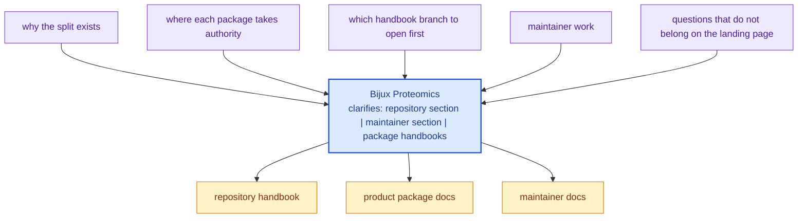

# Bijux Proteomics

`bijux-proteomics` is a deliberately split system for deterministic protein
runtime execution, shared contracts, decision intelligence, evidence handling,
and lab orchestration. The split is the architecture, not a packaging detail.

This site is meant to stand on its own. A new reader should be able to answer
three questions quickly: why the repository is split, which package owns the
current concern, and which checked-in files prove the story being told.

<strong>Start with the package split, not the file tree.</strong>
Foundation keeps shared payload meaning stable. Core defines program and
lifecycle contracts. Knowledge tracks claims and evidence state. Intelligence
turns those inputs into inspectable decisions. Lab carries assay planning and
outcomes. <code>agentic-proteins</code> governs execution and replay. The
repository handbook exists to explain how those responsibilities fit together
without pretending they are one thing.

  
<h3>Whole-System Idea</h3>
Use the root pages to understand why the repository is split and how the proteomics packages fit into one accountable flow.

  
<h3>Honesty Rule</h3>
The docs are only useful if they send readers back to code, schema artifacts, tests, and workflows quickly enough to verify the claims.

  
<h3>Fast Reading Path</h3>
Open the repository handbook for cross-package questions, one product handbook for owned behavior, and the maintainer handbook for repository health.

<a class="md-button md-button--primary" href="bijux-proteomics/">Open the repository handbook</a>
<a class="md-button" href="bijux-proteomics-maintain/">Open maintenance docs</a>

## Visual Summary

## Start Here

- open [bijux-proteomics](bijux-proteomics/index.md) when the question crosses
  package boundaries or touches shared governance
- open one product package when you need ownership, interfaces, operations, or
  proof for one package
- open [bijux-proteomics-maintain](bijux-proteomics-maintain/index.md) for
  repository automation, schema enforcement, and maintainer-only guardrails

## Package Flow

| Package | Owns | Open It When |
| --- | --- | --- |
| `agentic-proteins` | runtime execution, replay, and operator-facing orchestration | you need the execution authority layer |
| `bijux-proteomics-foundation` | schema compatibility and canonical serialization primitives | you are changing shared payload meaning |
| `bijux-proteomics-core` | program definitions, constraints, and lifecycle contracts | you are changing program or gate behavior |
| `bijux-proteomics-intelligence` | scoring, ranking, and explainable decision logic | you are tuning recommendations or policy |
| `bijux-proteomics-knowledge` | evidence records, claim state, and contradiction handling | the work concerns trust or evidence state |
| `bijux-proteomics-lab` | experiment planning, assay outcomes, and closed-loop lab artifacts | the work concerns lab execution or outcome promotion |

## Documentation Scope

- the `bijux-proteomics` repository handbook
- the `bijux-proteomics-maintain` maintainer handbook
- the product package handbooks published from this repository

## Purpose

This page is the front door to the handbook. Its job is to make the split
legible quickly enough that a reader can choose the right next section before
they drown in detail.

## Stability

Keep it aligned with the sections rendered in `docs/`, the packages that still
ship from this repository, and the reasons the split exists.
