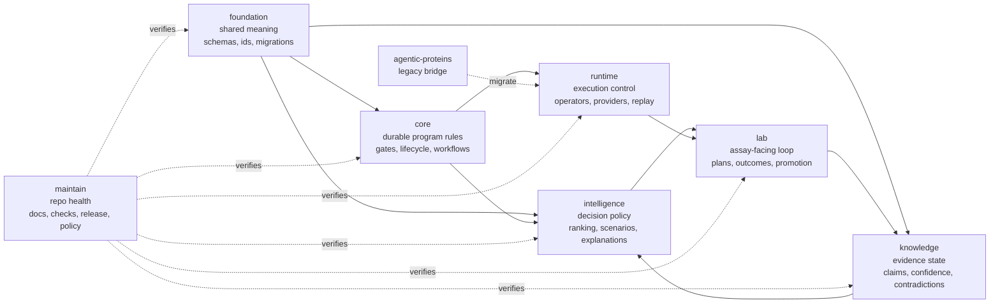

# Bijux Proteomics

`bijux-proteomics` is a modular proteomics system. It does not hide its ideas
inside one large package. It separates shared meaning, durable program rules,
evidence state, decision policy, lab execution, and runtime control so each
kind of responsibility can stay legible.

The point of this split is not packaging for its own sake. The point is to make
serious scientific and operational work reviewable: what the system means,
what it knows, how it decides, how it runs, and how it touches the lab are not
the same question and should not collapse into the same code story.

That does not mean the full scientific workflow already exists. Today the
repository is strongest where contracts, package boundaries, and reviewable
domain surfaces are concerned. The end-to-end proteomics workflow story still
needs more explicit stage blueprints and clearer current-scope boundaries.

<!-- bijux-proteomics-badges:generated:start -->

<!-- bijux-proteomics-badges:generated:end -->

## What Makes This Repository Worth Reading

- it treats proteomics work as a system with distinct layers of truth, policy,
  execution, and experiment
- it keeps evidence and recommendation separate, so a ranking is never allowed
  to masquerade as raw fact
- it keeps runtime and lab behavior separate, so orchestration and assay action
  can evolve without erasing their seam
- it keeps the migration from `agentic-proteins` visible instead of pretending
  the transition never happened

## Current Limit

The current repository can explain and validate package-level responsibilities,
but it is still building the scientific workflow spine that should carry one
proteomics program from sequence intake through assay planning, evidence review,
and advancement decisions.

## Start Here

- Open the [Repository Handbook](https://bijux.io/bijux-proteomics/01-bijux-proteomics/)
  when the question is about the system as a whole and not yet about one
  package.
- Open the [Scientific Workflow Roadmap](https://bijux.io/bijux-proteomics/01-bijux-proteomics/foundation/scientific-workflow-roadmap/)
  when the question is what the current package stack still needs before it
  becomes a full proteomics workflow engine.
- Open one product handbook when you already know where the real idea lives:
  evidence, decisions, lab work, execution, or shared contracts.
- Open the [Maintainer Handbook](https://bijux.io/bijux-proteomics/08-bijux-proteomics-maintain/)
  when the question is how the repository keeps itself honest.

## Package Family At A Glance

The live publishable shape is six real product packages plus one compatibility
bridge:

| Package | Owns |
| --- | --- |
| `bijux-proteomics-foundation` | shared schema compatibility, identifiers, and deterministic serialization |
| `bijux-proteomics-core` | program definitions, lifecycle contracts, and gate semantics |
| `bijux-proteomics-knowledge` | evidence records, claims, confidence, and contradiction state |
| `bijux-proteomics-intelligence` | scoring, ranking, scenario evaluation, and explanations |
| `bijux-proteomics-lab` | assay planning, outcome capture, and lab-facing loop control |
| `bijux-proteomics-runtime` | execution, replay, provider integration, and operator entrypoints |
| `agentic-proteins` | explicit compatibility bridge for legacy imports and checked migration-off paths |

<code>bijux-proteomics-runtime</code> governs execution and replay.
<code>agentic-proteins</code> preserves compatibility entrypoints.

## Reading Paths

- If you want the architecture story first:
  [Repository Handbook](https://bijux.io/bijux-proteomics/01-bijux-proteomics/)
  then
  [Foundation](https://bijux.io/bijux-proteomics/03-bijux-proteomics-foundation/)
  then
  [Core](https://bijux.io/bijux-proteomics/04-bijux-proteomics-core/)
- If you want the scientific reasoning story first:
  [Knowledge](https://bijux.io/bijux-proteomics/06-bijux-proteomics-knowledge/)
  then
  [Intelligence](https://bijux.io/bijux-proteomics/05-bijux-proteomics-intelligence/)
  then
  [Lab](https://bijux.io/bijux-proteomics/07-bijux-proteomics-lab/)
- If you want the operational story first:
  [Runtime Handbook](https://bijux.io/bijux-proteomics/09-bijux-proteomics-runtime/)
  then
  [agentic-proteins](https://bijux.io/bijux-proteomics/02-agentic-proteins/)
  then
  [Maintainer Handbook](https://bijux.io/bijux-proteomics/08-bijux-proteomics-maintain/)

## First Proof Check

- `packages/` for the package split this page is explaining
- `mkdocs.yml` for the published navigation spine
- package tests, schema artifacts, and workflows once one package clearly owns
  the claim

## Boundary

This page should make the system feel coherent before the reader sees code. It
should not try to replace the owning handbooks for package-level detail.
