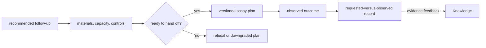

# bijux-proteomics-lab

<!-- bijux-proteomics-badges:generated:start -->
[](https://pypi.org/project/bijux-proteomics-lab/)
[-0A7BBB)](https://pypi.org/project/bijux-proteomics-lab/)
[](https://github.com/bijux/bijux-proteomics/blob/main/LICENSE)
[](https://github.com/bijux/bijux-proteomics/actions/workflows/verify.yml?query=branch%3Amain)
[](https://github.com/bijux/bijux-proteomics)

[](https://pypi.org/project/bijux-proteomics-lab/)
[](https://pypi.org/project/agentic-proteins/)
[](https://pypi.org/project/bijux-proteomics-foundation/)
[](https://pypi.org/project/bijux-proteomics-core/)
[](https://pypi.org/project/bijux-proteomics-runtime/)
[](https://pypi.org/project/bijux-proteomics-intelligence/)
[](https://pypi.org/project/bijux-proteomics-knowledge/)

[](https://github.com/bijux/bijux-proteomics/pkgs/container/bijux-proteomics%2Fbijux-proteomics-lab)
[](https://github.com/bijux/bijux-proteomics/pkgs/container/bijux-proteomics%2Fagentic-proteins)
[](https://github.com/bijux/bijux-proteomics/pkgs/container/bijux-proteomics%2Fbijux-proteomics-foundation)
[](https://github.com/bijux/bijux-proteomics/pkgs/container/bijux-proteomics%2Fbijux-proteomics-core)
[](https://github.com/bijux/bijux-proteomics/pkgs/container/bijux-proteomics%2Fbijux-proteomics-runtime)
[](https://github.com/bijux/bijux-proteomics/pkgs/container/bijux-proteomics%2Fbijux-proteomics-intelligence)
[](https://github.com/bijux/bijux-proteomics/pkgs/container/bijux-proteomics%2Fbijux-proteomics-knowledge)

[](https://bijux.io/bijux-proteomics/07-bijux-proteomics-lab/)
[](https://bijux.io/bijux-proteomics/02-agentic-proteins/)
[](https://bijux.io/bijux-proteomics/03-bijux-proteomics-foundation/)
[](https://bijux.io/bijux-proteomics/04-bijux-proteomics-core/)
[](https://bijux.io/bijux-proteomics/09-bijux-proteomics-runtime/)
[](https://bijux.io/bijux-proteomics/05-bijux-proteomics-intelligence/)
[](https://bijux.io/bijux-proteomics/06-bijux-proteomics-knowledge/)
<!-- bijux-proteomics-badges:generated:end -->

`bijux-proteomics-lab` is the operational lab layer for assay planning,
readiness, handoff honesty, and observed-outcome reconciliation. It turns
scientific intent into executable work only when queue pressure, material
limits, controls, provenance, and operator-facing caveats stay explicit.

Within the suite, lab owns assay consequence planning, readiness, and observed
outcomes.

Use this package when the question is whether a follow-up is feasible, safe to
hand off, and traceable after execution. Its success criteria are operational
honesty, feasibility, and traceability rather than analytical enthusiasm.
Operational honesty, feasibility, and traceability are the non-negotiable
release criteria for this package.

Release-facing maintainers should keep `README.md`, `CHANGELOG.md`, and the
package `docs/*.md` set aligned before claiming stronger operational coverage
or handoff safety guarantees.

## At a glance

- Use lab when the real question is whether a follow-up should run, can run
  safely, and can be reconciled honestly after execution.
- Start with the planning entrypoints for advisory and executable assay plans,
  then open the
  [lab handbook](https://bijux.io/bijux-proteomics/07-bijux-proteomics-lab/)
  for readiness, handoff, and outcome routes.
- Route scientific truth to core, evidence memory to knowledge,
  recommendation posture to intelligence, and execution control to runtime.

## Consequence flow



Lab makes the cost and operational consequence of a recommendation visible. It
does not reinterpret analytical evidence or silently convert advisory planning
into executable instructions.

## No result is not one state

Work can stop before readiness, during execution, at QC, or after an accepted
but inconclusive measurement. Those outcomes carry different evidence and
permit different next actions.

| Terminal condition | Record to retain | Do not report |
| --- | --- | --- |
| unready plan | failed readiness checks and unresolved prerequisites | assay failure |
| deferred plan | capacity, material, timing, and owner constraint | rejected scientific question |
| failed execution | handoff identity, events, diagnostics, and consumed resources | biological null result |
| rejected measurement | raw observation, QC failure, controls, and deviations | accepted evidence |
| inconclusive measurement | accepted data, answerability limits, and requested-versus-observed comparison | confirmation or contradiction |

Keeping these dispositions distinct prevents pressure to turn operational loss
or weak answerability into an apparently complete experimental loop.

## Why teams pick this package

- dependency-aware planning that keeps queue pressure, gate pressure, and
  family capacity visible before spend is committed
- readiness and handoff contracts that refuse weak, ambiguous, or
  under-controlled follow-up instead of flattening those problems into notes
- outcome reconciliation that records what was asked, what actually ran, and
  how belief posture should change afterward
- benchmark rehearsals that show whether targeted operational claims are
  supportable before operators inherit them
- outcome dossiers and worth-it ledgers that show whether requested follow-up
  loops repaid their cost after execution pressure was visible

## Typical use cases

- build executable assay batches from scientific requirements, dependencies,
  and capacity limits
- block or downgrade execution when material, controls, provenance, staffing,
  or instrument readiness is weak
- produce operator-facing handoffs that preserve protocol version, required
  controls, caveats, field loss, and refusal reasons
- reconcile observed outcomes back into supported, weakened, or blocked
  feedback for downstream review

## Installation

```bash
pip install bijux-proteomics-lab
```

## Quick start

```python
from bijux_proteomics_lab import (
    build_advisory_assay_plan,
    build_executable_assay_plan,
    plan_experiment_batches,
)
```

Import owner bands directly for deeper work:

```python
from bijux_proteomics_lab.handoffs.explanations import build_handoff_explanation
from bijux_proteomics_lab.handoffs.exports import build_lims_export_bundle
from bijux_proteomics_lab.handoffs.transitions import build_targeted_transition_review
from bijux_proteomics_lab.readiness.operations import build_operational_readiness_report
from bijux_proteomics_lab.reconciliation.follow_up import (
    reconcile_planned_and_observed_outcome,
)
```

## Public APIs

The stable root API stays focused on planning and execution readiness:

- `plan_experiment_batches(...)` for dependency-aware batch planning
- `build_advisory_assay_plan(...)` for non-executable scientific follow-up guidance
- `build_executable_assay_plan(...)` for execution-ready batch instructions

Minimal executable example:

```python
from bijux_proteomics.domain.assays import AssayRequirement
from bijux_proteomics.domain.program_spec import create_program_spec
from bijux_proteomics.domain.reviews import ReviewGate
from bijux_proteomics_lab import build_advisory_assay_plan

program = create_program_spec(
    program_id="prog-readme",
    name="binder rescue",
    objective="recover binding while preserving folding",
    target_id="protein:p11111",
    target_name="PTM1",
    sequence="MPEPTIDEK",
    organism="human",
    mechanism="stabilize productive packing",
).model_copy(
    update={
        "assay_panel": [
            AssayRequirement(
                assay_id="primary-binding",
                purpose="confirm target engagement",
                readout="binding_score",
                sample_kind="biophysical",
                blocking=True,
            )
        ],
        "review_gates": [
            ReviewGate(
                gate_id="pre-synthesis",
                name="Pre-synthesis review",
                required_roles=["scientist"],
                decision_inputs=["evidence_bundle"],
            )
        ],
    }
)
plan = build_advisory_assay_plan(program)

assert plan.program_id == "prog-readme"
assert plan.recommendations[0].assay_id == "primary-binding"
```

## Package identity

- Distribution name: `bijux-proteomics-lab`
- Import root: `bijux_proteomics_lab`
- Stable root entrypoints: `plan_experiment_batches`,
  `build_advisory_assay_plan`, and `build_executable_assay_plan`
- Stable owner bands: `design`, `planning`, `readiness`, `lifecycle`,
  `handoffs`, `outcomes`, `reconciliation`, and `benchmarks`

## Package boundaries

This package owns execution reality for lab follow-up: planning, readiness,
handoff honesty, observed-outcome reconciliation, and benchmark rehearsals that
prove whether an operational story is supportable.

It does not own analytical recommendation logic, core scientific semantics, or
execution orchestration or runtime policy.

## What this package must not do

- it must not decide analytical ranking or recommendation posture
- it must not redefine core scientific semantics or runtime orchestration rules
- it must not hide blocked work inside optimistic handoff packets or free-form operator notes

## Consequence chain route

Lab owns the downstream burden and observed outcome part of the shared
consequence chain, not a separate trust story that can outrank knowledge or
intelligence.

- use [Workflow Consequence Maps](https://bijux.io/bijux-proteomics/01-bijux-proteomics/foundation/workflow-consequence-maps/)
  when the question is whether assay burden or the cost of being wrong already
  blocks stronger public recommendation language
- use [Outcome Learning Loops](https://bijux.io/bijux-proteomics/07-bijux-proteomics-lab/foundation/outcome-learning-loops/)
  when the question is how requested-versus-observed follow-up should tighten
  or weaken the next recommendation
- use [Workflow Refusal Handbook](https://bijux.io/bijux-proteomics/07-bijux-proteomics-lab/foundation/workflow-refusal-handbook/)
  when the honest next action is to stop, rerun, narrow, or refuse before more
  assay spend

## Contract checkpoints

- planning outputs preserve dependency, queue, and material context
- readiness reports keep blocked controls, provenance gaps, and staffing or
  instrument pressure explicit
- handoff artifacts preserve protocol version, required controls, refusal
  reasons, and lossy export notes
- reconciliation keeps requested assays, observed assays, belief posture, and
  operational follow-through aligned
- benchmark outputs keep supported, weakened, and blocked claims separate
- benchmark outcome dossiers keep requested assays, observed assays, and
  worth-it judgment visible in the same owner surface

## Choose this package when

- a change alters lab feasibility, execution readiness, handoff integrity, or
  observed-outcome follow-through
- queue pressure, material limits, or control coverage need to change how work
  is planned or refused
- the package should be able to defend a handoff to operations reviewers
  without hiding weak evidence or fragile execution assumptions

## Route elsewhere when

- the change decides which candidates should be recommended, ranked, or argued
  for analytically
- the change defines core scientific truth such as assay semantics, domain
  lifecycle law, sequence meaning, or evidence ontology
- the change owns execution orchestration, runtime policy, provider binding,
  route transport, or operator entrypoints

## Verification route

- run the owner-family tests under `tests/design`, `tests/planning`,
  `tests/readiness`, `tests/handoffs`, `tests/outcomes`, and
  `tests/reconciliation`
- review `docs/BOUNDARIES.md`, `docs/CONTRACTS.md`, and `docs/ARCHITECTURE.md`
  when ownership or refusal behavior changes
- use `tests/benchmarks` when targeted operational claims or benchmark
  rehearsals change

## Review questions

- does the change improve operational honesty, feasibility, or traceability
  rather than just making a recommendation look cleaner
- would operators learn about blocked controls, weak provenance, or material
  scarcity early enough to stop irresponsible spend
- can the package still explain the behavior without claiming analytical
  recommendation authority, core scientific semantics, or runtime ownership

## Escalation route

- escalate out when the real owner is intelligence recommendation policy, core
  scientific semantics, or runtime execution orchestration
- stop and review the handoff and readiness owners when a proposal tries to
  smuggle fragile execution assumptions through a successful-looking packet
- escalate before release when operators could mistake advisory enthusiasm for
  executable readiness

## Consumer impact signals

- treat changes to queue pressure, material feasibility, refusal reasons,
  protocol caveats, or reconciliation posture as high impact
- expect downstream review when benchmark, handoff, or readiness behavior
  changes because operators and reviewers depend on those claims staying
  interpretable
- treat root-surface changes as high impact because the root is intentionally
  narrow and curated

## Explicit non-goals

- this package does not own analytical recommendation logic
- this package does not own core scientific semantics
- this package does not own execution orchestration or runtime policy
- this package does not hide blocked work inside optimistic packets or free-form
  operator notes

## Source guide

- `planning/assays.py`, `planning/scheduling.py`, `planning/priorities.py`,
  and `planning/next_cycle.py` for executable planning, capacity fitting,
  practical prioritization, and next-cycle recommendation
- `readiness/operations.py` and `readiness/stages.py` for material,
  provenance, controls, staffing, instrument, and stage readiness
- `handoffs/transitions.py`, `handoffs/explanations.py`, and
  `handoffs/exports.py` for transition review, refusal behavior, explanation
  packets, and lossy export notes
- `handoffs/risk.py` and `handoffs/ptm.py` for assay-risk and PTM-specific
  operational controls
- `outcomes/observations.py` and `reconciliation/follow_up.py` for observed
  outcome posture and follow-through
- `benchmarks/claims.py` and `benchmarks/rehearsals.py` for targeted benchmark
  claim support and rehearsal delivery
- `benchmarks/follow_up.py` and `benchmarks/outcome_dossiers.py` for planned
  assay boundaries, requested-versus-observed closure, and assay-worth-it
  evidence

## Documentation

- [Lab consequence](https://bijux.io/bijux-proteomics/07-bijux-proteomics-lab/foundation/lab-consequence/)
- [Outcome learning loops](https://bijux.io/bijux-proteomics/07-bijux-proteomics-lab/foundation/outcome-learning-loops/)
- [Product architecture](https://bijux.io/bijux-proteomics/01-bijux-proteomics/foundation/product-architecture/)
- [Cross-package ownership](https://bijux.io/bijux-proteomics/01-bijux-proteomics/foundation/cross-package-ownership/)
- [Package guide](https://bijux.io/bijux-proteomics/07-bijux-proteomics-lab/)
- [Architecture overview](https://bijux.io/bijux-proteomics/07-bijux-proteomics-lab/architecture/)
- [Ownership boundary](https://bijux.io/bijux-proteomics/07-bijux-proteomics-lab/foundation/ownership-boundary/)
- [Interface contracts](https://bijux.io/bijux-proteomics/07-bijux-proteomics-lab/interfaces/)
- [Workflow refusal handbook](https://bijux.io/bijux-proteomics/07-bijux-proteomics-lab/foundation/workflow-refusal-handbook/)
- [Experiment design and protocol planning](https://github.com/bijux/bijux-proteomics/blob/main/packages/bijux-proteomics-lab/docs/EXPERIMENT_DESIGN.md)
