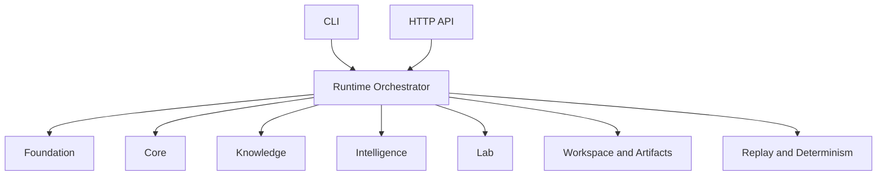

# Architecture

## Package identity

- Distribution name: `bijux-proteomics-runtime`
- Import root: `bijux_proteomics_runtime`

## Architectural role

`bijux-proteomics-runtime` is the canonical execution layer in the proteomics
package family.

## Responsibility

The runtime layer coordinates how workflows run; it does not define what the
scientific meaning is.

Runtime-owned capabilities:

- CLI and operator entrypoint routing
- HTTP API wiring for runtime operations
- provider binding and provider execution adapters
- runtime state machine and execution control
- workspace and run artifact lifecycle
- replay and determinism enforcement
- orchestration across foundation/core/knowledge/intelligence/lab

## Execution charter

- canonical entrypoints: `api/cli.py`, `api/app.py`, `api/v1/endpoints/`, and `runs/manager.py`
- provider binding: `providers/catalog.py`, `providers/contracts.py`, `providers/selection.py`, `providers/capabilities.py`, and `providers/environment.py`
- workflow execution: `runs/manager.py`, `workflows/paths.py`, `workflows/plans.py`, `execution/agents/`, `execution/`, and `execution/tools/`
- replay and recovery: `runs/replay.py`, `runs/reruns.py`, `runs/recovery.py`, `runs/preflight.py`, `state/`, `support/`, and `support/workspace.py`
- reviewable outputs: `api/catalog.py`, `runs/contracts.py`, `runs/import_lineage.py`, `runs/launch_bundles.py`, `runs/failure_reports.py`, and `workflows/paths.py`

## Execution model

The runtime layer composes lower-layer package capabilities and exposes
execution surfaces to users and automation.

## Design constraints

- Runtime composes lower layers but never redefines their domain truth.
- Runtime adapts lower-layer models for execution and transport boundaries.
- Runtime keeps operator interfaces stable while internal orchestration evolves.

## Module topology

- `governance/charter.py` owns the machine-readable execution charter and release-blocking module audit
- `api/` owns FastAPI assembly, request logging, `api/routes/`, and `api/v1/endpoints/`
- `api/cli.py` owns the canonical CLI contract and operator-safe command output
- `artifacts/` owns runtime artifact trees, publication materialization, and archive-safe export helpers
- `checkpoints/` owns resumable execution checkpoints and checkpoint persistence primitives
- `diff/` owns runtime comparison and drift-report surfaces over completed runs
- `runs/` owns run identity, run config, preflight, recovery, decisions, lineage, bundles, and typed execution context
- `handoff/` owns runtime-side handoff packaging between execution and downstream review surfaces
- `parallel/` owns parallel execution coordination helpers that remain runtime-local
- `workflows/` owns workflow planning, reproducibility, smoke workflow catalogs, reviewable path manifests, and execution assurance ledgers
- `providers/` owns provider cataloging, capability gates, selection, metadata, and execution environment contracts
- `rehydrate/` owns completed-run rehydration and archive-to-runtime restoration helpers
- `resume/` owns resumable workflow restart surfaces built on runtime checkpoints
- `execution/agents/` and `execution/` own runtime-local planning, coordination, engine, graph, and tool support
- `state/` owns replayable state, history, and review-safe persistence contracts
- `streaming/` owns runtime event streaming and live execution transport contracts
- `support/` owns runtime identity, execution primitives, artifact format contracts, and workspace support

## Route owners

- `api/routes/runtime_execution.py` owns run, import, resume, compare, and inspect route composition
- `api/routes/decision_briefs.py` owns decision brief transport
- `api/routes/quant_reports.py` owns quant-report transport
- `api/routes/ptm_reports.py` owns PTM-report transport
- `api/routes/evidence_graph.py` owns evidence-graph transport
- `api/routes/lab_handoffs.py` owns lab handoff transport
- `api/routes/adapter_conformance.py` owns adapter-conformance transport

## Supported execution surfaces

- `launch_surface="local"` is the direct workspace execution surface
- `launch_surface="container"` is the container bundle and digest-capture surface, not a container-image build system
- `launch_surface="scheduler"` is the scheduler bundle and submission-metadata surface, not a queue-policy or cluster-provisioning system
- `launch_surface="import"` is the import-only normalization surface, not a scientific derivation surface
- `execution_mode="auto"` may degrade to CPU after provider capability checks
- `execution_mode="cpu"` is the CPU-compatible execution surface
- `execution_mode="gpu"` requires a provider and environment that can honor GPU work

## Canonical tree layout

- Import roots: `bijux_proteomics_runtime`
- Top-level families: `api/`, `artifacts/`, `checkpoints/`, `diff/`, `execution/`, `governance/`, `handoff/`, `parallel/`, `providers/`, `rehydrate/`, `resume/`, `runs/`, `state/`, `streaming/`, `support/`, `workflows/`
- Root modules: `public_api.py`

## Dependency direction

Runtime may depend on foundation, core, intelligence, knowledge, and lab in
order to orchestrate flagship workflow execution.

Lower-layer packages must not depend on runtime, and runtime should not take
ownership of their scientific meaning.

## Interop topology

Runtime consumes lower-layer public contracts directly and keeps compatibility
forwarding in `agentic-proteins` instead of mirroring runtime-local ownership
inside the canonical package.

This keeps lower packages runtime-agnostic and prevents upward leakage of
runtime-specific schemas.

## Downstream expectations

Downstream callers should integrate through exact owner modules such as
`api.app`, `runs.manager`, `workflows.paths`, and `providers.selection` instead
of teaching internal consumers to widen package-root imports.

New orchestration features should land here before compat forwarding in
`agentic-proteins` grows.

## Extension signals

- add code here when a new concern changes canonical operator entrypoints,
  provider binding, replay safety, or orchestration coordination
- extend `api/cli.py`, `api/routes/`, `api/v1/endpoints/`, `runs/`,
  `workflows/`, or `providers/` before compat or lower packages invent
  runtime-local entrypoints
- keep new transport and orchestration behavior here when it changes how
  canonical execution runs rather than what lower-layer domain truth means

## Misplacement signals

- if the change defines schema, lifecycle, evidence, ranking, or lab semantics,
  it belongs in the owning lower package first
- if a helper exists only to preserve historical imports, it belongs in
  `agentic-proteins` as a forwarding surface instead of widening runtime roots
- if a provider-specific rule would leak back into domain models, keep it in the
  runtime/provider layer rather than pushing runtime ownership downward

## Review questions

- does the change alter canonical operator entrypoints, provider binding,
  replay safety, or orchestration coordination rather than lower-layer truth
- would compat or lower packages start carrying runtime-local transport or
  execution behavior if this concern stayed out of runtime
- can the architecture still be described without masking a missing contract in
  foundation, core, intelligence, knowledge, or lab
