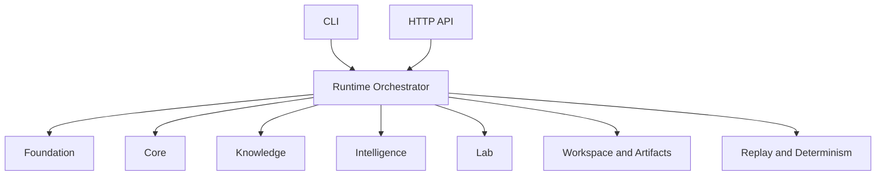

# Architecture

## Package identity

- Distribution name: `bijux-proteomics-runtime`
- Import root: `bijux_proteomics_runtime`

## Architectural role

`bijux-proteomics-runtime` is the canonical execution layer in the proteomics
package family.

## Responsibility

The runtime layer coordinates how workflows run; it does not define what the
scientific meaning is.

Runtime-owned capabilities:

- CLI and operator entrypoint routing
- HTTP API wiring for runtime operations
- provider binding and provider execution adapters
- runtime state machine and execution control
- workspace and run artifact lifecycle
- replay and determinism enforcement
- orchestration across foundation/core/knowledge/intelligence/lab

## Execution charter

- canonical entrypoints: `interfaces/`, `api/`, and `runs/operations.py`
- provider binding: `providers/`, `providers/capabilities.py`, and `providers/support.py`
- workflow execution: `agents/`, `execution/`, `tools/`, `runs/manager.py`, and `workflows/`
- replay and recovery: `runs/`, `runtime/control/`, `memory/`, `state/`, and `runtime/workspace.py`
- reviewable outputs: `api/catalog.py`, `runtime/control/execution_surfaces.py`, `runtime/control/failure_reports.py`, and `workflows/paths.py`

## Execution model

The runtime layer composes lower-layer package capabilities and exposes
execution surfaces to users and automation.

## Design constraints

- Runtime composes lower layers but never redefines their domain truth.
- Runtime adapts lower-layer models for execution and transport boundaries.
- Runtime keeps operator interfaces stable while internal orchestration evolves.

## Module topology

- `charter.py` owns the machine-readable execution charter and release-blocking module audit
- `interfaces/` owns CLI-facing runtime contracts
- `api/` owns HTTP entrypoints, request logging, and request-scoped base-dir wiring
- `runs/` owns run identity, run config, correlation, canonical run operations, and typed execution context
- `workflows/` owns workflow planning, reproducibility, reviewable path manifests, and end-to-end workflow run reports
- `providers/` owns provider binding, capability gates, and provider execution support
- `runtime/context/` and moved `runtime/control/*` modules remain compatibility forwarding surfaces only
- `agents/`, `execution/`, and `tools/` own runtime-local execution planning and coordination support
- `memory/` and `state/` own replayable state, history, and review-safe persistence contracts

## Dependency direction

Runtime may depend on foundation, core, intelligence, knowledge, and lab in
order to orchestrate canonical workflow execution.

Lower-layer packages must not depend on runtime, and runtime should not take
ownership of their scientific meaning.

## Interop topology

Runtime consumes lower-layer public contracts directly and keeps compatibility
forwarding in `agentic-proteins` instead of mirroring runtime-local ownership
inside the canonical package.

This keeps lower packages runtime-agnostic and prevents upward leakage of
runtime-specific schemas.

## Downstream expectations

Downstream callers should integrate through the canonical runtime roots and
leave domain meaning in the lower packages. New orchestration features should
land here before compat forwarding in `agentic-proteins` grows.

## Extension signals

- add code here when a new concern changes canonical operator entrypoints,
  provider binding, replay safety, or orchestration coordination
- extend `interfaces/`, `api/`, `runs/`, `workflows/`, or `providers/` before
  compat or lower packages invent runtime-local entrypoints
- keep new transport and orchestration behavior here when it changes how
  canonical execution runs rather than what lower-layer domain truth means

## Misplacement signals

- if the change defines schema, lifecycle, evidence, ranking, or lab semantics,
  it belongs in the owning lower package first
- if a helper exists only to preserve historical imports, it belongs in
  `agentic-proteins` as a forwarding surface instead of widening runtime roots
- if a provider-specific rule would leak back into domain models, keep it in the
  runtime/provider layer rather than pushing runtime ownership downward

## Review questions

- does the change alter canonical operator entrypoints, provider binding,
  replay safety, or orchestration coordination rather than lower-layer truth
- would compat or lower packages start carrying runtime-local transport or
  execution behavior if this concern stayed out of runtime
- can the architecture still be described without masking a missing contract in
  foundation, core, intelligence, knowledge, or lab
