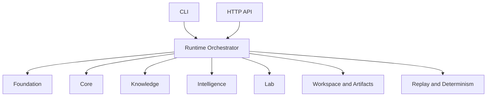

# Architecture

## Package identity

- Distribution name: `bijux-proteomics-runtime`
- Import root: `bijux_proteomics_runtime`

## Architectural role

`bijux-proteomics-runtime` is the canonical execution layer in the proteomics
package family.

## Responsibility

The runtime layer coordinates how workflows run; it does not define what the
scientific meaning is.

Runtime-owned capabilities:

- CLI and operator entrypoint routing
- HTTP API wiring for runtime operations
- provider binding and provider execution adapters
- runtime state machine and execution control
- workspace and run artifact lifecycle
- replay and determinism enforcement
- orchestration across foundation/core/knowledge/intelligence/lab

## Execution model

The runtime layer composes lower-layer package capabilities and exposes
execution surfaces to users and automation.

## Design constraints

- Runtime composes lower layers but never redefines their domain truth.
- Runtime adapts lower-layer models for execution and transport boundaries.
- Runtime keeps operator interfaces stable while internal orchestration evolves.

## Module topology

- `interfaces/` owns CLI-facing runtime contracts
- `api/` owns HTTP entrypoints and transport wiring
- `runtime/control/` owns orchestration, replay, and execution coordination
- `runtime/adapters/` owns lower-layer to runtime payload mapping
- `providers/` owns provider binding and provider-specific execution surfaces
- `registry/`, `validation/`, and `execution/` own runtime support contracts

## Dependency direction

Runtime may depend on foundation, core, intelligence, knowledge, and lab in
order to orchestrate canonical workflow execution.

Lower-layer packages must not depend on runtime, and runtime should not take
ownership of their scientific meaning.

## Adapter topology

Runtime adapter modules are the only place where lower-layer domain objects are
translated into runtime interface payloads.

- `runtime/adapters/candidates.py`: candidate model mapping and selection wiring
- `runtime/adapters/quality.py`: quality and reliability mapping
- `runtime/adapters/memory.py`: memory record mapping
- `runtime/adapters/design_loop.py`: design-loop orchestration contracts
- `runtime/adapters/lab.py`: lab planning and evidence-promotion entrypoints

This keeps lower packages runtime-agnostic and prevents upward leakage of
runtime-specific schemas.

## Downstream expectations

Downstream callers should integrate through the canonical runtime roots and
leave domain meaning in the lower packages. New orchestration features should
land here before compat forwarding in `agentic-proteins` grows.
