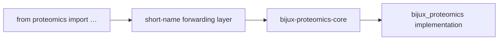

# proteomics

<!-- bijux-proteomics-badges:generated:start -->
[](https://pypi.org/project/proteomics/)
[-0A7BBB)](https://pypi.org/project/proteomics/)
[](https://github.com/bijux/bijux-proteomics/blob/main/LICENSE)
[](https://github.com/bijux/bijux-proteomics/actions/workflows/verify.yml?query=branch%3Amain)
[](https://github.com/bijux/bijux-proteomics)

[](https://pypi.org/project/proteomics/)
[](https://pypi.org/project/agentic-proteins/)
[](https://pypi.org/project/bijux-proteomics-foundation/)
[](https://pypi.org/project/bijux-proteomics-core/)
[](https://pypi.org/project/bijux-proteomics-runtime/)
[](https://pypi.org/project/bijux-proteomics-intelligence/)
[](https://pypi.org/project/bijux-proteomics-knowledge/)
[](https://pypi.org/project/bijux-proteomics-lab/)

[](https://github.com/bijux/bijux-proteomics/pkgs/container/bijux-proteomics%2Fproteomics)
[](https://github.com/bijux/bijux-proteomics/pkgs/container/bijux-proteomics%2Fagentic-proteins)
[](https://github.com/bijux/bijux-proteomics/pkgs/container/bijux-proteomics%2Fbijux-proteomics-foundation)
[](https://github.com/bijux/bijux-proteomics/pkgs/container/bijux-proteomics%2Fbijux-proteomics-core)
[](https://github.com/bijux/bijux-proteomics/pkgs/container/bijux-proteomics%2Fbijux-proteomics-runtime)
[](https://github.com/bijux/bijux-proteomics/pkgs/container/bijux-proteomics%2Fbijux-proteomics-intelligence)
[](https://github.com/bijux/bijux-proteomics/pkgs/container/bijux-proteomics%2Fbijux-proteomics-knowledge)
[](https://github.com/bijux/bijux-proteomics/pkgs/container/bijux-proteomics%2Fbijux-proteomics-lab)

[](https://bijux.io/bijux-proteomics/04-bijux-proteomics-core/)
[](https://bijux.io/bijux-proteomics/02-agentic-proteins/)
[](https://bijux.io/bijux-proteomics/03-bijux-proteomics-foundation/)
[](https://bijux.io/bijux-proteomics/04-bijux-proteomics-core/)
[](https://bijux.io/bijux-proteomics/09-bijux-proteomics-runtime/)
[](https://bijux.io/bijux-proteomics/05-bijux-proteomics-intelligence/)
[](https://bijux.io/bijux-proteomics/06-bijux-proteomics-knowledge/)
[](https://bijux.io/bijux-proteomics/07-bijux-proteomics-lab/)
<!-- bijux-proteomics-badges:generated:end -->

`proteomics` is the short-name compatibility alias for the canonical core owner
`bijux-proteomics-core`.
It is the install and import alias for bijux-proteomics-core.

Use this package when you want the shortest public distribution and import name
for the core scientific surface without creating a second owner.

## Compatibility role

- Use `proteomics` when the shortest install and import name matters more than
  the canonical owner package spelling.
- Start behavior discovery from the
  [canonical core package docs](https://bijux.io/bijux-proteomics/04-bijux-proteomics-core/)
  because this package is only a short-name forwarding layer.
- Route all scientific behavior to `bijux-proteomics-core`; keep this package
  focused on compatibility naming and short-form ergonomics.



The short name changes how consumers install and import the surface; it does
not change scientific semantics. Behavioral changes belong to Core and must be
visible through the canonical tests before this alias forwards them.

## Installation

```bash
pip install proteomics
```

## Public APIs

The alias forwards to the canonical core surface through the short import root:

```python
from proteomics import parse_fasta_document

report = parse_fasta_document(">sp|P11111|PTM1 Protein 1\nMPEPTIDEK\n")

assert report.total_records == 1
assert len(report.accepted_records) == 1
assert report.accepted_records[0].canonical_accession == "P11111"
```

## Package identity

- Distribution name: `proteomics`
- Import root: `proteomics`
- Canonical owner package: `bijux-proteomics-core`
- Canonical owner import root: `bijux_proteomics`

## Package boundaries

- this package owns compatibility naming for installs, imports, and the short
  CLI surface
- all scientific behavior remains owned by `bijux-proteomics-core`
- new features must land in the canonical owner before alias exports change

## What this package must not do

- define independent scientific or workflow behavior
- diverge from canonical core exports
- become a second place where core release policy is decided

## Contract checkpoints

- the short import surface must keep forwarding to canonical core behavior
- docs must continue to name `bijux-proteomics-core` as the owner
- compatibility updates must stay covered by alias-package tests

## Choose this package when

- you need the shortest import and install name for the core surface
- migration or user ergonomics favor `proteomics` over the canonical package
  name
- compatibility packaging work needs a clear short-name alias

## Route elsewhere when

- the change alters core scientific logic or workflow semantics
- the work adds a feature that is not already owned by core
- the proposal would make the alias more than a forwarding layer

## Verification route

- run alias compatibility tests before changing imports or console-script
  expectations
- review `docs/ARCHITECTURE.md`, `docs/BOUNDARIES.md`, and `docs/CONTRACTS.md`
  when alias claims or routing language change
- validate the canonical core README and tests when the proposal changes
  user-facing scientific behavior

## Review questions

- does the change preserve this package as a short-name alias only
- is the canonical owner explicit in behavior and documentation
- would the same behavior remain valid if core were imported directly

## Escalation route

- route scientific behavior changes to `bijux-proteomics-core`
- stop and review alias boundaries when the proposal introduces package-local
  semantics
- escalate before release when packaging or command-name drift could confuse
  consumers

## Consumer impact signals

- short-name install or import changes are high-impact because downstream code
  may rely on them directly
- alias documentation changes should still be reviewed against the core owner
- wording-only or documentation-only clarifications carry lower release risk

## Explicit non-goals

- this package does not own assay-processing or workflow semantics
- this package does not define runtime, intelligence, knowledge, or lab policy
- this package does not replace the canonical core release surface

## Documentation

- Release guidance lives in this `README.md`, this package `CHANGELOG.md`, and
  package `docs/*.md` under the canonical core owner surface.
- [Product architecture](https://bijux.io/bijux-proteomics/01-bijux-proteomics/foundation/product-architecture/)
- [Cross-package ownership](https://bijux.io/bijux-proteomics/01-bijux-proteomics/foundation/cross-package-ownership/)
- [Canonical core package docs](https://bijux.io/bijux-proteomics/04-bijux-proteomics-core/)
- [Changelog](CHANGELOG.md)
